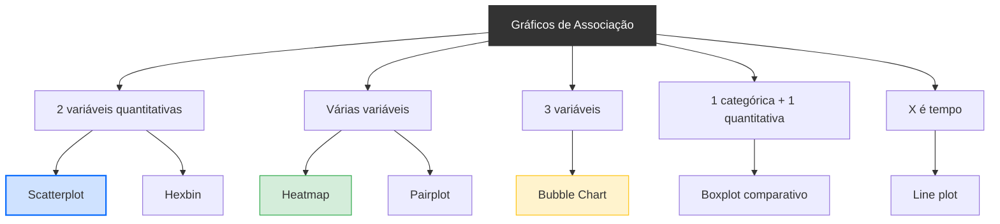
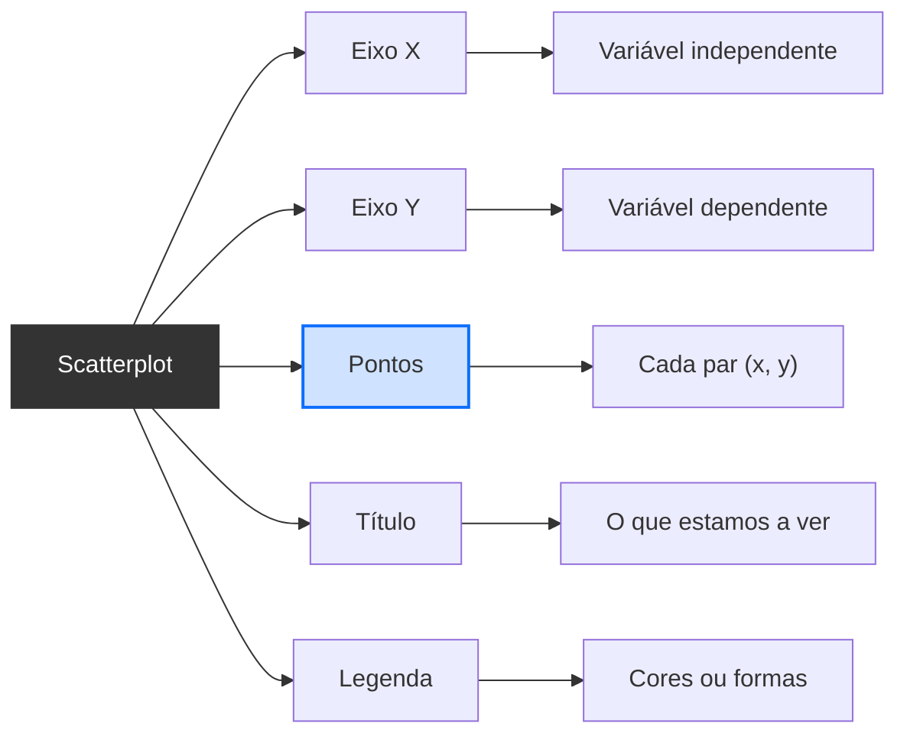

# <center>Scatterplot</center>

## Introdução

&emsp;&emsp;&emsp;Nas aulas anteriores estudámos como **quantificar** a relação entre duas variáveis — primeiro com o coeficiente de Pearson, depois com o coeficiente de Spearman. Aprendemos a calcular o **r** e o **ρ**, a interpretar a sua direção e força, e a escolher o coeficiente certo para cada situação. Mas há uma pergunta que ainda não respondemos: **como sabemos qual coeficiente usar?** Como decidimos se a relação é linear ou monótona? Como detetamos outliers antes de calcular seja o que for?

&emsp;&emsp;&emsp;A resposta é simples: **olhamos para os dados primeiro**. E a ferramenta que nos permite fazer isso chama-se **scatterplot** — ou **diagrama de dispersão**.

> 💡 **Regra de Ouro:** Nunca calcules um coeficiente de correlação sem antes ver o scatterplot. O número pode enganar-te; o gráfico não.

&emsp;&emsp;&emsp;Voltemos ao nosso professor com as horas de estudo e as notas. Antes de calcular o r de Pearson, ele deve **desenhar os pontos num plano cartesiano**. Cada aluno é um ponto: a coordenada X é as horas de estudo; a coordenada Y é a nota. O padrão que emerge desses pontos diz-nos **tudo** sobre a relação antes de qualquer fórmula.

**Exemplo visual:**

<details>
<summary>📊 Scatterplot — Horas de Estudo vs. Nota</summary>

<div style="background: #0a0f1e; padding: 1.5rem; border-radius: 16px; border: 1px solid rgba(255,255,255,0.08); max-width: 700px; margin: 1rem auto; text-align: center; font-family: 'Segoe UI', system-ui, sans-serif;">

  <div style="color: #fbbf24; font-weight: 700; font-size: 0.9rem; margin-bottom: 1rem;">SCATTERPLOT — HORAS DE ESTUDO VS. NOTA</div>

  <div style="position: relative; width: 100%; aspect-ratio: 1.4; background: #1a1a2e; border-radius: 12px; border: 1px solid rgba(255,255,255,0.05);">

    <div style="position: absolute; left: 8%; bottom: 12%; width: 84%; height: 76%; border-left: 2px solid #4b5563; border-bottom: 2px solid #4b5563;"></div>

    <span style="position: absolute; left: 14%; bottom: 24%; width: 10px; height: 10px; background: #60a5fa; border-radius: 50%; transform: translate(-50%, 50%);"></span>
    <span style="position: absolute; left: 22%; bottom: 30%; width: 10px; height: 10px; background: #60a5fa; border-radius: 50%; transform: translate(-50%, 50%);"></span>
    <span style="position: absolute; left: 30%; bottom: 38%; width: 10px; height: 10px; background: #60a5fa; border-radius: 50%; transform: translate(-50%, 50%);"></span>
    <span style="position: absolute; left: 38%; bottom: 44%; width: 10px; height: 10px; background: #60a5fa; border-radius: 50%; transform: translate(-50%, 50%);"></span>
    <span style="position: absolute; left: 46%; bottom: 52%; width: 10px; height: 10px; background: #60a5fa; border-radius: 50%; transform: translate(-50%, 50%);"></span>
    <span style="position: absolute; left: 54%; bottom: 58%; width: 10px; height: 10px; background: #60a5fa; border-radius: 50%; transform: translate(-50%, 50%);"></span>
    <span style="position: absolute; left: 62%; bottom: 66%; width: 10px; height: 10px; background: #60a5fa; border-radius: 50%; transform: translate(-50%, 50%);"></span>
    <span style="position: absolute; left: 70%; bottom: 72%; width: 10px; height: 10px; background: #60a5fa; border-radius: 50%; transform: translate(-50%, 50%);"></span>
    <span style="position: absolute; left: 78%; bottom: 80%; width: 10px; height: 10px; background: #60a5fa; border-radius: 50%; transform: translate(-50%, 50%);"></span>
    <span style="position: absolute; left: 86%; bottom: 86%; width: 10px; height: 10px; background: #60a5fa; border-radius: 50%; transform: translate(-50%, 50%);"></span>

    <div style="position: absolute; left: 50%; bottom: 2%; transform: translateX(-50%); color: #6b7280; font-size: 0.6rem;">Horas de Estudo</div>
    <div style="position: absolute; left: 2%; top: 50%; transform: translateY(-50%) rotate(-90deg); color: #6b7280; font-size: 0.6rem;">Nota Final</div>

  </div>

  <div style="color: #6b7280; font-size: 0.55rem; margin-top: 0.5rem;">
    Relação linear positiva muito forte (r ≈ 0,998)
  </div>

</div>

</details>

> O **scatterplot** (ou **diagrama de dispersão**) é uma representação gráfica que mostra a relação entre **duas variáveis quantitativas**, colocando cada par de valores como um **ponto** num plano cartesiano. O eixo X representa uma variável; o eixo Y representa a outra.

&emsp;&emsp;&emsp;O scatterplot é a **primeira ferramenta** que devemos usar em qualquer análise de correlação. Antes de calcular r, ρ, τ ou qualquer outro coeficiente, desenhamos os pontos. Só assim sabemos:

- Se a relação é **linear** ou **curva**
- Se há **outliers**
- Se a relação é **positiva**, **negativa** ou **nula**
- Se faz sentido usar Pearson ou Spearman

<details>
<summary>Mapa Completo dos gráficos de Associação </summary>

&emsp;&emsp;&emsp;O scatterplot não vive sozinho. Há vários gráficos que mostram associações entre variáveis, e cada um serve um propósito diferente. O diagrama abaixo mostra o mapa completo:


</details>

&emsp;&emsp;&emsp;O **scatterplot** é o gráfico base para **duas variáveis quantitativas**. É a partir dele que os outros gráficos evoluem. Quando há muitas variáveis, usamos heatmap ou pairplot; quando há três, usamos bubble chart; quando há uma categórica, usamos boxplot comparativo; quando X é tempo, usamos line plot.

<details>
<summary>Anatomia de Scatterplot</summary>

Um scatterplot tem cinco elementos essenciais:


</details>


### Interpretação de Scatterplot

Um scatterplot revela **quatro coisas** sobre a relação entre duas variáveis:

**1. Direção**

- **Positiva** → os pontos sobem da esquerda para a direita
- **Negativa** → os pontos descem da esquerda para a direita
- **Nula** → os pontos estão espalhados sem padrão

<details>
<summary>📊 Direção da Correlação — Positiva, Negativa e Nula</summary>

<div style="background: #0a0f1e; padding: 1.5rem; border-radius: 16px; border: 1px solid rgba(255,255,255,0.08); max-width: 800px; margin: 1rem auto; font-family: 'Segoe UI', system-ui, sans-serif;">

  <div style="color: #fbbf24; font-weight: 700; font-size: 0.85rem; margin-bottom: 1rem; text-align: center;">DIREÇÃO DA CORRELAÇÃO</div>

  <div style="display: flex; gap: 1rem; justify-content: center; flex-wrap: wrap;">

    <div style="flex: 0 1 220px; background: #1a1a2e; border-radius: 10px; padding: 0.8rem; border: 1px solid rgba(255,255,255,0.05); text-align: center;">
      <div style="color: #34d399; font-weight: 600; font-size: 0.7rem; margin-bottom: 0.5rem;">POSITIVA</div>
      <div style="position: relative; width: 100%; aspect-ratio: 1.3;">
        <span style="position: absolute; left: 15%; bottom: 15%; width: 8px; height: 8px; background: #34d399; border-radius: 50%; transform: translate(-50%, 50%);"></span>
        <span style="position: absolute; left: 30%; bottom: 32%; width: 8px; height: 8px; background: #34d399; border-radius: 50%; transform: translate(-50%, 50%);"></span>
        <span style="position: absolute; left: 45%; bottom: 48%; width: 8px; height: 8px; background: #34d399; border-radius: 50%; transform: translate(-50%, 50%);"></span>
        <span style="position: absolute; left: 60%; bottom: 62%; width: 8px; height: 8px; background: #34d399; border-radius: 50%; transform: translate(-50%, 50%);"></span>
        <span style="position: absolute; left: 75%; bottom: 78%; width: 8px; height: 8px; background: #34d399; border-radius: 50%; transform: translate(-50%, 50%);"></span>
        <span style="position: absolute; left: 88%; bottom: 90%; width: 8px; height: 8px; background: #34d399; border-radius: 50%; transform: translate(-50%, 50%);"></span>
      </div>
      <div style="color: #6b7280; font-size: 0.55rem; margin-top: 0.3rem;">Pontos sobem da esquerda para a direita</div>
    </div>

    <div style="flex: 0 1 220px; background: #1a1a2e; border-radius: 10px; padding: 0.8rem; border: 1px solid rgba(255,255,255,0.05); text-align: center;">
      <div style="color: #f87171; font-weight: 600; font-size: 0.7rem; margin-bottom: 0.5rem;">NEGATIVA</div>
      <div style="position: relative; width: 100%; aspect-ratio: 1.3;">
        <span style="position: absolute; left: 12%; bottom: 20%; width: 8px; height: 8px; background: #f87171; border-radius: 50%; transform: translate(-50%, 50%);"></span>
        <span style="position: absolute; left: 25%; bottom: 32%; width: 8px; height: 8px; background: #f87171; border-radius: 50%; transform: translate(-50%, 50%);"></span>
        <span style="position: absolute; left: 38%; bottom: 45%; width: 8px; height: 8px; background: #f87171; border-radius: 50%; transform: translate(-50%, 50%);"></span>
        <span style="position: absolute; left: 52%; bottom: 58%; width: 8px; height: 8px; background: #f87171; border-radius: 50%; transform: translate(-50%, 50%);"></span>
        <span style="position: absolute; left: 68%; bottom: 72%; width: 8px; height: 8px; background: #f87171; border-radius: 50%; transform: translate(-50%, 50%);"></span>
        <span style="position: absolute; left: 85%; bottom: 88%; width: 8px; height: 8px; background: #f87171; border-radius: 50%; transform: translate(-50%, 50%);"></span>
      </div>
      <div style="color: #6b7280; font-size: 0.55rem; margin-top: 0.3rem;">Pontos descem da esquerda para a direita</div>
    </div>

    <div style="flex: 0 1 220px; background: #1a1a2e; border-radius: 10px; padding: 0.8rem; border: 1px solid rgba(255,255,255,0.05); text-align: center;">
      <div style="color: #fbbf24; font-weight: 600; font-size: 0.7rem; margin-bottom: 0.5rem;">NULA</div>
      <div style="position: relative; width: 100%; aspect-ratio: 1.3;">
        <span style="position: absolute; left: 50%; bottom: 15%; width: 8px; height: 8px; background: #fbbf24; border-radius: 50%; transform: translate(-50%, 50%);"></span>
        <span style="position: absolute; left: 30%; bottom: 30%; width: 8px; height: 8px; background: #fbbf24; border-radius: 50%; transform: translate(-50%, 50%);"></span>
        <span style="position: absolute; left: 70%; bottom: 30%; width: 8px; height: 8px; background: #fbbf24; border-radius: 50%; transform: translate(-50%, 50%);"></span>
        <span style="position: absolute; left: 15%; bottom: 45%; width: 8px; height: 8px; background: #fbbf24; border-radius: 50%; transform: translate(-50%, 50%);"></span>
        <span style="position: absolute; left: 85%; bottom: 45%; width: 8px; height: 8px; background: #fbbf24; border-radius: 50%; transform: translate(-50%, 50%);"></span>
        <span style="position: absolute; left: 25%; bottom: 60%; width: 8px; height: 8px; background: #fbbf24; border-radius: 50%; transform: translate(-50%, 50%);"></span>
        <span style="position: absolute; left: 75%; bottom: 60%; width: 8px; height: 8px; background: #fbbf24; border-radius: 50%; transform: translate(-50%, 50%);"></span>
        <span style="position: absolute; left: 45%; bottom: 75%; width: 8px; height: 8px; background: #fbbf24; border-radius: 50%; transform: translate(-50%, 50%);"></span>
        <span style="position: absolute; left: 55%; bottom: 75%; width: 8px; height: 8px; background: #fbbf24; border-radius: 50%; transform: translate(-50%, 50%);"></span>
      </div>
      <div style="color: #6b7280; font-size: 0.55rem; margin-top: 0.3rem;">Pontos espalhados sem padrão</div>
    </div>

  </div>

</div>

</details>

**2. Força**

- **Forte** → os pontos estão apertados em torno de uma linha imaginária
- **Fraca** → os pontos estão dispersos
- **Moderada** → algo entre os dois

<details>
<summary>📊 Força da Correlação — Forte, Moderada e Fraca</summary>

<div style="background: #0a0f1e; padding: 1.5rem; border-radius: 16px; border: 1px solid rgba(255,255,255,0.08); max-width: 800px; margin: 1rem auto; font-family: 'Segoe UI', system-ui, sans-serif;">

  <div style="color: #fbbf24; font-weight: 700; font-size: 0.85rem; margin-bottom: 1rem; text-align: center;">FORÇA DA CORRELAÇÃO</div>

  <div style="display: flex; gap: 1rem; justify-content: center; flex-wrap: wrap;">

    <div style="flex: 0 1 220px; background: #1a1a2e; border-radius: 10px; padding: 0.8rem; border: 1px solid rgba(255,255,255,0.05); text-align: center;">
      <div style="color: #34d399; font-weight: 600; font-size: 0.7rem; margin-bottom: 0.5rem;">FORTE</div>
      <div style="position: relative; width: 100%; aspect-ratio: 1.3;">
        <span style="position: absolute; left: 15%; bottom: 18%; width: 8px; height: 8px; background: #34d399; border-radius: 50%; transform: translate(-50%, 50%);"></span>
        <span style="position: absolute; left: 28%; bottom: 30%; width: 8px; height: 8px; background: #34d399; border-radius: 50%; transform: translate(-50%, 50%);"></span>
        <span style="position: absolute; left: 42%; bottom: 42%; width: 8px; height: 8px; background: #34d399; border-radius: 50%; transform: translate(-50%, 50%);"></span>
        <span style="position: absolute; left: 55%; bottom: 54%; width: 8px; height: 8px; background: #34d399; border-radius: 50%; transform: translate(-50%, 50%);"></span>
        <span style="position: absolute; left: 68%; bottom: 66%; width: 8px; height: 8px; background: #34d399; border-radius: 50%; transform: translate(-50%, 50%);"></span>
        <span style="position: absolute; left: 82%; bottom: 80%; width: 8px; height: 8px; background: #34d399; border-radius: 50%; transform: translate(-50%, 50%);"></span>
      </div>
      <div style="color: #6b7280; font-size: 0.55rem; margin-top: 0.3rem;">Pontos apertados em torno de uma linha</div>
    </div>

    <div style="flex: 0 1 220px; background: #1a1a2e; border-radius: 10px; padding: 0.8rem; border: 1px solid rgba(255,255,255,0.05); text-align: center;">
      <div style="color: #fbbf24; font-weight: 600; font-size: 0.7rem; margin-bottom: 0.5rem;">MODERADA</div>
      <div style="position: relative; width: 100%; aspect-ratio: 1.3;">
        <span style="position: absolute; left: 20%; bottom: 15%; width: 8px; height: 8px; background: #fbbf24; border-radius: 50%; transform: translate(-50%, 50%);"></span>
        <span style="position: absolute; left: 35%; bottom: 35%; width: 8px; height: 8px; background: #fbbf24; border-radius: 50%; transform: translate(-50%, 50%);"></span>
        <span style="position: absolute; left: 50%; bottom: 25%; width: 8px; height: 8px; background: #fbbf24; border-radius: 50%; transform: translate(-50%, 50%);"></span>
        <span style="position: absolute; left: 40%; bottom: 55%; width: 8px; height: 8px; background: #fbbf24; border-radius: 50%; transform: translate(-50%, 50%);"></span>
        <span style="position: absolute; left: 65%; bottom: 50%; width: 8px; height: 8px; background: #fbbf24; border-radius: 50%; transform: translate(-50%, 50%);"></span>
        <span style="position: absolute; left: 75%; bottom: 70%; width: 8px; height: 8px; background: #fbbf24; border-radius: 50%; transform: translate(-50%, 50%);"></span>
        <span style="position: absolute; left: 55%; bottom: 80%; width: 8px; height: 8px; background: #fbbf24; border-radius: 50%; transform: translate(-50%, 50%);"></span>
        <span style="position: absolute; left: 85%; bottom: 85%; width: 8px; height: 8px; background: #fbbf24; border-radius: 50%; transform: translate(-50%, 50%);"></span>
      </div>
      <div style="color: #6b7280; font-size: 0.55rem; margin-top: 0.3rem;">Algo entre forte e fraca</div>
    </div>

    <div style="flex: 0 1 220px; background: #1a1a2e; border-radius: 10px; padding: 0.8rem; border: 1px solid rgba(255,255,255,0.05); text-align: center;">
      <div style="color: #f87171; font-weight: 600; font-size: 0.7rem; margin-bottom: 0.5rem;">FRACA</div>
      <div style="position: relative; width: 100%; aspect-ratio: 1.3;">
        <span style="position: absolute; left: 50%; bottom: 15%; width: 8px; height: 8px; background: #f87171; border-radius: 50%; transform: translate(-50%, 50%);"></span>
        <span style="position: absolute; left: 30%; bottom: 30%; width: 8px; height: 8px; background: #f87171; border-radius: 50%; transform: translate(-50%, 50%);"></span>
        <span style="position: absolute; left: 70%; bottom: 30%; width: 8px; height: 8px; background: #f87171; border-radius: 50%; transform: translate(-50%, 50%);"></span>
        <span style="position: absolute; left: 15%; bottom: 45%; width: 8px; height: 8px; background: #f87171; border-radius: 50%; transform: translate(-50%, 50%);"></span>
        <span style="position: absolute; left: 85%; bottom: 45%; width: 8px; height: 8px; background: #f87171; border-radius: 50%; transform: translate(-50%, 50%);"></span>
        <span style="position: absolute; left: 25%; bottom: 60%; width: 8px; height: 8px; background: #f87171; border-radius: 50%; transform: translate(-50%, 50%);"></span>
        <span style="position: absolute; left: 75%; bottom: 60%; width: 8px; height: 8px; background: #f87171; border-radius: 50%; transform: translate(-50%, 50%);"></span>
        <span style="position: absolute; left: 45%; bottom: 75%; width: 8px; height: 8px; background: #f87171; border-radius: 50%; transform: translate(-50%, 50%);"></span>
        <span style="position: absolute; left: 55%; bottom: 75%; width: 8px; height: 8px; background: #f87171; border-radius: 50%; transform: translate(-50%, 50%);"></span>
      </div>
      <div style="color: #6b7280; font-size: 0.55rem; margin-top: 0.3rem;">Pontos dispersos sem padrão claro</div>
    </div>

  </div>

</div>

</details>

**3. Forma**

- **Linear** → os pontos alinham-se numa reta
- **Monótona não-linear** → os pontos sobem/descem sempre, mas em curva
- **Não-monótona** → os pontos sobem e depois descem (curva em U)

<details>
<summary>📊 Forma da Correlação — Linear, Monótona não-linear e Não-monótona</summary>

<div style="background: #0a0f1e; padding: 1.5rem; border-radius: 16px; border: 1px solid rgba(255,255,255,0.08); max-width: 800px; margin: 1rem auto; font-family: 'Segoe UI', system-ui, sans-serif;">

  <div style="color: #fbbf24; font-weight: 700; font-size: 0.85rem; margin-bottom: 1rem; text-align: center;">FORMA DA CORRELAÇÃO</div>

  <div style="display: flex; gap: 1rem; justify-content: center; flex-wrap: wrap;">

    <div style="flex: 0 1 220px; background: #1a1a2e; border-radius: 10px; padding: 0.8rem; border: 1px solid rgba(255,255,255,0.05); text-align: center;">
      <div style="color: #34d399; font-weight: 600; font-size: 0.7rem; margin-bottom: 0.5rem;">LINEAR</div>
      <div style="position: relative; width: 100%; aspect-ratio: 1.3;">
        <span style="position: absolute; left: 15%; bottom: 15%; width: 8px; height: 8px; background: #34d399; border-radius: 50%; transform: translate(-50%, 50%);"></span>
        <span style="position: absolute; left: 30%; bottom: 32%; width: 8px; height: 8px; background: #34d399; border-radius: 50%; transform: translate(-50%, 50%);"></span>
        <span style="position: absolute; left: 45%; bottom: 48%; width: 8px; height: 8px; background: #34d399; border-radius: 50%; transform: translate(-50%, 50%);"></span>
        <span style="position: absolute; left: 60%; bottom: 62%; width: 8px; height: 8px; background: #34d399; border-radius: 50%; transform: translate(-50%, 50%);"></span>
        <span style="position: absolute; left: 75%; bottom: 78%; width: 8px; height: 8px; background: #34d399; border-radius: 50%; transform: translate(-50%, 50%);"></span>
        <span style="position: absolute; left: 88%; bottom: 90%; width: 8px; height: 8px; background: #34d399; border-radius: 50%; transform: translate(-50%, 50%);"></span>
      </div>
      <div style="color: #6b7280; font-size: 0.55rem; margin-top: 0.3rem;">Pontos alinhados numa reta</div>
    </div>

    <div style="flex: 0 1 220px; background: #1a1a2e; border-radius: 10px; padding: 0.8rem; border: 1px solid rgba(255,255,255,0.05); text-align: center;">
      <div style="color: #fbbf24; font-weight: 600; font-size: 0.7rem; margin-bottom: 0.5rem;">MONÓTONA NÃO-LINEAR</div>
      <div style="position: relative; width: 100%; aspect-ratio: 1.3;">
        <span style="position: absolute; left: 12%; bottom: 18%; width: 8px; height: 8px; background: #fbbf24; border-radius: 50%; transform: translate(-50%, 50%);"></span>
        <span style="position: absolute; left: 28%; bottom: 38%; width: 8px; height: 8px; background: #fbbf24; border-radius: 50%; transform: translate(-50%, 50%);"></span>
        <span style="position: absolute; left: 42%; bottom: 55%; width: 8px; height: 8px; background: #fbbf24; border-radius: 50%; transform: translate(-50%, 50%);"></span>
        <span style="position: absolute; left: 55%; bottom: 68%; width: 8px; height: 8px; background: #fbbf24; border-radius: 50%; transform: translate(-50%, 50%);"></span>
        <span style="position: absolute; left: 68%; bottom: 78%; width: 8px; height: 8px; background: #fbbf24; border-radius: 50%; transform: translate(-50%, 50%);"></span>
        <span style="position: absolute; left: 82%; bottom: 85%; width: 8px; height: 8px; background: #fbbf24; border-radius: 50%; transform: translate(-50%, 50%);"></span>
      </div>
      <div style="color: #6b7280; font-size: 0.55rem; margin-top: 0.3rem;">Sobem sempre, mas em curva</div>
    </div>

    <div style="flex: 0 1 220px; background: #1a1a2e; border-radius: 10px; padding: 0.8rem; border: 1px solid rgba(255,255,255,0.05); text-align: center;">
      <div style="color: #f87171; font-weight: 600; font-size: 0.7rem; margin-bottom: 0.5rem;">NÃO-MONÓTONA</div>
      <div style="position: relative; width: 100%; aspect-ratio: 1.3;">
        <span style="position: absolute; left: 12%; bottom: 20%; width: 8px; height: 8px; background: #f87171; border-radius: 50%; transform: translate(-50%, 50%);"></span>
        <span style="position: absolute; left: 28%; bottom: 50%; width: 8px; height: 8px; background: #f87171; border-radius: 50%; transform: translate(-50%, 50%);"></span>
        <span style="position: absolute; left: 42%; bottom: 72%; width: 8px; height: 8px; background: #f87171; border-radius: 50%; transform: translate(-50%, 50%);"></span>
        <span style="position: absolute; left: 58%; bottom: 78%; width: 8px; height: 8px; background: #f87171; border-radius: 50%; transform: translate(-50%, 50%);"></span>
        <span style="position: absolute; left: 72%; bottom: 62%; width: 8px; height: 8px; background: #f87171; border-radius: 50%; transform: translate(-50%, 50%);"></span>
        <span style="position: absolute; left: 88%; bottom: 35%; width: 8px; height: 8px; background: #f87171; border-radius: 50%; transform: translate(-50%, 50%);"></span>
      </div>
      <div style="color: #6b7280; font-size: 0.55rem; margin-top: 0.3rem;">Sobem e depois descem (curva em U)</div>
    </div>

  </div>

</div>

</details>

**4. Outliers**

- Pontos **isolados** que não seguem o padrão
- Podem distorcer os coeficientes
- Precisam de ser investigados antes de removidos

<details>
<summary>📊 Outlier — Ponto isolado que não segue o padrão</summary>

<div style="background: #0a0f1e; padding: 1.5rem; border-radius: 16px; border: 1px solid rgba(255,255,255,0.08); max-width: 500px; margin: 1rem auto; font-family: 'Segoe UI', system-ui, sans-serif;">

  <div style="color: #fbbf24; font-weight: 700; font-size: 0.85rem; margin-bottom: 1rem; text-align: center;">OUTLIER</div>

  <div style="position: relative; width: 100%; aspect-ratio: 1.4; background: #1a1a2e; border-radius: 10px; border: 1px solid rgba(255,255,255,0.05);">

    <span style="position: absolute; left: 18%; bottom: 22%; width: 8px; height: 8px; background: #60a5fa; border-radius: 50%; transform: translate(-50%, 50%);"></span>
    <span style="position: absolute; left: 28%; bottom: 32%; width: 8px; height: 8px; background: #60a5fa; border-radius: 50%; transform: translate(-50%, 50%);"></span>
    <span style="position: absolute; left: 38%; bottom: 42%; width: 8px; height: 8px; background: #60a5fa; border-radius: 50%; transform: translate(-50%, 50%);"></span>
    <span style="position: absolute; left: 48%; bottom: 52%; width: 8px; height: 8px; background: #60a5fa; border-radius: 50%; transform: translate(-50%, 50%);"></span>
    <span style="position: absolute; left: 58%; bottom: 62%; width: 8px; height: 8px; background: #60a5fa; border-radius: 50%; transform: translate(-50%, 50%);"></span>
    <span style="position: absolute; left: 68%; bottom: 72%; width: 8px; height: 8px; background: #60a5fa; border-radius: 50%; transform: translate(-50%, 50%);"></span>
    <span style="position: absolute; left: 78%; bottom: 82%; width: 8px; height: 8px; background: #60a5fa; border-radius: 50%; transform: translate(-50%, 50%);"></span>

    <span style="position: absolute; left: 85%; bottom: 25%; width: 12px; height: 12px; background: #f87171; border-radius: 50%; transform: translate(-50%, 50%); border: 2px solid #dc2626;"></span>

  </div>

  <div style="color: #f87171; font-size: 0.55rem; margin-top: 0.5rem;">
    Ponto isolado que não segue o padrão
  </div>

</div>

</details>


### Construir Um Scatterplot

**Passo 1 — Recolher os pares de dados**

Cada indivíduo tem um par (x, y). No nosso exemplo:

| Aluno | Horas (X) | Nota (Y) |
|-------|-----------|----------|
| 1 | 1 | 4 |
| 2 | 2 | 5 |
| 3 | 3 | 7 |
| 4 | 4 | 8 |
| 5 | 5 | 10 |
| 6 | 6 | 11 |
| 7 | 7 | 13 |
| 8 | 8 | 14 |
| 9 | 9 | 16 |
| 10 | 10 | 17 |

**Passo 2 — Definir os eixos**

- **Eixo X:** Horas de estudo (de 0 a 11)
- **Eixo Y:** Nota (de 0 a 20)

**Passo 3 — Desenhar os pontos**

Cada par (x, y) é um ponto no plano.

<details>
<summary>📊 Scatterplot — Horas de Estudo vs. Nota</summary>

<div style="background: #0a0f1e; padding: 1.5rem; border-radius: 16px; border: 1px solid rgba(255,255,255,0.08); max-width: 500px; margin: 1rem auto; text-align: center; font-family: 'Segoe UI', system-ui, sans-serif;">

  <div style="color: #fbbf24; font-weight: 700; font-size: 0.85rem; margin-bottom: 0.8rem;">SCATTERPLOT — HORAS VS. NOTA</div>

  <div style="position: relative; width: 100%; aspect-ratio: 1.4; background: #1a1a2e; border-radius: 10px; border: 1px solid rgba(255,255,255,0.05);">

    <div style="position: absolute; left: 8%; bottom: 12%; width: 84%; height: 76%; border-left: 2px solid #4b5563; border-bottom: 2px solid #4b5563;"></div>

    <span style="position: absolute; left: 14%; bottom: 24%; width: 10px; height: 10px; background: #60a5fa; border-radius: 50%; transform: translate(-50%, 50%);"></span>
    <span style="position: absolute; left: 22%; bottom: 30%; width: 10px; height: 10px; background: #60a5fa; border-radius: 50%; transform: translate(-50%, 50%);"></span>
    <span style="position: absolute; left: 30%; bottom: 38%; width: 10px; height: 10px; background: #60a5fa; border-radius: 50%; transform: translate(-50%, 50%);"></span>
    <span style="position: absolute; left: 38%; bottom: 44%; width: 10px; height: 10px; background: #60a5fa; border-radius: 50%; transform: translate(-50%, 50%);"></span>
    <span style="position: absolute; left: 46%; bottom: 52%; width: 10px; height: 10px; background: #60a5fa; border-radius: 50%; transform: translate(-50%, 50%);"></span>
    <span style="position: absolute; left: 54%; bottom: 58%; width: 10px; height: 10px; background: #60a5fa; border-radius: 50%; transform: translate(-50%, 50%);"></span>
    <span style="position: absolute; left: 62%; bottom: 66%; width: 10px; height: 10px; background: #60a5fa; border-radius: 50%; transform: translate(-50%, 50%);"></span>
    <span style="position: absolute; left: 70%; bottom: 72%; width: 10px; height: 10px; background: #60a5fa; border-radius: 50%; transform: translate(-50%, 50%);"></span>
    <span style="position: absolute; left: 78%; bottom: 80%; width: 10px; height: 10px; background: #60a5fa; border-radius: 50%; transform: translate(-50%, 50%);"></span>
    <span style="position: absolute; left: 86%; bottom: 86%; width: 10px; height: 10px; background: #60a5fa; border-radius: 50%; transform: translate(-50%, 50%);"></span>

    <div style="position: absolute; left: 50%; bottom: 2%; transform: translateX(-50%); color: #6b7280; font-size: 0.6rem;">Horas de Estudo</div>
    <div style="position: absolute; left: 2%; top: 50%; transform: translateY(-50%) rotate(-90deg); color: #6b7280; font-size: 0.6rem;">Nota Final</div>

  </div>

</div>

</details>

**Passo 4 — Interpretar o padrão**

- Direção? **Positiva**
- Força? **Muito forte**
- Forma? **Linear**
- Outliers? **Nenhum**

### ✅ Conclusão

O scatterplot mostra uma relação **linear positiva muito forte**. Não há outliers. Faz sentido usar **Pearson**.

### SCATTERPLOT VS OUTROS GRÁFICOS

| Gráfico | Quando usar | Vantagem | Limitação |
|---------|-------------|----------|-----------|
| **Scatterplot** | 2 variáveis quantitativas | Mostra a forma exata | Não funciona com muitas variáveis |
| **Hexbin** | Muitos pontos (milhares) | Evita sobreposição | Perde detalhe individual |
| **Heatmap** | Várias variáveis | Mostra correlações em matriz | Não mostra a forma |
| **Pairplot** | Muitas variáveis | Mostra todas as combinações | Pode ser confuso |
| **Bubble Chart** | 3 variáveis | Adiciona uma dimensão (tamanho) | Difícil de ler com muitos pontos |
| **Boxplot comparativo** | 1 categórica + 1 quantitativa | Compara grupos | Não mostra relação individual |
| **Line Plot** | X é tempo | Mostra tendências | Só funciona com tempo |

**Regra prática:** Se tens duas variáveis quantitativas e queres ver a relação → **scatterplot**. Se tens muitas variáveis → **heatmap** ou **pairplot**. Se tens milhares de pontos → **hexbin**.


<details>
<summary>📌 Exemplo Prático — Scatterplot no Python</summary>

```python
import matplotlib.pyplot as plt
import numpy as np

- _Dados: Horas de estudo vs. Nota_
x = [1, 2, 3, 4, 5, 6, 7, 8, 9, 10]
y = [4, 5, 7, 8, 10, 11, 13, 14, 16, 17]

- _Criar o scatterplot_
plt.figure(figsize=(8, 6))
plt.scatter(x, y, color='steelblue', s=100, alpha=0.7, edgecolors='black')

- _Adicionar título e rótulos_
plt.title('Horas de Estudo vs. Nota Final', fontsize=14)
plt.xlabel('Horas de Estudo', fontsize=12)
plt.ylabel('Nota Final', fontsize=12)

- _Adicionar grelha_
plt.grid(True, alpha=0.3)

- _Mostrar o gráfico_
plt.show()
```

**Variações úteis:**

</details>

<details>
<summary>📊 Exemplo Prático — Scatterplot no R</summary>

```r
- _Dados: Horas de estudo vs. Nota_
x <- c(1, 2, 3, 4, 5, 6, 7, 8, 9, 10)
y <- c(4, 5, 7, 8, 10, 11, 13, 14, 16, 17)

- _Scatterplot básico (base R)_
plot(x, y,
     main = "Horas de Estudo vs. Nota Final",
     xlab = "Horas de Estudo",
     ylab = "Nota Final",
     pch = 19,         _pontos preenchidos_
     col = "steelblue",
     cex = 1.5)        _tamanho dos pontos_
grid()

- _Scatterplot com ggplot2_
library(ggplot2)
df <- data.frame(x = x, y = y)
ggplot(df, aes(x = x, y = y)) +
  geom_point(size = 3, color = "steelblue") +
  geom_smooth(method = "lm", se = FALSE, color = "red", linetype = "dashed") +
  labs(title = "Horas de Estudo vs. Nota Final",
       x = "Horas de Estudo",
       y = "Nota Final") +
  theme_minimal()
```

</details>

<details>
<summary>📊 Exemplo Prático — Scatterplot no Excel</summary>

**Passo 1 — Inserir os dados:**

| - | A | B |
|---|---|---|
| **1** | Horas (X) | Nota (Y) |
| **2** | 1 | 4 |
| **3** | 2 | 5 |
| **4** | 3 | 7 |
| **5** | 4 | 8 |
| **6** | 5 | 10 |
| **7** | 6 | 11 |
| **8** | 7 | 13 |
| **9** | 8 | 14 |
| **10** | 9 | 16 |
| **11** | 10 | 17 |

**Passo 2 — Selecionar os dados** (A1:B11)

**Passo 3 — Inserir → Gráfico → Dispersão (Scatter)**

<details>
<summary>📊 Excel — Inserir Gráfico de Dispersão</summary>

<div style="background: #0a0f1e; padding: 1.5rem; border-radius: 16px; border: 1px solid rgba(255,255,255,0.08); max-width: 600px; margin: 1rem auto; text-align: center; font-family: 'Segoe UI', system-ui, sans-serif;">

  <div style="color: #fbbf24; font-weight: 700; font-size: 0.85rem; margin-bottom: 1rem;">EXCEL — INSERIR GRÁFICO DE DISPERSÃO</div>

  <div style="background: #1a1a2e; border-radius: 10px; padding: 1rem; border: 1px solid rgba(255,255,255,0.05);">

    <div style="display: flex; gap: 0.5rem; justify-content: center; margin-bottom: 0.8rem; flex-wrap: wrap;">

      <div style="background: #2d1b69; color: #c4b5fd; padding: 0.4rem 0.8rem; border-radius: 6px; font-size: 0.65rem;">1. Selecionar Dados</div>
      <div style="color: #fbbf24; font-size: 1rem;">→</div>
      <div style="background: #1a3a5c; color: #93c5fd; padding: 0.4rem 0.8rem; border-radius: 6px; font-size: 0.65rem;">2. Inserir</div>
      <div style="color: #fbbf24; font-size: 1rem;">→</div>
      <div style="background: #1a5c3a; color: #6ee7b7; padding: 0.4rem 0.8rem; border-radius: 6px; font-size: 0.65rem;">3. Gráfico</div>
      <div style="color: #fbbf24; font-size: 1rem;">→</div>
      <div style="background: #5c3a1a; color: #fcd34d; padding: 0.4rem 0.8rem; border-radius: 6px; font-size: 0.65rem;">4. Dispersão</div>

    </div>

    <div style="position: relative; width: 100%; aspect-ratio: 1.4; background: #0a0f1e; border-radius: 8px; border: 1px solid rgba(255,255,255,0.05);">

      <div style="position: absolute; left: 8%; bottom: 12%; width: 84%; height: 76%; border-left: 2px solid #4b5563; border-bottom: 2px solid #4b5563;"></div>

      <span style="position: absolute; left: 14%; bottom: 24%; width: 8px; height: 8px; background: #60a5fa; border-radius: 50%; transform: translate(-50%, 50%);"></span>
      <span style="position: absolute; left: 22%; bottom: 30%; width: 8px; height: 8px; background: #60a5fa; border-radius: 50%; transform: translate(-50%, 50%);"></span>
      <span style="position: absolute; left: 30%; bottom: 38%; width: 8px; height: 8px; background: #60a5fa; border-radius: 50%; transform: translate(-50%, 50%);"></span>
      <span style="position: absolute; left: 38%; bottom: 44%; width: 8px; height: 8px; background: #60a5fa; border-radius: 50%; transform: translate(-50%, 50%);"></span>
      <span style="position: absolute; left: 46%; bottom: 52%; width: 8px; height: 8px; background: #60a5fa; border-radius: 50%; transform: translate(-50%, 50%);"></span>
      <span style="position: absolute; left: 54%; bottom: 58%; width: 8px; height: 8px; background: #60a5fa; border-radius: 50%; transform: translate(-50%, 50%);"></span>
      <span style="position: absolute; left: 62%; bottom: 66%; width: 8px; height: 8px; background: #60a5fa; border-radius: 50%; transform: translate(-50%, 50%);"></span>
      <span style="position: absolute; left: 70%; bottom: 72%; width: 8px; height: 8px; background: #60a5fa; border-radius: 50%; transform: translate(-50%, 50%);"></span>
      <span style="position: absolute; left: 78%; bottom: 80%; width: 8px; height: 8px; background: #60a5fa; border-radius: 50%; transform: translate(-50%, 50%);"></span>
      <span style="position: absolute; left: 86%; bottom: 86%; width: 8px; height: 8px; background: #60a5fa; border-radius: 50%; transform: translate(-50%, 50%);"></span>

    </div>

  </div>

</div>

</details>

**Passo 4 — Personalizar:**
- Adicionar título
- Adicionar rótulos dos eixos
- Adicionar linha de tendência (clique direito no ponto → Adicionar linha de tendência → Linear)

**Resultado:** Um scatterplot com linha de tendência linear.

</details>

---

## EXERCÍCIOS

<details>
<summary>📗 Exercício 1 — Interpretar um scatterplot</summary>

**Enunciado:** Olha para o scatterplot abaixo e responde:

<details>
<summary>📊 Scatterplot — Exercício 1</summary>

<div style="background: #0a0f1e; padding: 1.5rem; border-radius: 16px; border: 1px solid rgba(255,255,255,0.08); max-width: 600px; margin: 1rem auto; text-align: center; font-family: 'Segoe UI', system-ui, sans-serif;">

  <div style="color: #fbbf24; font-weight: 700; font-size: 0.85rem; margin-bottom: 0.8rem;">SCATTERPLOT — EXERCÍCIO 1</div>

  <div style="position: relative; width: 100%; aspect-ratio: 1.4; background: #1a1a2e; border-radius: 12px; border: 1px solid rgba(255,255,255,0.05);">

    <div style="position: absolute; left: 8%; bottom: 12%; width: 84%; height: 76%; border-left: 2px solid #4b5563; border-bottom: 2px solid #4b5563;"></div>

    <span style="position: absolute; left: 16%; bottom: 20%; width: 10px; height: 10px; background: #34d399; border-radius: 50%; transform: translate(-50%, 50%);"></span>
    <span style="position: absolute; left: 24%; bottom: 28%; width: 10px; height: 10px; background: #34d399; border-radius: 50%; transform: translate(-50%, 50%);"></span>
    <span style="position: absolute; left: 32%; bottom: 36%; width: 10px; height: 10px; background: #34d399; border-radius: 50%; transform: translate(-50%, 50%);"></span>
    <span style="position: absolute; left: 40%; bottom: 42%; width: 10px; height: 10px; background: #34d399; border-radius: 50%; transform: translate(-50%, 50%);"></span>
    <span style="position: absolute; left: 48%; bottom: 50%; width: 10px; height: 10px; background: #34d399; border-radius: 50%; transform: translate(-50%, 50%);"></span>
    <span style="position: absolute; left: 56%; bottom: 58%; width: 10px; height: 10px; background: #34d399; border-radius: 50%; transform: translate(-50%, 50%);"></span>
    <span style="position: absolute; left: 64%; bottom: 64%; width: 10px; height: 10px; background: #34d399; border-radius: 50%; transform: translate(-50%, 50%);"></span>
    <span style="position: absolute; left: 72%; bottom: 72%; width: 10px; height: 10px; background: #34d399; border-radius: 50%; transform: translate(-50%, 50%);"></span>
    <span style="position: absolute; left: 80%; bottom: 80%; width: 10px; height: 10px; background: #34d399; border-radius: 50%; transform: translate(-50%, 50%);"></span>
    <span style="position: absolute; left: 88%; bottom: 88%; width: 10px; height: 10px; background: #34d399; border-radius: 50%; transform: translate(-50%, 50%);"></span>

  </div>

</div>

</details>

a) A direção é positiva, negativa ou nula?
b) A força é fraca, moderada ou forte?
c) A forma é linear ou curva?
d) Há outliers?
e) Que coeficiente usarias — Pearson ou Spearman?

<details>
<summary>💡 Ver resposta</summary>

**Resposta:**

a) **Positiva** — os pontos sobem da esquerda para a direita
b) **Forte** — os pontos estão apertados em torno de uma linha imaginária
c) **Linear** — os pontos alinham-se numa reta
d) **Não** — não há pontos isolados
e) **Pearson** — relação linear, sem outliers

</details>
</details>

<details>
<summary>📗 Exercício 2 — Detetar outliers</summary>

**Enunciado:** No scatterplot abaixo, há um ponto que não segue o padrão. Identifica-o e explica porque é que ele distorceria o coeficiente de Pearson.

<details>
<summary>📊 Scatterplot — Exercício 2 (com outlier)</summary>

<div style="background: #0a0f1e; padding: 1.5rem; border-radius: 16px; border: 1px solid rgba(255,255,255,0.08); max-width: 600px; margin: 1rem auto; text-align: center; font-family: 'Segoe UI', system-ui, sans-serif;">

  <div style="color: #fbbf24; font-weight: 700; font-size: 0.85rem; margin-bottom: 0.8rem;">SCATTERPLOT — EXERCÍCIO 2 (com outlier)</div>

  <div style="position: relative; width: 100%; aspect-ratio: 1.4; background: #1a1a2e; border-radius: 12px; border: 1px solid rgba(255,255,255,0.05);">

    <div style="position: absolute; left: 8%; bottom: 12%; width: 84%; height: 76%; border-left: 2px solid #4b5563; border-bottom: 2px solid #4b5563;"></div>

    <span style="position: absolute; left: 16%; bottom: 22%; width: 10px; height: 10px; background: #60a5fa; border-radius: 50%; transform: translate(-50%, 50%);"></span>
    <span style="position: absolute; left: 24%; bottom: 30%; width: 10px; height: 10px; background: #60a5fa; border-radius: 50%; transform: translate(-50%, 50%);"></span>
    <span style="position: absolute; left: 32%; bottom: 38%; width: 10px; height: 10px; background: #60a5fa; border-radius: 50%; transform: translate(-50%, 50%);"></span>
    <span style="position: absolute; left: 40%; bottom: 44%; width: 10px; height: 10px; background: #60a5fa; border-radius: 50%; transform: translate(-50%, 50%);"></span>
    <span style="position: absolute; left: 48%; bottom: 52%; width: 10px; height: 10px; background: #60a5fa; border-radius: 50%; transform: translate(-50%, 50%);"></span>
    <span style="position: absolute; left: 56%; bottom: 60%; width: 10px; height: 10px; background: #60a5fa; border-radius: 50%; transform: translate(-50%, 50%);"></span>
    <span style="position: absolute; left: 64%; bottom: 66%; width: 10px; height: 10px; background: #60a5fa; border-radius: 50%; transform: translate(-50%, 50%);"></span>
    <span style="position: absolute; left: 72%; bottom: 74%; width: 10px; height: 10px; background: #60a5fa; border-radius: 50%; transform: translate(-50%, 50%);"></span>
    <span style="position: absolute; left: 80%; bottom: 80%; width: 10px; height: 10px; background: #60a5fa; border-radius: 50%; transform: translate(-50%, 50%);"></span>

    <span style="position: absolute; left: 85%; bottom: 25%; width: 12px; height: 12px; background: #f87171; border-radius: 50%; transform: translate(-50%, 50%); border: 2px solid #dc2626;"></span>

  </div>

  <div style="color: #f87171; font-size: 0.6rem; margin-top: 0.5rem;">
    ⚠️ Outlier: ponto no canto inferior direito (X alto, Y baixo)
  </div>

</div>

</details>

<details>
<summary>💡 Ver resposta</summary>

**Resposta:**

O outlier é o ponto no canto inferior direito (X alto, Y baixo). Este ponto:

- **Aumenta a dispersão** dos dados
- **Reduz o r de Pearson** — porque a relação linear global fica menos clara
- **Não afeta o Spearman** — porque o Spearman usa rankings, e o outlier é apenas "o último" no ranking de Y

**Conclusão:** Com este outlier, o Pearson pode dar um valor enganador. O Spearman é mais adequado.

</details>
</details>

<details>
<summary>📗 Exercício 3 — Escolher o gráfico certo</summary>

**Enunciado:** Para cada situação, indica se usarias scatterplot, hexbin, heatmap, pairplot ou bubble chart:

a) Relação entre altura e peso de 50 pessoas
b) Relação entre 10 variáveis macroeconómicas
c) Relação entre altura, peso e idade de 100 pessoas
d) Relação entre 50.000 pontos de dados de GPS
e) Relação entre horas de estudo, nota, e número de disciplinas

<details>
<summary>💡 Ver resposta</summary>

**Resposta:**

a) **Scatterplot** — 2 variáveis quantitativas, poucos pontos
b) **Heatmap** — muitas variáveis, queremos ver a matriz de correlações
c) **Bubble Chart** — 3 variáveis (altura, peso, idade)
d) **Hexbin** — muitos pontos, scatterplot ficaria sobreposto
e) **Bubble Chart** — 3 variáveis (horas, nota, disciplinas)

</details>
</details>

<details>
<summary>📗 Exercício 4 — Identificar a forma</summary>

**Enunciado:** Olha para os scatterplots abaixo e identifica a forma de cada um: linear, monótona não-linear, ou não-monótona.

<details>
<summary>📊 Scatterplots — Exercício 4</summary>

<div style="background: #0a0f1e; padding: 1.5rem; border-radius: 16px; border: 1px solid rgba(255,255,255,0.08); max-width: 800px; margin: 1rem auto; font-family: 'Segoe UI', system-ui, sans-serif;">

  <div style="color: #fbbf24; font-weight: 700; font-size: 0.85rem; margin-bottom: 1rem; text-align: center;">SCATTERPLOTS — EXERCÍCIO 4</div>

  <div style="display: flex; gap: 1rem; justify-content: center; flex-wrap: wrap;">

    <div style="flex: 0 1 220px; background: #1a1a2e; border-radius: 10px; padding: 0.8rem; border: 1px solid rgba(255,255,255,0.05); text-align: center;">
      <div style="color: #34d399; font-weight: 600; font-size: 0.7rem; margin-bottom: 0.5rem;">GRÁFICO A</div>
      <div style="position: relative; width: 100%; aspect-ratio: 1.3;">
        <span style="position: absolute; left: 15%; bottom: 15%; width: 8px; height: 8px; background: #34d399; border-radius: 50%; transform: translate(-50%, 50%);"></span>
        <span style="position: absolute; left: 30%; bottom: 32%; width: 8px; height: 8px; background: #34d399; border-radius: 50%; transform: translate(-50%, 50%);"></span>
        <span style="position: absolute; left: 45%; bottom: 48%; width: 8px; height: 8px; background: #34d399; border-radius: 50%; transform: translate(-50%, 50%);"></span>
        <span style="position: absolute; left: 60%; bottom: 62%; width: 8px; height: 8px; background: #34d399; border-radius: 50%; transform: translate(-50%, 50%);"></span>
        <span style="position: absolute; left: 75%; bottom: 78%; width: 8px; height: 8px; background: #34d399; border-radius: 50%; transform: translate(-50%, 50%);"></span>
        <span style="position: absolute; left: 88%; bottom: 90%; width: 8px; height: 8px; background: #34d399; border-radius: 50%; transform: translate(-50%, 50%);"></span>
      </div>
    </div>

    <div style="flex: 0 1 220px; background: #1a1a2e; border-radius: 10px; padding: 0.8rem; border: 1px solid rgba(255,255,255,0.05); text-align: center;">
      <div style="color: #fbbf24; font-weight: 600; font-size: 0.7rem; margin-bottom: 0.5rem;">GRÁFICO B</div>
      <div style="position: relative; width: 100%; aspect-ratio: 1.3;">
        <span style="position: absolute; left: 12%; bottom: 18%; width: 8px; height: 8px; background: #fbbf24; border-radius: 50%; transform: translate(-50%, 50%);"></span>
        <span style="position: absolute; left: 28%; bottom: 38%; width: 8px; height: 8px; background: #fbbf24; border-radius: 50%; transform: translate(-50%, 50%);"></span>
        <span style="position: absolute; left: 42%; bottom: 55%; width: 8px; height: 8px; background: #fbbf24; border-radius: 50%; transform: translate(-50%, 50%);"></span>
        <span style="position: absolute; left: 55%; bottom: 68%; width: 8px; height: 8px; background: #fbbf24; border-radius: 50%; transform: translate(-50%, 50%);"></span>
        <span style="position: absolute; left: 68%; bottom: 78%; width: 8px; height: 8px; background: #fbbf24; border-radius: 50%; transform: translate(-50%, 50%);"></span>
        <span style="position: absolute; left: 82%; bottom: 85%; width: 8px; height: 8px; background: #fbbf24; border-radius: 50%; transform: translate(-50%, 50%);"></span>
      </div>
    </div>

    <div style="flex: 0 1 220px; background: #1a1a2e; border-radius: 10px; padding: 0.8rem; border: 1px solid rgba(255,255,255,0.05); text-align: center;">
      <div style="color: #f87171; font-weight: 600; font-size: 0.7rem; margin-bottom: 0.5rem;">GRÁFICO C</div>
      <div style="position: relative; width: 100%; aspect-ratio: 1.3;">
        <span style="position: absolute; left: 12%; bottom: 20%; width: 8px; height: 8px; background: #f87171; border-radius: 50%; transform: translate(-50%, 50%);"></span>
        <span style="position: absolute; left: 28%; bottom: 50%; width: 8px; height: 8px; background: #f87171; border-radius: 50%; transform: translate(-50%, 50%);"></span>
        <span style="position: absolute; left: 42%; bottom: 72%; width: 8px; height: 8px; background: #f87171; border-radius: 50%; transform: translate(-50%, 50%);"></span>
        <span style="position: absolute; left: 58%; bottom: 78%; width: 8px; height: 8px; background: #f87171; border-radius: 50%; transform: translate(-50%, 50%);"></span>
        <span style="position: absolute; left: 72%; bottom: 62%; width: 8px; height: 8px; background: #f87171; border-radius: 50%; transform: translate(-50%, 50%);"></span>
        <span style="position: absolute; left: 88%; bottom: 35%; width: 8px; height: 8px; background: #f87171; border-radius: 50%; transform: translate(-50%, 50%);"></span>
      </div>
    </div>

  </div>

</div>

</details>

<details>
<summary>💡 Ver resposta</summary>

**Resposta:**

- **Gráfico A:** Linear — os pontos alinham-se numa reta
- **Gráfico B:** Monótona não-linear — os pontos sobem sempre, mas em curva
- **Gráfico C:** Não-monótona — os pontos sobem e depois descem (curva em U)

**Implicação:** Para A, usar Pearson. Para B, usar Spearman. Para C, nenhum dos dois funciona bem.

</details>
</details>

<details>
<summary>📗 Exercício 5 — Correlação espúria</summary>

**Enunciado:** Um scatterplot mostra uma correlação forte entre o número de gelados vendidos e o número de afogamentos. Podemos concluir que comer gelados causa afogamentos? Justifica com base no que o scatterplot mostra e no que não mostra.

<details>
<summary>💡 Ver resposta</summary>

**Resposta:**

**Não!** O scatterplot mostra **associação**, não **causalidade**.

O que o scatterplot mostra:
- Quando os gelados vendidos aumentam, os afogamentos também aumentam
- Há uma correlação positiva forte

O que o scatterplot **não** mostra:
- A causa dessa relação
- A existência de uma **variável de confusão** (a temperatura)

**Explicação:** Quando está mais calor, as pessoas comem mais gelados **e** vão mais à praia (aumentando o risco de afogamento). A temperatura causa ambas as variáveis.

**Lição:** Correlação não implica causalidade. O scatterplot é o primeiro passo, não o último.

</details>
</details>


> **Em resumo:** o scatterplot é a primeira ferramenta de qualquer análise de correlação. Mostra a direção, a força, a forma e os outliers — tudo o que precisamos de saber antes de calcular um coeficiente. Sem ele, o número pode enganar-nos. Com ele, sabemos exatamente qual coeficiente usar e como interpretá-lo. **Vê sempre o gráfico primeiro.**