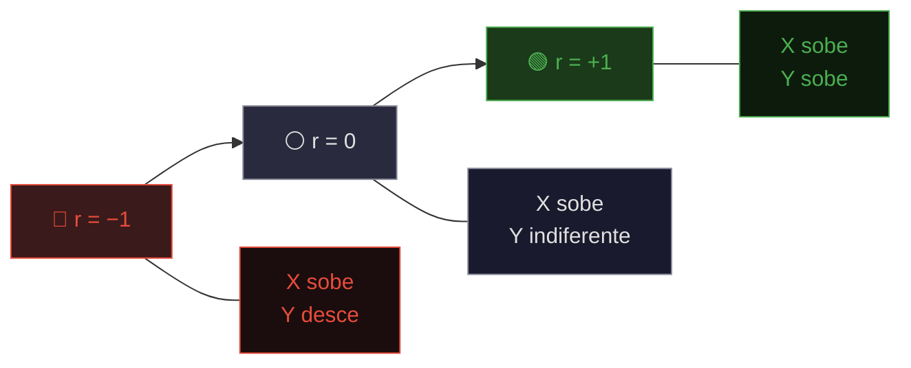

# Coeficiente De Pearson (r)

## Introdução

&emsp;&emsp;&emsp;Bem como sabemos que correlação mede a força e a direção da relação entre duas variáveis. Vimos também que o scatterplot mostra visualmente o padrão antes de qualquer cálculo. Agora chegou o momento de **quantificar** tudo isso. Como transformar o que vemos no gráfico num número que possamos comparar, interpretar e comunicar?

&emsp;&emsp;&emsp;A resposta é o **coeficiente de correlação de Pearson** — o mais usado e o mais importante de todos os coeficientes de correlação. Voltemos ao professor com as horas de estudo e as notas.

- Aluno `1 2 3 4 5 6 7 8 9 10`
- Horas de estudo (X) `1 2 3 4 5 6 7 8 9 10`
- Nota (Y) `4 5 7 8 10 11 13 14 16 17`

> 💡 **Regra de Ouro:** Pearson só mede relações **lineares**. Se o scatterplot mostrar uma curva, o Pearson pode enganar-nos. Nesse caso, devemos usar Spearman. Esta é uma das limitações mais importantes que precisamos de ter sempre presente.


&emsp;&emsp;&emsp;O **coeficiente de correlação de Pearson** (r) é uma medida que quantifica a **força** e a **direção** da **relação linear** entre **duas variáveis quantitativas**. O r varia sempre entre **−1 e +1**:

- **r = +1** → relação linear positiva perfeita (todos os pontos numa reta ascendente)
- **r = 0** → ausência de relação linear
- **r = −1** → relação linear negativa perfeita (todos os pontos numa reta descendente)

<details>
<summary> A Escala Da Correlação: −1, 0 e +1</summary>

</details>

&emsp;&emsp;&emsp;Quanto mais próximo de ±1, mais forte a relação linear. O **sinal** indica a direção. Esta escala é fundamental porque nos dá uma medida **universal** — podemos comparar correlações entre estudos completamente diferentes.

**Fórmula principal do Coeficiente De Pearson (r)**

$$r = \frac{\sum (x_i - \bar{x})(y_i - \bar{y})}{\sqrt{\sum (x_i - \bar{x})^2} \cdot \sqrt{\sum (y_i - \bar{y})^2}}$$

Onde:
- **xi, yi** = cada par de valores
- **x̄, ȳ** = médias de cada variável
- **Σ** = soma de todos os pares

**Fórmula alternativa do Coeficiente De Pearson (r)**

$$r = \frac{n \sum x_i y_i - \sum x_i \sum y_i}{\sqrt{\left[ n \sum x_i^2 - (\sum x_i)^2 \right] \cdot \left[ n \sum y_i^2 - (\sum y_i)^2 \right]}}$$

Onde **n** = número de pares.

A fórmula compara **duas coisas**:

- **Covariação** (numerador): quanto X e Y variam **juntos**
- **Variabilidade individual** (denominador): quanto X e Y variam **sozinhos**

&emsp;&emsp;&emsp;Se a covariação for grande em relação à variabilidade individual, **r é alto**. Se for pequena, **r é baixo**. Esta lógica é a chave para entender porque o r funciona. Esta segunda fórmula é mais prática para calcular à mão, porque evita calcular os desvios individualmente. No entanto, a primeira fórmula é mais **intuitiva** — mostra-nos exatamente o que o r está a medir.


### Cálculo Passo à Passo

Vamos calcular o r para o exemplo das horas de estudo.
- Aluno `1 2 3 4 5 6 7 8 9 10`
- Horas de estudo (X) `1 2 3 4 5 6 7 8 9 10`
- Nota (Y) `4 5 7 8 10 11 13 14 16 17`


**Passo 1 — Calcular as médias**

$$\bar{x} = \frac{1+2+3+4+5+6+7+8+9+10}{10} = \frac{55}{10} = 5{,}5$$

$$\bar{y} = \frac{4+5+7+8+10+11+13+14+16+17}{10} = \frac{105}{10} = 10{,}5$$

**Passo 2 — Calcular os desvios**

| Aluno | x | y | (x − x̄) | (y − ȳ) |
|---------|---|----|---------|---------|
| 1 | 1 | 4 | −4,5 | −6,5 |
| 2 | 2 | 5 | −3,5 | −5,5 |
| 3 | 3 | 7 | −2,5 | −3,5 |
| 4 | 4 | 8 | −1,5 | −2,5 |
| 5 | 5 | 10 | −0,5 | −0,5 |
| 6 | 6 | 11 | +0,5 | +0,5 |
| 7 | 7 | 13 | +1,5 | +2,5 |
| 8 | 8 | 14 | +2,5 | +3,5 |
| 9 | 9 | 16 | +3,5 | +5,5 |
| 10 | 10 | 17 | +4,5 | +6,5 |

**Passo 3 — Calcular produtos e quadrados**

| (x−x̄)(y−ȳ) | (x−x̄)² | (y−ȳ)² |
|-------------|--------|--------|
| +29,25 | 20,25 | 42,25 |
| +19,25 | 12,25 | 30,25 |
| +8,75 | 6,25 | 12,25 |
| +3,75 | 2,25 | 6,25 |
| +0,25 | 0,25 | 0,25 |
| +0,25 | 0,25 | 0,25 |
| +3,75 | 2,25 | 6,25 |
| +8,75 | 6,25 | 12,25 |
| +19,25 | 12,25 | 30,25 |
| +29,25 | 20,25 | 42,25 |
| **Σ = 122,5** | **Σ = 82,5** | **Σ = 182,5** |

**Passo 4 — Aplicar a fórmula**

$$r = \frac{122{,}5}{\sqrt{82{,}5 \times 182{,}5}} = \frac{122{,}5}{\sqrt{15\,056{,}25}} = \frac{122{,}5}{122{,}7} \approx +0{,}998$$

### ✅ Conclusão

**r ≈ +0,998** → correlação **positiva**, **muito forte**.

1. Quanto à DIREÇÃO --> ***correlação positiva*** (r > 0)
2. Quanto à FORÇA --> ***correlação muito forte (|r| > 0,8)***

> Quem estuda mais tende a tirar melhores notas, e a relação é quase perfeita. O valor tão próximo de +1 indica que os pontos estão quase perfeitamente alinhados numa reta ascendente.

### Interpretação Do r

**Direção**

- **r > 0** → positiva (X↑ → Y↑)
- **r < 0** → negativa (X↑ → Y↓)
- **r ≈ 0** → nula (sem relação linear)

**Força**

| r | Força |
|-----|-------|
| 0,00 — 0,19 | Muito fraca |
| 0,20 — 0,39 | Fraca |
| 0,40 — 0,59 | Moderada |
| 0,60 — 0,79 | Forte |
| 0,80 — 1,00 | Muito forte |

&emsp;&emsp;&emsp;Esta escala é uma **convenção** — diferentes autores usam ligeiras variações. O importante é perceber que a força aumenta à medida que |r| se aproxima de 1.


### Coeficiente De Determinação — r² 

O **r²** é o quadrado do r. Diz-nos **que percentagem da variação de Y é explicada por X**.

**Fórmula:**

$$r^2 = r \times r$$

**Exemplo:** Se r = 0,8, então r² = 0,64.

**Interpretação:** 64% da variação de Y é explicada por X. Os restantes 36% devem-se a outros fatores.

**Porque é importante:**
- r = 0,5 parece moderado, mas r² = 0,25 significa que só 25% da variação é explicada
- r = 0,9 parece forte, e r² = 0,81 significa 81% explicado
- O r² é mais **honesto** sobre o poder explicativo

O r² é especialmente útil em contextos de **regressão** e **machine learning**, onde queremos saber quanto do comportamento de Y é capturado pelo modelo.<br><br>

Usamos Pearson quando:

- Temos **duas variáveis quantitativas** (intervalar ou razão)
- A relação é **linear** (confirmamos no scatterplot)
- **Não há outliers** fortes
- As variáveis seguem aproximadamente uma **distribuição normal**
- Queremos uma medida **padrão** e **comparável** entre estudos<br><br>


Não usamos Pearson quando:

- **As variáveis são ordinais** → usamos Spearman
- **Há outliers** fortes → usamos Spearman
- A relação é **não-linear** (curva) → usamos Spearman ou outros
- A relação é **monótona mas não linear** → usamos Spearman
- Temos **variáveis nominais** → usamos V de Cramér ou Qui-quadrado
- A amostra é **muito pequena** → cuidado com a instabilidade


<details>
<summary>📌 Exemplo Completo — Cálculo do Coeficiente de Correlação de Pearson</summary>

**Problema:** Calcular o r entre o preço de um produto (X) e a quantidade vendida (Y).

| Semana | Preço (X) | Quantidade (Y) |
|---------|---------|---------|
| 1 | 10 | 100 |
| 2 | 12 | 90 |
| 3 | 14 | 75 |
| 4 | 16 | 60 |
| 5 | 18 | 50 |

### Passo 1 — Médias

$$\bar{x} = \frac{10+12+14+16+18}{5} = 14$$

$$\bar{y} = \frac{100+90+75+60+50}{5} = 75$$

### Passo 2 — Desvios e produtos

| x | y | (x−x̄) | (y−ȳ) | (x−x̄)(y−ȳ) | (x−x̄)² | (y−ȳ)² |
|---|---|-------|-------|-------------|--------|--------|
| 10 | 100 | −4 | +25 | −100 | 16 | 625 |
| 12 | 90 | −2 | +15 | −30 | 4 | 225 |
| 14 | 75 | 0 | 0 | 0 | 0 | 0 |
| 16 | 60 | +2 | −15 | −30 | 4 | 225 |
| 18 | 50 | +4 | −25 | −100 | 16 | 625 |
| | | | | **Σ = −260** | **Σ = 40** | **Σ = 1700** |

### Passo 3 — Fórmula

$$r = \frac{-260}{\sqrt{40 \times 1700}} = \frac{-260}{\sqrt{68\,000}} = \frac{-260}{260{,}8} \approx -0{,}997$$

### ✅ Conclusão

**r ≈ −0,997** → correlação **negativa**, **muito forte**.

Quando o preço sobe, a quantidade vendida desce quase perfeitamente. Esta é uma relação típica da lei da procura em economia.
> O sinal é a bússola: diz-nos para onde vamos. Positivo, quando as duas variáveis sobem de mãos dadas; negativo, quando uma sobe enquanto a outra desce. O número é a força do vento: perto de 1 ou −1, sopra forte e seguro; perto de 0, é apenas uma brisa — ou nem isso.

</details>


<details>
<summary>📌 Exemplo Completo — Cálculo do Coeficiente de Correlação de Pearson (r = 0)</summary>

**Problema:** Calcular o coeficiente de correlação entre o número do sapato (X) e o QI (Y) de 8 pessoas.

| Pessoa | X (sapato) | Y (QI) |
|--------|------------|--------|
| 1 | 38 | 100 |
| 2 | 39 | 115 |
| 3 | 40 | 95 |
| 4 | 41 | 120 |
| 5 | 42 | 105 |
| 6 | 43 | 98 |
| 7 | 44 | 110 |
| 8 | 45 | 102 |


**Passo 1 — Calcular as médias de X e Y**

$$
\bar{x} = \frac{38+39+40+41+42+43+44+45}{8} = \frac{332}{8} = 41{,}5
$$

$$
\bar{y} = \frac{100+115+95+120+105+98+110+102}{8} = \frac{845}{8} = 105{,}625
$$


**Passo 2 — Calcular os desvios de cada valor em relação à média**

| Pessoa | X | Y | X − x̄ | Y − ȳ |
|--------|---|-----|--------|--------|
| 1 | 38 | 100 | 38 − 41,5 = **−3,5** | 100 − 105,625 = **−5,625** |
| 2 | 39 | 115 | 39 − 41,5 = **−2,5** | 115 − 105,625 = **9,375** |
| 3 | 40 | 95 | 40 − 41,5 = **−1,5** | 95 − 105,625 = **−10,625** |
| 4 | 41 | 120 | 41 − 41,5 = **−0,5** | 120 − 105,625 = **14,375** |
| 5 | 42 | 105 | 42 − 41,5 = **0,5** | 105 − 105,625 = **−0,625** |
| 6 | 43 | 98 | 43 − 41,5 = **1,5** | 98 − 105,625 = **−7,625** |
| 7 | 44 | 110 | 44 − 41,5 = **2,5** | 110 − 105,625 = **4,375** |
| 8 | 45 | 102 | 45 − 41,5 = **3,5** | 102 − 105,625 = **−3,625** |

**Passo 3 — Multiplicar os desvios (X − x̄) × (Y − ȳ)**

| Pessoa | (X − x̄) | (Y − ȳ) | Produto |
|--------|----------|----------|---------|
| 1 | −3,5 | −5,625 | **19,6875** |
| 2 | −2,5 | 9,375 | **−23,4375** |
| 3 | −1,5 | −10,625 | **15,9375** |
| 4 | −0,5 | 14,375 | **−7,1875** |
| 5 | 0,5 | −0,625 | **−0,3125** |
| 6 | 1,5 | −7,625 | **−11,4375** |
| 7 | 2,5 | 4,375 | **10,9375** |
| 8 | 3,5 | −3,625 | **−12,6875** |
| **Total** | | | **−8,5** |

> **🔍 O que este total significa:** Os produtos são uma mistura de positivos e negativos, e quase se anulam. A soma é **−8,5**, muito próxima de zero. É o primeiro sinal de que a correlação é **nula**.


**Passo 4 — Calcular os quadrados dos desvios de X e de Y**

| Pessoa | (X − x̄)² | (Y − ȳ)² |
|--------|----------|----------|
| 1 | (−3,5)² = **12,25** | (−5,625)² = **31,64** |
| 2 | (−2,5)² = **6,25** | (9,375)² = **87,89** |
| 3 | (−1,5)² = **2,25** | (−10,625)² = **112,89** |
| 4 | (−0,5)² = **0,25** | (14,375)² = **206,64** |
| 5 | (0,5)² = **0,25** | (−0,625)² = **0,39** |
| 6 | (1,5)² = **2,25** | (−7,625)² = **58,14** |
| 7 | (2,5)² = **6,25** | (4,375)² = **19,14** |
| 8 | (3,5)² = **12,25** | (−3,625)² = **13,14** |
| **Total** | **42** | **529,87** |

**Passo 5 — Aplicar a fórmula de Pearson**

$$
r = \frac{\sum (x_i - \bar{x})(y_i - \bar{y})}{\sqrt{\sum (x_i - \bar{x})^2 \cdot \sum (y_i - \bar{y})^2}}
$$

$$
r = \frac{-8{,}5}{\sqrt{42 \times 529{,}87}} = \frac{-8{,}5}{\sqrt{22254{,}54}} = \frac{-8{,}5}{149{,}18} \approx \mathbf{-0{,}057}
$$


**Passo 6 — Interpretar o resultado**

$$ r \approx -0{,}057 $$

✅ O coeficiente de correlação é **−0,057** — praticamente **zero**. Correlação **nula**.

> **🔍 Interpretação:** O valor de r está **muito próximo de 0**, o que significa que **não existe relação linear** entre o número do sapato e o QI. Saber o número do sapato de alguém **não ajuda** a prever o seu QI — e vice-versa. As duas variáveis são **independentes**.

</details>


<details>
<summary>🐍 Exemplo do Coeficiente de Correlação de Pearson no Python</summary>

**Dados:** Horas de estudo (X) e nota final (Y) de 8 alunos.

**X:** `1, 2, 3, 4, 5, 6, 7, 8`
**Y:** `4, 5, 7, 8, 10, 11, 13, 14`

- _Opção 1 — Função direta (scipy)_

```python
from scipy.stats import pearsonr

x = [1, 2, 3, 4, 5, 6, 7, 8]
y = [4, 5, 7, 8, 10, 11, 13, 14]

r, p = pearsonr(x, y)
print(f"r = {r}")
print(f"p-value = {p}")
```

- _Opção 2 — Função direta (pandas)_

```python
import pandas as pd

x = [1, 2, 3, 4, 5, 6, 7, 8]
y = [4, 5, 7, 8, 10, 11, 13, 14]

df = pd.DataFrame({"X": x, "Y": y})
r = df["X"].corr(df["Y"])
print(f"r = {r}")
```

- _Opção 3 — Função direta (numpy)_

```python
import numpy as np

x = [1, 2, 3, 4, 5, 6, 7, 8]
y = [4, 5, 7, 8, 10, 11, 13, 14]

r = np.corrcoef(x, y)[0, 1]
print(f"r = {r}")
```

</details>

<details>
<summary>📊 Exemplo do Coeficiente de Correlação de Pearson no R</summary>

**Dados:** Horas de estudo (X) e nota final (Y) de 8 alunos.

**X:** `1, 2, 3, 4, 5, 6, 7, 8`
**Y:** `4, 5, 7, 8, 10, 11, 13, 14`

- _Opção 1 — Função direta (base R)_

```r
x <- c(1, 2, 3, 4, 5, 6, 7, 8)
y <- c(4, 5, 7, 8, 10, 11, 13, 14)

r <- cor(x, y)
print(paste("r =", r))
```

- _Opção 2 — Com teste de significância (base R)_

```r
x <- c(1, 2, 3, 4, 5, 6, 7, 8)
y <- c(4, 5, 7, 8, 10, 11, 13, 14)

teste <- cor.test(x, y)
print(teste)
```

- _Opção 3 — Função direta (dplyr)_

```r
library(dplyr)

df <- data.frame(
  X = c(1, 2, 3, 4, 5, 6, 7, 8),
  Y = c(4, 5, 7, 8, 10, 11, 13, 14)
)

r <- df %>%
  summarise(correlacao = cor(X, Y))
print(r)
```

</details>

<details>
<summary>📊 Exemplo do Coeficiente de Correlação de Pearson no Excel</summary>

**Dados:** Horas de estudo (X) e nota final (Y) de 8 alunos.

**Passo 1 — Inserir os dados na planilha:**

| - | A | B |
|---|---|---|
| **1** | X (horas) | Y (nota) |
| **2** | 1 | 4 |
| **3** | 2 | 5 |
| **4** | 3 | 7 |
| **5** | 4 | 8 |
| **6** | 5 | 10 |
| **7** | 6 | 11 |
| **8** | 7 | 13 |
| **9** | 8 | 14 |

**Passo 2 — Calcular a correlação:**

Em qualquer célula vazia, digite:

```
=CORREL(A2:A9;B2:B9)
```

Resultado: **0,997**

✅ A correlação é **0,997** — positiva muito forte.

**📌 Resumo das Fórmulas no Excel**

| Função | Inglês | Português | Resultado |
|--------|--------|-----------|-----------|
| Correlação | `=CORREL(A2:A9,B2:B9)` | `=CORREL(A2:A9;B2:B9)` | 0,997 |

> **💡 Dica:** A função `CORREL` calcula apenas a correlação de **Pearson**. Para a correlação de **Spearman**, é preciso calcular os ranks primeiro e depois aplicar `CORREL` aos ranks.

</details>

## EXERCÍCIOS

<details>
<summary>📗 Exercício 1 — Calcular o r de Pearson</summary>

**Enunciado:** Calcule o coeficiente de Pearson para os dados abaixo.

| X | Y |
|---|---|
| 1 | 2 |
| 2 | 4 |
| 3 | 5 |
| 4 | 4 |
| 5 | 5 |

<details>
<summary>💡 Ver resposta</summary>

**Resposta:**

Média X = 3, Média Y = 4

| xi | yi | xi − 3 | yi − 4 | Produto | (xi−3)² | (yi−4)² |
|-----|-----|---------|---------|---------|---------|---------|
| 1 | 2 | −2 | −2 | 4 | 4 | 4 |
| 2 | 4 | −1 | 0 | 0 | 1 | 0 |
| 3 | 5 | 0 | 1 | 0 | 0 | 1 |
| 4 | 4 | 1 | 0 | 0 | 1 | 0 |
| 5 | 5 | 2 | 1 | 2 | 4 | 1 |
| **Total** | | | | **6** | **10** | **6** |

r = 6 / (√10 × √6) = 6 / (3,16 × 2,45) = 6 / 7,74 ≈ **0,775**

**Interpretação:** Correlação positiva forte.

</details>
</details>

<details>
<summary>📗 Exercício 2 — Interpretar o r</summary>

**Enunciado:** Um estudo encontrou r = −0,82 entre o preço de um produto e a quantidade vendida. O que podes concluir?

<details>
<summary>💡 Ver resposta</summary>

**Resposta:**

r = −0,82 indica uma **correlação negativa forte**. Isto significa que:
- Quando o preço aumenta, a quantidade vendida tende a **diminuir**.
- A relação é **forte** (|r| > 0,7).
- r² = 0,82² ≈ 0,67 → **67% da variação da quantidade vendida é explicada pelo preço**.

</details>
</details>

<details>
<summary>📗 Exercício 3 — Calcular o r²</summary>

**Enunciado:** Se r = 0,8, qual é o r²? O que significa?

<details>
<summary>💡 Ver resposta</summary>

**Resposta:**

r² = 0,8² = **0,64**

**Interpretação:** 64% da variação de Y é explicada por X. Os restantes 36% devem-se a outros fatores ou aleatoriedade.

</details>
</details>

<details>
<summary>📗 Exercício 4 — Propriedades do r</summary>

**Enunciado:** Se multiplicarmos todos os valores de X por 3, o que acontece ao r?

<details>
<summary>💡 Ver resposta</summary>

**Resposta:**

O r **não muda**. O coeficiente de Pearson é **invariante a transformações lineares**. Multiplicar X por 3 é uma transformação linear (mudança de escala), e o r permanece o mesmo.

</details>
</details>

<details>
<summary>📗 Exercício 5 — Quando NÃO usar Pearson</summary>

**Enunciado:** Em que situações NÃO devemos usar o coeficiente de Pearson?

<details>
<summary>💡 Ver resposta</summary>

**Resposta:**

Não devemos usar Pearson quando:
- As variáveis são **ordinais** → usar Spearman
- Há **outliers** fortes → usar Spearman
- A relação é **não-linear** (curva) → usar Spearman
- Temos **variáveis nominais** → usar V de Cramér
- A amostra é **muito pequena**

</details>
</details>

> Em resumo: o coeficiente de Pearson é a medida padrão da correlação linear. Dá-nos um número entre −1 e +1 que resume força e direção. É poderoso, mas exige pressupostos — vemos sempre o scatterplot antes de confiar no r. A sua ligação ao r² torna-o fundamental para qualquer análise preditiva.