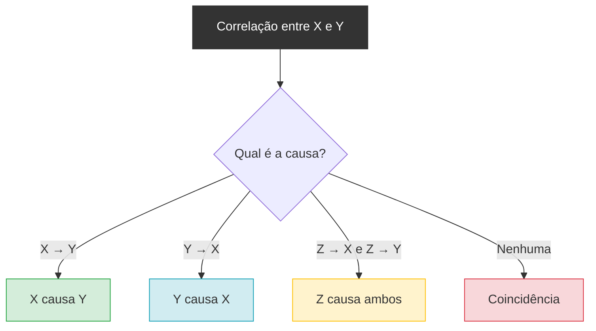
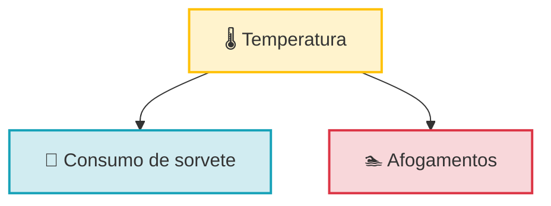

# <center>CORRELAÇÃO VS CAUSALIDADE</center>

### INTRODUÇÃO

&emsp;&emsp;&emsp;Nas aulas anteriores estudámos como medir a correlação entre duas variáveis. Vimos o coeficiente de Pearson, o coeficiente de Spearman, e aprendemos a interpretar os valores de r e ρ. Vimos também que a correlação nos diz se duas variáveis andam juntas, para que lado, e com que força. Mas há um erro que atravessa toda a estatística e que precisamos de enfrentar de frente: **assumir que correlação implica causalidade**. Este erro é tão comum que tem um nome em latim — *cum hoc ergo propter hoc* ("com isto, portanto por causa disto"). E é tão perigoso que aparece em jornais, em decisões políticas, em diagnósticos médicos e em estratégias de negócio.<br><br>

&emsp;&emsp;&emsp;**Exemplo clássico:** Num estudo, verificou-se que o consumo de sorvete e o número de afogamentos têm uma correlação de r = 0,95. Uma correlação fortíssima. Será que comer sorvete causa afogamentos? **Não.** A explicação é muito mais simples: quando está calor, as pessoas comem mais sorvete **e** vão mais à praia. A variável que causa ambas é a **temperatura**. O sorvete e os afogamentos estão correlacionados, mas não há relação causal direta entre eles.<br><br>

&emsp;&emsp;&emsp;Este é o tipo de armadilha que precisamos de aprender a evitar. Nesta aula, vamos estudar a diferença entre correlação e causalidade, os quatro cenários possíveis quando duas variáveis estão correlacionadas, o conceito de variável de confusão, e as três condições necessárias para estabelecer causalidade. Antes de avançarmos, precisamos de perceber exatamente o que significa cada termo.

> A **causalidade** é uma relação em que uma variável (a causa) produz um efeito noutra variável (o efeito). A **correlação** é apenas uma medida de associação — não nos diz **nada** sobre a direção da causa.

&emsp;&emsp;&emsp;É fundamental perceber a diferença:

- **Correlação** → "X e Y andam juntos"
- **Causalidade** → "X faz Y acontecer"

&emsp;&emsp;&emsp;São coisas completamente diferentes. Uma correlação forte pode existir sem qualquer relação causal. E uma relação causal pode existir sem correlação forte (se houver outras variáveis a interferir). Vejamos um exemplo para clarificar. Se medirmos o número de horas de sol e o número de gelados vendidos, encontramos uma correlação forte. Mas será que o sol **causa** a venda de gelados? Sim, provavelmente. Agora, se medirmos o número de gelados vendidos e o número de afogamentos, também encontramos uma correlação forte. Mas será que os gelados **causam** afogamentos? Não. A causa é a temperatura, que influencia ambos. Este erro é comum por várias razões que vale a pena compreender.<br><br>

**1. O cérebro humano procura padrões**

&emsp;&emsp;&emsp;Estamos programados para encontrar padrões. Quando vemos duas coisas a acontecer juntas, o nosso cérebro grita "uma causa a outra!". Esta é uma tendência natural — mas em estatística, é uma armadilha.<br><br>

**2. A correlação é fácil de calcular, a causalidade não**

&emsp;&emsp;&emsp;Calcular uma correlação é simples: temos os dados, aplicamos a fórmula, obtemos um número. Estabelecer causalidade exige **experiências controladas**, **estudos longitudinais** e **muito mais cuidado**. É muito mais fácil ficar pela correlação.<br><br>

**3. A comunicação simplifica tudo**

&emsp;&emsp;&emsp;Quando um jornal diz "estudo revela que X está ligado a Y", está a simplificar. O estudo original provavelmente falava de correlação, mas a manchete sugere causalidade. Esta simplificação é perigosa.<br><br>

**4. Confundimos sequência temporal com causa**

&emsp;&emsp;&emsp;Se X acontece antes de Y, tendemos a assumir que X causou Y. Mas a ordem temporal **não é suficiente** para estabelecer causalidade. Muitas coisas acontecem antes de outras sem as causar.

### OS CENÁRIOS POSSÍVEIS

&emsp;&emsp;&emsp;Quando duas variáveis estão correlacionadas, há **quatro cenários possíveis**. Precisamos de considerar todos antes de tirar conclusões.

**1. X causa Y**

&emsp;&emsp;&emsp;A variável X influencia diretamente a variável Y. Este é o cenário que queremos provar quando falamos de causalidade.
**Exemplo:** Fumar causa cancro do pulmão.<br><br>

**2. Y causa X**

&emsp;&emsp;&emsp;A variável Y influencia diretamente a variável X. A direção da causa é a oposta da que podíamos supor.

**Exemplo:** As pessoas com cancro tendem a fumar menos (porque estão doentes). Se medirmos "fumar" e "cancro" ao mesmo tempo, podemos encontrar uma correlação negativa — mas a causa é o cancro, não o contrário.<br><br>

**3. Z causa ambos (variável de confusão)**

&emsp;&emsp;&emsp;Uma terceira variável (Z) causa tanto X como Y. A correlação entre X e Y é **espúria** — não há relação causal direta entre eles.

**Exemplo:** A temperatura causa o consumo de sorvete e os afogamentos. O sorvete e os afogamentos estão correlacionados, mas nenhum causa o outro.<br><br>

**4. Coincidência**

&emsp;&emsp;&emsp;As duas variáveis não têm qualquer relação — a correlação é puro acaso. Isto acontece especialmente com **amostras pequenas** ou quando **testamos muitas combinações** de variáveis.

**Exemplo:** O número de filmes do Nicolas Cage e o número de afogamentos em piscinas. Correlação alta — mas pura coincidência.

<center><details>
<summary>Diagrama dos Cenários</summary> 


</details></center>

###  VARIÁVEIS DE CONFUSÃO

&emsp;&emsp;&emsp;A **variável de confusão** (ou *confounding variable*) é uma terceira variável que causa tanto X como Y, criando uma correlação espúria.

**Exemplo visual:**



&emsp;&emsp;&emsp;A temperatura causa **ambas**. O sorvete e os afogamentos estão correlacionados, mas não há relação causal direta entre eles.

**Outros exemplos de variáveis de confusão:**

- **Nível socioeconómico** → causa tanto "ter livros em casa" como "melhores notas na escola"
- **Idade** → causa tanto "consumo de medicamentos" como "problemas de saúde"
- **Genética** → causa tanto "altura" como "peso"

**Como detetar uma variável de confusão:**

- Perguntamos: "Existe uma terceira variável que possa causar ambas?"
- Controlamos essa variável (correlação parcial)
- Se a correlação desaparecer, era espúria


### CORRELAÇÃO ESPÚRIA

&emsp;&emsp;&emsp;A **correlação espúria** é uma correlação que parece significativa mas é causada por outra coisa — variável de confusão, coincidência ou erro de amostragem.

**Exemplos famosos:**

- **Nicolas Cage vs. Afogamentos** → correlação alta, mas pura coincidência
- **Vendas de gelados vs. Afogamentos** → variável de confusão (temperatura)
- **Número de bombeiros vs. Danos de incêndio** → variável de confusão (tamanho do incêndio)

**Porque é perigosa:**

- Pode levar a decisões erradas
- Pode gerar teorias falsas
- Pode ser usada para manipular opiniões

**Como evitar:**

- Vemos sempre o scatterplot
- Pensamos em variáveis de confusão
- Não assumimos causalidade sem experiência controlada
- Desconfiamos de correlações "perfeitas demais"


### COMO ESTABELECER CAUSALIDADE

&emsp;&emsp;&emsp;Se a correlação não basta, o que é preciso para estabelecer causalidade? A resposta tem **três pilares**.

**1. Correlação**

&emsp;&emsp;&emsp;Primeiro, é preciso que exista uma **correlação** entre X e Y. Sem correlação, não há causalidade a estabelecer. Mas a correlação é apenas o **primeiro passo**.

**2. Ordem temporal**

&emsp;&emsp;&emsp;A causa tem de **preceder** o efeito. Se X causa Y, então X tem de acontecer **antes** de Y. Isto exige **estudos longitudinais** — medir as variáveis ao longo do tempo.

**3. Ausência de variáveis de confusão**

&emsp;&emsp;&emsp;É preciso **eliminar** a possibilidade de uma terceira variável estar a causar ambas. Isto exige **experiências controladas** — manipular X e ver se Y muda, mantendo tudo o resto constante.

**4. O padrão-ouro: RCT**

&emsp;&emsp;&emsp;O **ensaio clínico randomizado** (RCT — *Randomized Controlled Trial*) é o padrão-ouro para estabelecer causalidade. Os participantes são **aleatoriamente** atribuídos a grupos (tratamento vs. controlo), eliminando variáveis de confusão.

**Exemplo:** Para provar que um medicamento causa melhoria, damos o medicamento a um grupo e um placebo a outro, e comparamos. A randomização garante que não há variáveis de confusão.


### 7. EXEMPLOS CLÁSSICOS

#### 7.1 Sorvete e afogamentos

- **Correlação:** r = 0,95
- **Variável de confusão:** temperatura
- **Conclusão:** não há causalidade direta

#### 7.2 Fumar e cancro

- **Correlação:** r = 0,7 (forte)
- **Ordem temporal:** fumar precede o cancro (estudos longitudinais)
- **Variáveis de confusão:** controladas em estudos
- **Conclusão:** há causalidade estabelecida

#### 7.3 Número de bombeiros e danos de incêndio

- **Correlação:** r = 0,8 (forte)
- **Variável de confusão:** tamanho do incêndio (causa mais bombeiros e mais danos)
- **Conclusão:** não há causalidade direta — o tamanho do incêndio causa ambos

#### 7.4 Nicolas Cage e afogamentos

- **Correlação:** r = 0,67
- **Explicação:** pura coincidência
- **Conclusão:** correlação espúria


## 8. REGRAS PARA EVITAR O ERRO

&emsp;&emsp;&emsp;Para evitarmos o erro de confundir correlação com causalidade, seguimos estas regras.

**Regra 1 — Nunca assumimos causalidade só com correlação.** A correlação é o ponto de partida, não o ponto de chegada.

**Regra 2 — Procuramos variáveis de confusão.** Perguntamos sempre: "Existe uma terceira variável que possa causar ambas?"

**Regra 3 — Verificamos a ordem temporal.** A causa tem de preceder o efeito. Isto exige estudos longitudinais.

**Regra 4 — Usamos desenho experimental.** O RCT é o padrão-ouro para estabelecer causalidade.

**Regra 5 — Consideramos o contexto.** A plausibilidade biológica, física ou social importa. Uma correlação entre duas variáveis sem qualquer mecanismo plausível é suspeita.

**Regra 6 — Desconfiamos de correlações "perfeitas demais".** Se r = 0,99, é provável que haja algo errado — ou uma variável de confusão, ou um erro de cálculo.


&emsp;&emsp;&emsp;Nem sempre precisamos de estabelecer causalidade. Há situações em que a correlação **por si só** é suficiente.

**Quando queremos prever, não explicar:** Se queremos prever Y a partir de X, basta que haja correlação. Não precisamos de saber **porquê**.

**Quando a causalidade é óbvia:** Se X é "altura" e Y é "peso", a correlação basta — a causalidade é evidente e não precisa de ser provada.

**Quando a experiência não é possível:** Em muitas áreas (economia, sociologia, epidemiologia), não podemos fazer RCTs. A correlação é o melhor que temos.

**Quando queremos apenas explorar:** Na análise exploratória de dados, a correlação é suficiente para identificar padrões e gerar hipóteses.


## 11. EXEMPLO PRÁTICO COMPLETO

**Problema:** Um estudo encontrou uma correlação de r = 0,85 entre o número de horas que os alunos passam em bibliotecas e as suas notas finais. Podemos concluir que estudar em bibliotecas causa melhores notas?

**Análise:**

1. **Correlação:** Sim, r = 0,85 é forte.
2. **Ordem temporal:** Não sabemos se os alunos vão à biblioteca **antes** ou **depois** de tirarem boas notas.
3. **Variáveis de confusão:** Várias possibilidades:
   - **Motivação** → alunos motivados vão mais à biblioteca **e** estudam mais
   - **Nível socioeconómico** → alunos com mais recursos têm acesso a bibliotecas **e** mais apoio em casa
   - **Inteligência** → alunos mais inteligentes podem preferir bibliotecas **e** tirar melhores notas
4. **Conclusão:** Não podemos concluir causalidade. A correlação pode ser explicada por uma ou mais variáveis de confusão.

**Para estabelecer causalidade:** Precisaríamos de um RCT — atribuir aleatoriamente alunos a "usar biblioteca" vs. "não usar biblioteca" e comparar as notas. Mas isto seria antiético e impraticável.

### Exemplo Prático usando Python

<details>
<summary>📌 Exemplo Prático usando Python</summary>
```python
import numpy as np
import pandas as pd
from scipy.stats import pearsonr, spearmanr
import matplotlib.pyplot as plt

- _Dados de exemplo: Consumo de sorvete e afogamentos ao longo de 12 meses_
np.random.seed(42)
temperatura = np.random.normal(25, 5, 12)  # _Temperatura média mensal (°C)_
sorvete = 50 + 15 * temperatura + np.random.normal(0, 20, 12)  # _Consumo de sorvete_
afogamentos = 5 + 2 * temperatura + np.random.normal(0, 5, 12)  # _Número de afogamentos_

- _1. CORRELAÇÃO SIMPLES ENTRE SORVETE E AFOGAMENTOS_
r_sorvete_afog, p_sorvete_afog = pearsonr(sorvete, afogamentos)
print(f"Correlação Sorvete vs Afogamentos (Pearson): r = {r_sorvete_afog:.4f}, p = {p_sorvete_afog:.4e}")

- _2. CORRELAÇÃO CONTROLANDO PELA TEMPERATURA (CORRELAÇÃO PARCIAL)_
- _Resíduos de sorvete após remover efeito da temperatura_
resid_sorvete = sorvete - np.polyval(np.polyfit(temperatura, sorvete, 1), temperatura)
resid_afog = afogamentos - np.polyval(np.polyfit(temperatura, afogamentos, 1), temperatura)
r_parcial, p_parcial = pearsonr(resid_sorvete, resid_afog)
print(f"Correlação Parcial (controlando temperatura): r = {r_parcial:.4f}, p = {p_parcial:.4e}")

- _3. VISUALIZAÇÃO_
fig, axes = plt.subplots(1, 2, figsize=(12, 5))

- _Scatterplot sorvete vs afogamentos_
axes[0].scatter(sorvete, afogamentos, color='#dc3545', alpha=0.7)
axes[0].set_xlabel('Consumo de Sorvete')
axes[0].set_ylabel('Afogamentos')
axes[0].set_title(f'Sorvete vs Afogamentos (r = {r_sorvete_afog:.2f})')
axes[0].grid(True, alpha=0.3)

- _Scatterplot temperatura vs sorvete e afogamentos_
axes[1].scatter(temperatura, sorvete, color='#17a2b8', alpha=0.7, label='Sorvete')
axes[1].scatter(temperatura, afogamentos * 10, color='#dc3545', alpha=0.7, label='Afogamentos (x10)')
axes[1].set_xlabel('Temperatura (°C)')
axes[1].set_ylabel('Valor')
axes[1].set_title('Temperatura vs Sorvete e Afogamentos')
axes[1].legend()
axes[1].grid(True, alpha=0.3)

plt.tight_layout()
plt.show()

- _4. INTERPRETAÇÃO_
print("\n--- INTERPRETAÇÃO ---")
print(f"A correlação bruta entre sorvete e afogamentos é {r_sorvete_afog:.2f} (forte).")
print(f"Após controlar pela temperatura, a correlação cai para {r_parcial:.2f} (fraca).")
print("Conclusão: A temperatura é uma variável de confusão.")
print("O sorvete e os afogamentos estão correlacionados, mas não há causalidade direta.")
```
</details>

## EXERCÍCIOS

<details>
<summary>📗 Exercício 1 — Identificar o cenário (Fácil)</summary>

**Enunciado:** Para cada situação, identifique qual dos quatro cenários se aplica:

a) Um estudo encontra correlação entre "número de televisores por casa" e "esperança de vida".  
b) Um estudo encontra correlação entre "consumo de tabaco" e "cancro do pulmão".  
c) Um estudo encontra correlação entre "número de filmes do Nicolas Cage" e "afogamentos em piscinas".  
d) Um estudo encontra correlação entre "horas de estudo" e "notas em exames".

<details>
<summary>💡 Ver resposta</summary>

a) **Variável de confusão (Z causa ambos):** O nível socioeconómico causa tanto mais televisores como maior esperança de vida.

b) **X causa Y:** O tabaco causa cancro do pulmão (estabelecido por estudos longitudinais e experimentais).

c) **Coincidência:** Pura coincidência estatística, sem relação causal.

d) **X causa Y (provavelmente):** Estudar causa melhores notas, mas é preciso controlar variáveis de confusão (motivação, inteligência).

</details>
</details>

<details>
<summary>📗 Exercício 2 — Variável de confusão (Médio)</summary>

**Enunciado:** Um estudo encontra uma correlação forte entre "venda de gelados" e "número de afogamentos". Identifique a variável de confusão e explique porque a correlação é espúria.

<details>
<summary>💡 Ver resposta</summary>

**Variável de confusão:** Temperatura.

**Explicação:** Quando está calor, as pessoas compram mais gelados **e** vão mais à praia (onde se afogam). A temperatura causa ambas as variáveis. A correlação entre gelados e afogamentos é espúria — não há relação causal direta entre eles.

</details>
</details>

<details>
<summary>📗 Exercício 3 — Estabelecer causalidade (Médio)</summary>

**Enunciado:** Quais são as três condições necessárias para estabelecer causalidade? Explique cada uma.

<details>
<summary>💡 Ver resposta</summary>

**1. Correlação:** É preciso que exista uma associação entre X e Y. Sem correlação, não há causalidade a estabelecer.

**2. Ordem temporal:** A causa tem de preceder o efeito. X tem de acontecer antes de Y. Isto exige estudos longitudinais.

**3. Ausência de variáveis de confusão:** É preciso eliminar a possibilidade de uma terceira variável estar a causar ambas. Isto exige experiências controladas ou randomização (RCT).

</details>
</details>

<details>
<summary>📗 Exercício 4 — RCT (Médio)</summary>

**Enunciado:** O que é um RCT e porque é considerado o padrão-ouro para estabelecer causalidade?

<details>
<summary>💡 Ver resposta</summary>

**RCT (Randomized Controlled Trial):** É um estudo em que os participantes são **aleatoriamente** atribuídos a grupos (tratamento vs. controlo).

**Porque é o padrão-ouro:** A randomização garante que não há variáveis de confusão — os grupos são estatisticamente equivalentes em todas as variáveis, exceto a que está a ser testada. Assim, qualquer diferença no resultado pode ser atribuída à intervenção.

</details>
</details>

<details>
<summary>📗 Exercício 5 — Correlação espúria (Difícil)</summary>

**Enunciado:** Encontre um exemplo de correlação espúria (real ou inventado) e explique porque é espúria.

<details>
<summary>💡 Ver resposta</summary>

**Exemplo:** Correlação entre "número de bombeiros num incêndio" e "danos causados pelo incêndio".

**Porque é espúria:** O tamanho do incêndio é a variável de confusão. Incêndios maiores atraem mais bombeiros **e** causam mais danos. Não são os bombeiros que causam os danos — pelo contrário, eles tentam minimizá-los.

**Outro exemplo:** Correlação entre "consumo de chocolate" e "número de prémios Nobel por país". Países mais ricos consomem mais chocolate e têm mais prémios Nobel. A riqueza é a variável de confusão.

</details>
</details>

<details>
<summary>📗 Exercício 6 — Quando a correlação basta (Difícil)</summary>

**Enunciado:** Em que situações a correlação por si só é suficiente, sem necessidade de estabelecer causalidade?

<details>
<summary>💡 Ver resposta</summary>

A correlação é suficiente quando:

1. **Queremos prever, não explicar:** Se o objetivo é prever Y a partir de X, basta a correlação.
2. **A causalidade é óbvia:** Ex: altura e peso — a causalidade é evidente.
3. **A experiência não é possível:** Em economia, sociologia, epidemiologia, não podemos fazer RCTs.
4. **Queremos apenas explorar:** Na análise exploratória, a correlação identifica padrões e gera hipóteses.

</details>
</details>