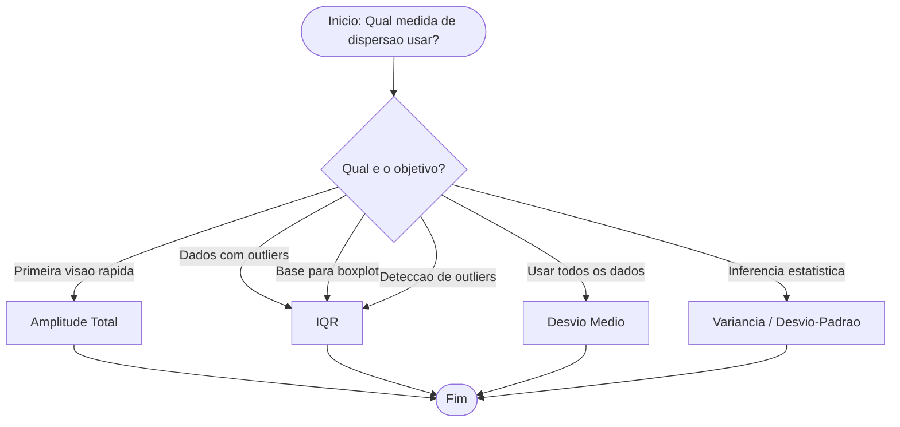

# <center>Medidas de Dispersão Absolutas</center>

## Introdução

&emsp;&emsp;&emsp;Nas aulas anteriores estudámos as **medidas de tendência central** (média, mediana e moda) e as **separatrizes** (quartis, decis e percentis). Todas elas respondem à mesma pergunta: **"Onde está o centro dos dados?"** Mas nenhuma responde a uma pergunta igualmente fundamental: **"Quão espalhados estão os dados?"**<br>

&emsp;&emsp;&emsp;Considera o seguinte problema prático:

**Duas turmas tiveram a mesma média (7,0) na prova:**
- **Turma A:** `6,0 | 6,5 | 7,0 | 7,5 | 8,0`
- **Turma B:** `0,0 | 2,0 | 7,0 | 10,0 | 10,0`

**Vamos calcular as medidas de tendência central para ambas:**

| Medida | Turma A | Turma B |
|---------|---------|---------|
| **Média** | 7,0 | 7,0 |
| **Mediana** | 7,0 | 7,0 |
| **Moda** | Amodal | 10,0 |

&emsp;&emsp;&emsp;A **média** e a **mediana** são **exatamente iguais** para as duas turmas. Se usássemos apenas estas medidas, concluiríamos que as turmas têm o mesmo desempenho. Mas isso é **falso**!

- A **Turma A** é **homogénea** — as notas estão próximas (6,0 a 8,0).
- A **Turma B** é **heterogénea** — as notas estão muito dispersas (0,0 a 10,0).

&emsp;&emsp;&emsp;As separatrizes (Q1, Q3, IQR) já revelam alguma diferença, mas não dão um número único e interpretável que quantifique a **variabilidade total** dos dados.

&emsp;&emsp;&emsp;É precisamente aqui que entram as **medidas de dispersão** — e, nesta primeira aula, vamos estudar as **medidas absolutas mais simples**: a **Amplitude Total**, a **Amplitude Interquartil (IQR)** e o **Desvio Médio**.

<center><details>
<summary>📊 As medidas de dispersão</summary>
<style>
.r{font:14px system-ui;text-align:center}
.r b{display:inline-block;padding:4px 10px;background:#333;color:#fff;border-radius:6px}
.r i{display:block;width:2px;height:18px;background:#333;margin:0 auto}
.r em{display:flex;gap:8px;justify-content:center;position:relative;padding-top:18px}
.r em::before{content:'';position:absolute;top:0;left:12.5%;right:12.5%;height:2px;background:#333}
.r em span{flex:1;padding:8px;border:2px solid #333;border-radius:8px;max-width:120px}
.r em span::before{content:'';position:absolute;top:-18px;left:50%;width:2px;height:18px;background:#333}
.r em span{position:relative}
</style>
<div class="r">
  <b>Medidas de Dispersão</b>
  <i></i>
  <em>
    <span style="background-color: blue; color: white;">Amplitude<br>Total</span>
    <span style="background-color: blue; color: white;">Amplitude<br>Interquartil</span>
    <span style="background-color: blue; color: white;>Amplitude<br>Interquartil</span>
    <span style="background-color: blue; color: white;>Desvio<br>Médio</span>
    <span>Variância</span>
    <span>Desvio<br>Padrão</span>
    <span>Coef. de<br>Variação</span>
  </em>
</div>
</details></center>

> **💡 Dica de Ouro:** As medidas de tendência central dizem-te **onde** está o centro. As medidas de dispersão dizem-te **quão longe** os dados estão desse centro. Sem ambas, a análise é incompleta.

## Amplitude Total

&emsp;&emsp;&emsp;A **amplitude total** é a medida de dispersão mais simples: a **diferença entre o maior e o menor valor** do conjunto. Dá-nos uma **primeira visão** do intervalo total que os dados ocupam.

**📐 Fórmula da Amplitude Total**

$$
\color{blue} A = x_{máx} - x_{mín}
$$

Onde:
- **$x_{max}$** = maior valor do conjunto
- **$x_{mín}$** = menor valor do conjunto

<details>
<summary>📌 Exemplo da Amplitude Total para Dados Não Agrupados</summary>

**Problema:** Notas: `2, 5, 7, 8, 10`

- **Maior valor:** 10
- **Menor valor:** 2
- **Amplitude:** <code>10 − 2 = 8</code>

✅ A amplitude é **8**.

> **🔍 Interpretação:** A diferença entre a maior e a menor nota é de **8 pontos**. Isto significa que o conjunto de notas ocupa uma **faixa total de 8 pontos** — desde o mínimo (2) até ao máximo (10). Quanto maior a amplitude, mais **espalhados** estão os dados; quanto menor, mais **concentrados**.
</details>

<details>
<summary>📌 Exemplo da Amplitude Total para Dados Agrupados por Lista</summary>

| Valor (xi) | fi |
|---------|---------|
| 4 | 1 |
| 5 | 2 |
| 6 | 3 |
| 7 | 2 |
| 8 | 1 |
| **Total** | **9** |

- **Maior valor:** 8
- **Menor valor:** 4
- **Amplitude:** <code>8 − 4 = 4</code>

✅ A amplitude é **4**.

> **🔍 Interpretação:** As notas variam entre 4 e 8, ocupando uma **faixa total de 4 pontos**. Comparando com o exemplo anterior (amplitude 8), este conjunto é **mais concentrado** — os dados estão mais próximos uns dos outros.
</details>

<details>
<summary>📌 Exemplo Amplitude Total para Dados Agrupados por Intervalo</summary>

| Classe | Intervalo | fi |
|---------|---------|-----|
| 1 | [4, 8[ | 7 |
| 2 | [8, 12[ | 5 |
| 3 | [12, 16[ | 5 |
| 4 | [16, 20] | 3 |
| **Total** | | **20** |

- **Maior valor:** 20 (limite superior da última classe)
- **Menor valor:** 4 (limite inferior da primeira classe)
- **Amplitude:** <code>20 − 4 = 16</code>

✅ A amplitude é **16**.

> **🔍 Interpretação:** As notas variam entre 4 e 20, ocupando uma **faixa total de 16 pontos**. Isto indica uma **dispersão elevada** — há alunos com notas muito baixas e alunos com notas muito altas.
</details>

<details>
<summary>📌 Exemplo da Amplitude Total no **R**</summary>
```R
# Dados de exemplo (dados brutos)
notas <- c(2, 5, 7, 9, 12)

- _Amplitude Total_
amplitude <- max(notas) - min(notas)
amplitude
```
</details>

<details>
<summary>📌 Exemplo da Amplitude Total no **Python**</summary>
```python
import numpy as np

- _Dados de exemplo (dados brutos)_
notas = np.array([2, 5, 7, 9, 12])

- _Amplitude Total_
amplitude = np.max(notas) - np.min(notas)
print(amplitude)
```
</details>

> **⚠️ Atenção:** A amplitude total é uma medida **muito limitada** — usa apenas dois valores e é **extremamente sensível a outliers**. Um único valor extremo pode distorcer completamente o resultado.

## Amplitude Interquartil (IQR)

&emsp;&emsp;&emsp;A **amplitude interquartil** resolve o problema dos outliers: em vez de usar os extremos (mínimo e máximo), usa os **quartis Q1 e Q3**. Mede a dispersão dos **50% centrais** dos dados, ignorando as caudas.

**📐 Fórmula da Amplitude interquartil**

$$
\color{blue} \text{IQR} = Q_3 - Q_1
$$

Onde:
- **Q1** = primeiro quartil (25% dos dados abaixo)
- **Q3** = terceiro quartil (75% dos dados abaixo)

### IQR para Dados Brutos (Não Agrupados)

**📐 Método da Amplitude interquartil**

- **1** --> Ordenar os dados (Rol)
- **2** --> Calcular Q1 (posição <code>(1/4)(n+1)</code>)
- **3** --> Calcular Q3 (posição <code>(3/4)(n+1)</code>)
- **4** --> Subtrair: <code>IQR = Q3 − Q1</code>

<details>
<summary>📌 Exemplo da Amplitude interquartil com Dados Não Agrupados</summary>

**Problema:** Calcular o IQR das notas: `4, 5, 5, 6, 6, 7, 7, 8, 8, 9, 10, 11, 12, 13, 14, 15, 16, 17, 18, 20`

**Q1:** Posição <code>(1/4) × 21 = 5,25</code> → Q1 = 6 + 0,25 × 1 = 6,25

**Q3:** Posição <code>(3/4) × 21 = 15,75</code> → Q3 = 14 + 0,75 × 1 = 14,75

$$
\text{IQR} = 14{,}75 - 6{,}25 = \mathbf{8{,}5}
$$

✅ O IQR é **8,5**.

> **🔍 Interpretação:** Os **50% centrais** dos dados estão distribuídos ao longo de uma faixa de **8,5 pontos**. Isto significa que, ignorando os 25% mais baixos e os 25% mais altos, os restantes 50% das notas ocupam uma faixa de 8,5. Como este valor é relativamente **elevado**, os dados têm uma **dispersão considerável** na zona central.
</details>

<details>
<summary>📌 Exemplo da Amplitude interquartil no **Python**</summary>

```python
import numpy as np

dados = [4, 5, 5, 6, 6, 7, 7, 8, 8, 9, 10, 11, 12, 13, 14, 15, 16, 17, 18, 20]

q1 = np.percentile(dados, 25)
q3 = np.percentile(dados, 75)
iqr = q3 - q1

print(f"Q1: {q1}")
print(f"Q3: {q3}")
print(f"IQR: {iqr}")
```
</details>

<details>
<summary>📌 Exemplo da Amplitude interquartil no **R**</summary>

```R
dados <- c(4, 5, 5, 6, 6, 7, 7, 8, 8, 9, 10, 11, 12, 13, 14, 15, 16, 17, 18, 20)

q1 <- quantile(dados, 0.25)
q3 <- quantile(dados, 0.75)
iqr <- q3 - q1

cat("Q1:", q1, "\n")
cat("Q3:", q3, "\n")
cat("IQR:", iqr, "\n")
```
</details>

## DESVIO MÉDIO

&emsp;&emsp;&emsp;O **desvio médio** é a **média dos valores absolutos dos desvios** em relação à média. Resolve o problema da soma dos desvios ser zero (usando valor absoluto em vez de quadrado) e **usa todos os dados**.

**📐 Fórmula do Desvio médio**

$$
\color{blue} DM = \frac{\sum_{i=1}^{n} |x_i - \bar{x}|}{n}
$$

Onde:
- **xi** = cada valor
- **x̄** = média
- **n** = número de dados

### Desvio Médio para Dados Não Agrupados

**📐 Método do Desvio Médio para Dados Não Agrupados**

- **1** --> Calcular a média x̄
- **2** --> Calcular o desvio absoluto de cada valor: <code>|xi − x̄|</code>
- **3** --> Somar todos os desvios absolutos: <code>Σ|xi − x̄|</code>
- **4** --> Dividir por n: <code>DM = Σ|xi − x̄| / n</code>

<details>
<summary>📌 Exemplo do Desvio Médio para Dados Não Agrupados</summary>

**Problema:** Calcular o desvio médio das notas: `2, 5, 7, 9, 12`

**Passo 1 — Média:**
x̄ = 35/5 = 7

**Passo 2 — Tabela de desvios absolutos**

| xi | xi − x̄ | \|xi − x̄\| |
|---------|---------|---------|
| 2 | −5 | 5 |
| 5 | −2 | 2 |
| 7 | 0 | 0 |
| 9 | 2 | 2 |
| 12 | 5 | 5 |
| **Total** | **0** | **14** |

**Passo 3 — Desvio médio:**

$$
DM = \frac{14}{5} = \mathbf{2{,}8}
$$

✅ O desvio médio é **2,8**.

> **🔍 Interpretação:** Em média, cada nota se afasta da média (7) em **2,8 pontos**. Isto significa que, em média, os alunos tiveram notas que diferem da média em cerca de 2,8 pontos — para cima ou para baixo. Quanto maior o desvio médio, mais **espalhados** estão os dados.

> **🔍 Nota:** O desvio médio é menos usado que a variância e o desvio-padrão porque é **menos tratável algebricamente** (o valor absoluto não é diferenciável em zero). No entanto, é mais **intuitivo** que a variância.
</details>

### Desvio Médio para Dados Agrupados por Lista

**📐 Fórmula do Desvio Médio para Dados Agrupados por Lista**

$$
\color{blue} DM = \frac{\sum_{i=1}^{k} f_i \cdot |x_i - \bar{x}|}{n}
$$

Onde:
- **xi** = cada valor distinto
- **fi** = frequência desse valor
- **n = Σfi** = total de dados

<details>
<summary>📌 Exemplo do Desvio Médio para Dados Agrupados por Lista</summary>

**Problema:** Calcular o desvio médio da tabela:

| xi | fi |
|---------|---------|
| 4 | 1 |
| 5 | 2 |
| 6 | 3 |
| 7 | 2 |
| 8 | 1 |
| **Total** | **9** |

**Passo 1 — Média:**
x̄ = (4×1 + 5×2 + 6×3 + 7×2 + 8×1) / 9 = 54/9 = 6

**Passo 2 — Tabela:**

| xi | fi | xi − x̄ | \|xi − x̄\| | fi · \|xi − x̄\| |
|---------|---------|---------|---------|---------|
| 4 | 1 | −2 | 2 | 2 |
| 5 | 2 | −1 | 1 | 2 |
| 6 | 3 | 0 | 0 | 0 |
| 7 | 2 | 1 | 1 | 2 |
| 8 | 1 | 2 | 2 | 2 |
| **Total** | **9** | | | **8** |

**Passo 3 — Desvio médio:**

$$
DM = \frac{8}{9} \approx \mathbf{0{,}89}
$$

✅ O desvio médio é **0,89**.

> **🔍 Interpretação:** Em média, cada nota se afasta da média (6) em apenas **0,89 pontos**. Isto indica que os dados são **muito concentrados** — a maioria das notas está próxima da média. Comparando com o exemplo anterior (DM = 2,8), este conjunto é **muito mais homogéneo**.
</details>

### 4.3 Desvio Médio para Dados Agrupados por Intervalo

&emsp;&emsp;&emsp;Usa-se o **ponto médio** de cada classe como xi.

**📐 Fórmula do Desvio Médio para Dados Agrupados por Intervalo**

$$
\color{blue} DM = \frac{\sum_{i=1}^{k} f_i \cdot |x_i - \bar{x}|}{n}
$$

<details>
<summary>📌 Exemplo do Desvio Médio para Dados Agrupados por Intervalo</summary>

**Problema:** Calcular o desvio médio das notas agrupadas:

| Classe | xi | fi |
|---------|---------|-----|
| [4, 8[ | 6 | 7 |
| [8, 12[ | 10 | 5 |
| [12, 16[ | 14 | 5 |
| [16, 20] | 18 | 3 |
| **Total** | | **20** |

**Passo 1 — Média:**
x̄ = (6×7 + 10×5 + 14×5 + 18×3) / 20 = 216/20 = 10,8

**Passo 2 — Tabela:**

| xi | fi | xi − x̄ | \|xi − x̄\| | fi · \|xi − x̄\| |
|---------|---------|---------|---------|---------|
| 6 | 7 | −4,8 | 4,8 | 33,6 |
| 10 | 5 | −0,8 | 0,8 | 4,0 |
| 14 | 5 | 3,2 | 3,2 | 16,0 |
| 18 | 3 | 7,2 | 7,2 | 21,6 |
| **Total** | **20** | | | **75,2** |

**Passo 3 — Desvio médio:**

$$
DM = \frac{75{,}2}{20} = \mathbf{3{,}76}
$$

✅ O desvio médio é **3,76**.

> **🔍 Interpretação:** Em média, cada nota se afasta da média (10,8) em **3,76 pontos**. Isto indica uma **dispersão moderada** — os dados não estão nem muito concentrados nem muito espalhados.
</details>

<details>
<summary>📌 Exemplo da Amplitude Total no **R**</summary>
```R
# Dados de exemplo (dados brutos)
notas <- c(2, 5, 7, 9, 12)

- _Desvio Médio_
media <- mean(notas)
desvios_abs <- abs(notas - media)
desvio_medio <- mean(desvios_abs)
desvio_medio
```
</details>


<details>
<summary>📌 Exemplo da Amplitude Total no **Python**</summary>

```python
import numpy as np

- _Dados de exemplo (dados brutos)_
notas = np.array([2, 5, 7, 9, 12])

- _Desvio Médio_
media = np.mean(notas)
desvios_abs = np.abs(notas - media)
desvio_medio = np.mean(desvios_abs)
print(desvio_medio)
```
</details>
 

### Vantagens e Desvantagens do Desvio Médio

**Vantagens:**

- **Usa todos os dados.** Ao contrário da amplitude total e do IQR, o desvio médio considera cada valor do conjunto, não apenas os extremos ou os quartis.
- **Intuitivo.** O conceito é simples: é a média dos desvios absolutos em relação à média. Facilmente compreensível.
- **Mesma unidade dos dados.** O desvio médio está na unidade original (ex.: pontos, metros, reais), o que facilita a interpretação direta.
- **Alternativa mais simples que a variância.** Evita o quadrado dos desvios, tornando o cálculo mais intuitivo.

**Desvantagens:**

- **Valor absoluto é difícil de tratar algebricamente.** A função módulo não é diferenciável em zero, o que dificulta o uso de cálculo diferencial e integral.
- **Sensível a outliers.** Embora menos que a variância, o desvio médio ainda é afetado por valores extremos.
- **Não é diferenciável em zero.** Isto impede o uso de técnicas de otimização baseadas em derivadas.
- **Menos usado em estatística avançada.** A variância e o desvio-padrão são preferidos por serem algebricamente tratáveis.


<details>
<summary>Diagrama - Desvio de Padrão</summary>

</details>


## EXERCÍCIOS

<details>
<summary>📗 Exercício 1 — Amplitude Total (Dados Brutos)</summary>

**Enunciado:** Calcule a amplitude total dos dados: 12, 7, 9, 5, 12, 8, 6, 10, 7, 11

<details>
<summary>💡 Ver resposta</summary>

**Resposta:**

Maior valor = 12 | Menor valor = 5

A = 12 − 5 = **7**

**Interpretação:** As notas variam entre 5 e 12, ocupando uma faixa total de **7 pontos**.

</details>
</details>

<details>
<summary>📗 Exercício 2 — Amplitude Total (Dados Agrupados por Lista)</summary>

**Enunciado:** Calcule a amplitude total da tabela:

| Valor (xi) | fi |
|---------|---------|
| 10 | 2 |
| 20 | 5 |
| 30 | 4 |
| 40 | 1 |
| **Total** | **12** |

<details>
<summary>💡 Ver resposta</summary>

**Resposta:**

Maior valor = 40 | Menor valor = 10

A = 40 − 10 = **30**

**Interpretação:** Os valores variam entre 10 e 40, ocupando uma faixa total de **30 unidades**.

</details>
</details>

<details>
<summary>📗 Exercício 3 — IQR (Dados Brutos)</summary>

**Enunciado:** Calcule o IQR dos dados: 10, 20, 30, 40, 50, 60, 70, 80

<details>
<summary>💡 Ver resposta</summary>

**Resposta:**

n = 8

**Q1:** Posição (1/4) × 9 = 2,25 → Q1 = 20 + 0,25 × 10 = 22,5

**Q3:** Posição (3/4) × 9 = 6,75 → Q3 = 60 + 0,75 × 10 = 67,5

IQR = 67,5 − 22,5 = **45**

**Interpretação:** Os 50% centrais dos dados estão distribuídos ao longo de uma faixa de **45 unidades** — uma dispersão considerável.

</details>
</details>

<details>
<summary>📗 Exercício 4 — IQR (Dados Agrupados por Intervalo)</summary>

**Enunciado:** Calcule o IQR das notas agrupadas:

| Classe | Intervalo | fi | Facum |
|---------|---------|---------|---------|
| 1 | [0, 5[ | 4 | 4 |
| 2 | [5, 10[ | 8 | 12 |
| 3 | [10, 15[ | 6 | 18 |
| 4 | [15, 20] | 2 | 20 |
| **Total** | | **20** | |

<details>
<summary>💡 Ver resposta</summary>

**Resposta:**

**Q1:** Posição 5 → classe [5, 10[
Q1 = 5 + ((5−4)/8) × 5 = 5,625

**Q3:** Posição 15 → classe [10, 15[
Q3 = 10 + ((15−12)/6) × 5 = 12,5

IQR = 12,5 − 5,625 = **6,875**

**Interpretação:** Os 50% centrais das notas estão distribuídos ao longo de uma faixa de **6,875 pontos** — uma dispersão moderada.

</details>
</details>

<details>
<summary>📗 Exercício 5 — Desvio Médio (Dados Brutos)</summary>

**Enunciado:** Calcule o desvio médio dos dados: 4, 6, 8, 10, 12

<details>
<summary>💡 Ver resposta</summary>

**Resposta:**

Média = 8

| xi | \|xi − 8\| |
|---------|---------|
| 4 | 4 |
| 6 | 2 |
| 8 | 0 |
| 10 | 2 |
| 12 | 4 |
| **Total** | **12** |

DM = 12/5 = **2,4**

**Interpretação:** Em média, cada valor se afasta da média (8) em **2,4 unidades**.

</details>
</details>

<details>
<summary>📗 Exercício 6 — Desvio Médio (Dados Agrupados por Lista)</summary>

**Enunciado:** Calcule o desvio médio da tabela:

| xi | fi |
|---------|---------|
| 10 | 2 |
| 20 | 5 |
| 30 | 3 |
| **Total** | **10** |

<details>
<summary>💡 Ver resposta</summary>

**Resposta:**

Média = (10×2 + 20×5 + 30×3) / 10 = 210/10 = 21

| xi | fi | \|xi − 21\| | fi · \|xi − 21\| |
|---------|---------|---------|---------|
| 10 | 2 | 11 | 22 |
| 20 | 5 | 1 | 5 |
| 30 | 3 | 9 | 27 |
| **Total** | **10** | | **54** |

DM = 54/10 = **5,4**

**Interpretação:** Em média, cada valor se afasta da média (21) em **5,4 unidades**.

</details>
</details>

<details>
<summary>📗 Exercício 7 — Deteção de Outliers (Tukey)</summary>

**Enunciado:** Com Q1 = 20, Q3 = 40, verifique se 100 é outlier.

<details>
<summary>💡 Ver resposta</summary>

**Resposta:**

IQR = 40 − 20 = 20

Limite superior: 40 + 1,5 × 20 = 70

Como 100 > 70, **100 é outlier**.

**Interpretação:** O valor 100 está tão distante do centro dos dados que não pertence ao padrão esperado — é uma anomalia.

</details>
</details>

> A amplitude total é a ponta do iceberg. O IQR é a parte visível e robusta. O desvio médio é a tentativa de ver tudo. Mas só a variância e o desvio-padrão revelam a verdade completa sobre a dispersão.