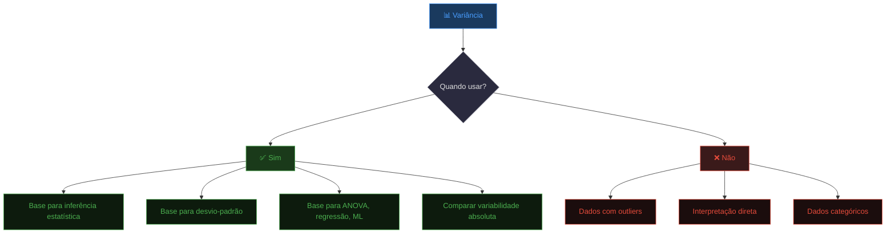

# <center>Variância</center>

## Introdução

&emsp;&emsp;&emsp;A Amplitude Total, o IQR e o Desvio Médio são as medidas de dispersão absolutas mais simples. Mas cada uma tem limitações importantes:

- A **Amplitude Total** usa apenas 2 valores (máximo e mínimo) e é **muito sensível a outliers**.
- O **IQR** ignora os 50% extremos dos dados — só olha para a zona central.
- O **Desvio Médio** usa valor absoluto, que é **difícil de tratar algebricamente** (não é diferenciável em zero).

&emsp;&emsp;&emsp;Considera o seguinte problema prático:

**Dois conjuntos com a mesma amplitude (10):**

- **Conjunto A:** `0, 10, 10, 10, 10, 10`
- **Conjunto B:** `0, 1, 2, 3, 4, 10`

&emsp;&emsp;&emsp;Repara: a **Amplitude Total** é **exatamente igual** (10) para os dois conjuntos. Se usássemos apenas esta medida, concluiríamos que têm a mesma dispersão. Mas isso é **falso**! O **Conjunto A** é **homogéneo** — quase todos os valores são 10 (só um é 0).Enquando o **Conjunto B** é **heterogéneo** — os valores estão bem distribuídos (0, 1, 2, 3, 4, 10). Podemos concluir que o IQR e o Desvio Médio já revelam alguma diferença, mas nenhum deles é **ideal**. O **IQR** ignora os extremos (0 e 10), que são precisamente a informação mais importante aqui, e o **Desvio Médio** usa valor absoluto, o que dificulta generalizações matemáticas. Precisamos de uma medida que:

1. **Use todos os dados** (como o Desvio Médio).
2. **Penalize desvios grandes** (para distinguir A de B).
3. **Seja tratável algebricamente** (para servir de base a toda a estatística inferencial).

***É precisamente aqui que entra a variância — a medida de dispersão mais importante da estatística.***

## Definição da variância

&emsp;&emsp;&emsp;A **variância** é a média dos quadrados dos desvios de cada valor em relação à média do conjunto. Mede quão longe, em média, os dados estão da média aritmética — mas ao quadrado.

&emsp;&emsp;&emsp;Porque ao quadrado? Porque se somássemos os desvios simples, os positivos e os negativos anular-se-iam, dando sempre zero. Elevar ao quadrado resolve esse problema: todos os desvios passam a ser positivos, e os valores mais afastados da média ganham um peso ainda maior. É precisamente isso que queremos: **penalizar mais os afastamentos grandes**.

## Fórmula da variância

&emsp;&emsp;&emsp;Formalmente, para uma **população** de $N$ elementos, a variância é:

$$
\sigma^2 = \frac{\sum_{i=1}^{N} (x_i - \mu)^2}{N}
$$

&emsp;&emsp;&emsp;E para uma **amostra** de $n$ elementos, a variância é:

$$
s^2 = \frac{\sum_{i=1}^{n} (x_i - \bar{x})^2}{n - 1}
$$

> **🔑 Ideia central:** A variância é a **distância média ao quadrado** entre cada dado e a média. Quanto maior a variância, mais espalhados estão os dados; quanto menor, mais concentrados em torno da média.

&emsp;&emsp;&emsp;Há uma limitação importante na variância: como os desvios são elevados ao quadrado, a unidade de medida também fica ao quadrado. Se os dados estão em metros, a variância está em **metros quadrados** ($m^2$). Se estão em euros, a variância está em **euros quadrados** (€²). Isto torna a variância difícil de interpretar diretamente — ninguém diz "a altura média é 1,70 m e a variância é 0,0025 m²". É precisamente aqui que entra o **desvio padrão**: ele é simplesmente a **raiz quadrada da variância**, e devolve-nos à unidade original dos dados.

$$
s = \sqrt{s^2}
$$

> **📌 Conclusão:** A variância é a medida de dispersão **mais importante** da Estatística — é a base para o desvio padrão, para a inferência estatística, para a ANOVA, para a regressão e para praticamente todos os métodos avançados. Mas, por estar ao quadrado, não é diretamente interpretável. O desvio padrão resolve esse problema: é a mesma informação, mas na unidade original dos dados.

> **💡 Dica de Ouro:** A variância é a **base de toda a estatística inferencial** — ANOVA, regressão, testes de hipóteses, machine learning. Sem ela, não há estatística moderna.


<center><details>
<summary>📊 As medidas de dispersão</summary>
<style>
.r{font:14px system-ui;text-align:center}
.r b{display:inline-block;padding:4px 10px;background:#333;color:#fff;border-radius:6px}
.r i{display:block;width:2px;height:18px;background:#333;margin:0 auto}
.r em{display:flex;gap:8px;justify-content:center;position:relative;padding-top:18px}
.r em::before{content:'';position:absolute;top:0;left:12.5%;right:12.5%;height:2px;background:#333}
.r em span{flex:1;padding:8px;border:2px solid #333;border-radius:8px;max-width:120px}
.r em span::before{content:'';position:absolute;top:-18px;left:50%;width:2px;height:18px;background:#333}
.r em span{position:relative}
</style>
<div class="r">
  <b>Medidas de Dispersão</b>
  <i></i>
  <em>
    <span>Amplitude<br>Total</span>
    <span>Amplitude<br>Interquartil</span>
    <span>Desvio<br>Médio</span>
    <span style="background-color: blue; color: white;">Variância</span>
    <span>Desvio<br>Padrão</span>
    <span>Coef. de<br>Variação</span>
  </em>
</div>
</details></center>
### Variância para Dados Brutos (Não Agrupados)

**📐 Método para Dados Brutos (Não Agrupados)**


- **1** --> Calcular a média x̄
- **2** --> Calcular o desvio de cada valor: xi − x̄
- **3** --> Elevar ao quadrado: (xi − x̄)²
- **4** --> Somar todos os quadrados: Σ(xi − x̄)²
- **5** --> Dividir por n−1 (amostra) ou N (população)

<details>
<summary>📌 Exemplo da Variância Amostral</summary>

**Problema:** Calcular a variância amostral das notas: `2, 5, 7, 9, 12`

**Passo 1 — Média:**
x̄ = (2 + 5 + 7 + 9 + 12) / 5 = 35/5 = 7

**Passo 2 — Tabela de cálculo:**

| xi | xi − x̄ | (xi − x̄)² |
|---------|---------|---------|
| 2 | 2 - 7 = −5 | 25 |
| 5 | 5 - 7 = −2 | 4 |
| 7 | 7 - 7 = 0 | 0 |
| 9 | 9 - 7 = 2 | 4 |
| 12 | 12 - 7 = 5 | 25 |
| **Total** | **0** | **58** |

**Passo 3 — Variância (amostral):**

$$
s^2 = \frac{58}{5 - 1} = \frac{58}{4} = \mathbf{14{,}5}
$$

✅ A variância amostral é **14,5**.

> **🔍 Interpretação:** A variância é **14,5 unidades ao quadrado**. Isto significa que, em média, os quadrados dos desvios em relação à média (7) somam 14,5 por observação. Como a unidade está ao quadrado, é **difícil de interpretar diretamente** — mas é a base para o desvio-padrão (próxima aula), que traz a unidade de volta à escala original.
</details>

<details>
<summary>📌 Exemplo da Variância Populacional</summary>

**Problema:** Calcular a variância populacional dos mesmos dados: `2, 5, 7, 9, 12`

**Passo 1 — Média:**
x̄ = (2 + 5 + 7 + 9 + 12) / 5 = 35/5 = 7

**Passo 2 — Tabela de cálculo:**

| xi | xi − x̄ | (xi − x̄)² |
|---------|---------|---------|
| 2 | 2 - 7 = −5 | 25 |
| 5 | 5 - 7 = −2 | 4 |
| 7 | 7 - 7 = 0 | 0 |
| 9 | 9 - 7 = 2 | 4 |
| 12 | 12 - 7 = 5 | 25 |
| **Total** | **0** | **58** |

**Passo 3 — Variância (populacional):**

$$
\sigma^2 = \frac{58}{5} = \mathbf{11{,}6}
$$

✅ A variância populacional é **11,6**.

> **🔍 Interpretação:** A variância populacional (11,6) é **menor** que a amostral (14,5) porque o denominador é maior (5 vs. 4). Isto reflete a correção de Bessel — a variância amostral é uma estimativa não enviesada da populacional.
</details>

<details>
<summary>📌Exemplo da Variância no **R**</summary>
```R
# Dados de exemplo (dados brutos)
notas <- c(2, 5, 7, 9, 12)

- _Variância Amostral_
var_amostral <- var(notas)
var_amostral

- _Variância Populacional_
var_populacional <- var(notas) * (length(notas) - 1) / length(notas)
var_populacional

- _Alternativa com pacote_
library(SciViews)
pop.var(notas)
```
</details>

<details>
<summary>📌Exemplo da Variância no **Python**</summary>

```python
import numpy as np

notas = np.array([2, 5, 7, 9, 12])

- _Variância Amostral_
var_amostral = np.var(notas, ddof=1)
print(var_amostral)

- _Variância Populacional_
var_populacional = np.var(notas, ddof=0)
print(var_populacional)
```

**Alternativa com Pandas**

```python
import pandas as pd
notas = np.array([2, 5, 7, 9, 12])

var_amostral = pd.Series(notas).var()
print(var_amostral)

var_populacional = pd.Series(notas).var(ddof=0)
print(var_populacional)
```
</details>


### Variância para Dados Agrupados por Lista

&emsp;&emsp;&emsp;Quando os dados estão numa **tabela de frequências**, cada valor xi tem um peso fi. A fórmula adapta-se multiplicando cada desvio ao quadrado pela frequência.

**📐 Fórmula da Variância para Dados Agrupados por Lista**

$$
\color{blue} s^2 = \frac{\sum_{i=1}^{k} f_i \cdot (x_i - \bar{x})^2}{n - 1}
$$

Onde:
- **xi** = cada valor distinto
- **fi** = frequência desse valor
- **x̄** = média
- **n = Σfi** = total de dados
- **k** = número de valores distintos

<details>
<summary>📌 Exemplo da Variância para Dados Agrupados por Lista</summary>

**Problema:** Calcular a variância das notas de 9 alunos:

| Valor (xi) | fi |
|---------|---------|
| 4 | 1 |
| 5 | 2 |
| 6 | 3 |
| 7 | 2 |
| 8 | 1 |
| **Total** | **9** |

**Passo 1 — Média:**
x̄ = (4×1 + 5×2 + 6×3 + 7×2 + 8×1) / 9 = 54/9 = 6

**Passo 2 — Tabela de cálculo:**

| xi | fi | xi − x̄ | (xi − x̄)² | fi · (xi − x̄)² |
|---------|---------|---------|---------|---------|
| 4 | 1 | −2 | 4 | 4 |
| 5 | 2 | −1 | 1 | 2 |
| 6 | 3 | 0 | 0 | 0 |
| 7 | 2 | 1 | 1 | 2 |
| 8 | 1 | 2 | 4 | 4 |
| **Total** | **9** | | | **12** |

**Passo 3 — Variância (amostral):**

$$
s^2 = \frac{12}{9 - 1} = \frac{12}{8} = \mathbf{1{,}5}
$$

✅ A variância é **1,5**.

> **🔍 Interpretação:** A variância é **1,5 unidades ao quadrado**. Comparando com o exemplo anterior (variância = 14,5), este conjunto é **muito mais homogéneo** — os dados estão muito concentrados em torno da média (6).

> **🔍 Verificação:** Se usarmos os dados soltos (4, 5, 5, 6, 6, 6, 7, 7, 8), a média é 6 e a variância é 1,5. **Confere!**
</details>

### 3.3 Variância para Dados Agrupados por Intervalo

&emsp;&emsp;&emsp;Quando os dados estão em **classes**, usamos o **ponto médio** de cada classe como representante xi. A fórmula é a mesma da lista, mas xi é o ponto médio.

**📐 Fórmula da Variância para Dados Agrupados por Intervalo**

$$
\color{blue} s^2 = \frac{\sum_{i=1}^{k} f_i \cdot (x_i - \bar{x})^2}{n - 1}
$$

Onde:
- **xi** = **ponto médio** da classe: xi = (L_inf + L_sup) / 2
- **fi** = frequência da classe
- **x̄** = média (calculada com os pontos médios)
- **n = Σfi** = total de dados

<details>
<summary>**📌 Exemplo da Variância para Dados Agrupados por Intervalo</summary>

**Problema:** Calcular a variância das notas de 20 alunos agrupadas:

| Classe | Intervalo | fi |
|---------|---------|-----|
| 1 | [4, 8[ | 7 |
| 2 | [8, 12[ | 5 |
| 3 | [12, 16[ | 5 |
| 4 | [16, 20] | 3 |
| **Total** | | **20** |

**Passo 1 — Pontos médios e média:**

| Classe | xi | fi | xi · fi |
|---------|---------|---------|---------|
| 1 | 6 | 7 | 42 |
| 2 | 10 | 5 | 50 |
| 3 | 14 | 5 | 70 |
| 4 | 18 | 3 | 54 |
| **Total** | | **20** | **216** |

$$
\bar{x} = \frac{216}{20} = 10{,}8
$$

**Passo 2 — Tabela de cálculo:**

| xi | fi | xi − x̄ | (xi − x̄)² | fi · (xi − x̄)² |
|---------|---------|---------|---------|---------|
| 6 | 7 | −4,8 | 23,04 | 161,28 |
| 10 | 5 | −0,8 | 0,64 | 3,20 |
| 14 | 5 | 3,2 | 10,24 | 51,20 |
| 18 | 3 | 7,2 | 51,84 | 155,52 |
| **Total** | **20** | | | **371,20** |

**Passo 3 — Variância (amostral):**

$$
s^2 = \frac{371{,}20}{20 - 1} = \frac{371{,}20}{19} \approx \mathbf{19{,}54}
$$

✅ A variância é **19,54**.

> **🔍 Interpretação:** A variância é **19,54 unidades ao quadrado** — um valor **elevado**, indicando que os dados estão **muito dispersos** em torno da média (10,8). Isto faz sentido: as notas variam de 4 a 20, uma faixa muito ampla.

> **⚠️ Atenção:** Comparando com os dados não agrupados (variância ≈ 19,26), há uma diferença — é o **erro de agrupamento**. Quanto mais finas forem as classes, menor o erro.
</details></center>

## Vantagens e Desvantagens Da Variância

&emsp;&emsp;&emsp;A variância apresenta vantagens e desvantagens que importa conhecer. Do lado das vantagens, destaca-se o facto de **usar todos os dados** do conjunto, ao contrário da Amplitude Total, que só olha para dois valores. Além disso, **penaliza desvios grandes** — precisamente por elevar ao quadrado — o que a torna particularmente sensível a afastamentos importantes da média. É também a **base para outras medidas e métodos**: o desvio padrão, a ANOVA, a regressão e praticamente toda a estatística inferencial assentam na variância. Finalmente, é **algebricamente tratável** — é diferenciável e somável, o que permite generalizações matemáticas que o Desvio Médio, com o seu valor absoluto, não permite. A variância **permite ainda comparação** entre conjuntos de dados, desde que estejam na mesma unidade.

&emsp;&emsp;&emsp;Do lado das desvantagens, a mais evidente é a **unidade ao quadrado** — se os dados estão em metros, a variância está em metros quadrados, o que a torna difícil de interpretar diretamente. É também **sensível a outliers**, porque o quadrado amplifica o efeito de valores extremos. O quadrado torna ainda os valores **grandes e menos intuitivos**, sobretudo quando os desvios são pequenos. A variância **nunca pode ser negativa** (é sempre ≥ 0), o que é uma consequência matemática mas também uma limitação conceptual. Por fim, **depende da média** — se a média não for representativa do conjunto, a variância também não será.

> **📌 Síntese:** A variância é uma medida poderosa e algebricamente elegante, mas paga um preço por isso: a interpretação difícil e a sensibilidade a outliers. É precisamente para resolver esses dois problemas que surge o **desvio padrão** — a raiz quadrada da variância, que devolve a unidade original e facilita a leitura dos resultados.

## Interpretação da Variância 

> **⚠️ A variância é difícil de interpretar diretamente**

&emsp;&emsp;&emsp;A variância, por si só, é **difícil de interpretar** porque a unidade está **ao quadrado**.

- **Exemplo 1:** Se os dados são em **anos**, a variância é em **anos²**.
- **Exemplo 2:** Se os dados são em **reais (R$)**, a variância é em **R$²**.
- **Exemplo 3:** Se os dados são em **kg**, a variância é em **kg²**.

&emsp;&emsp;&emsp;O que significa "14,5 anos²"? **Nada intuitivo!** Não consegues explicar a ninguém o que é um "ano ao quadrado".

**💡 Solução:** O **Desvio Padrão** (próxima aula) é a raiz quadrada da variância, trazendo a unidade de volta à escala original.


<center><details>
<summary>Guia de aplicação da variância</summary>

</details>
</center>


## EXERCÍCIOS

<details>
<summary>📗 Exercício 1 — Variância (Dados Brutos)</summary>

**Enunciado:** Calcule a variância amostral dos dados: 10, 12, 14, 16, 18

<details>
<summary>💡 Ver resposta</summary>

**Resposta:**

Média = 70/5 = 14

| xi | xi − 14 | (xi − 14)² |
|---------|---------|---------|
| 10 | −4 | 16 |
| 12 | −2 | 4 |
| 14 | 0 | 0 |
| 16 | 2 | 4 |
| 18 | 4 | 16 |
| **Total** | | **40** |

s² = 40/4 = **10**

**Interpretação:** A variância é **10 unidades ao quadrado**. Como a unidade está ao quadrado, a interpretação direta é limitada — mas é a base para o desvio-padrão, que será √10 ≈ 3,16.

</details>
</details>

<details>
<summary>📗 Exercício 2 — Variância (Dados Agrupados por Lista)</summary>

**Enunciado:** Calcule a variância da tabela:

| xi | fi |
|---------|---------|
| 5 | 2 |
| 10 | 5 |
| 15 | 3 |
| **Total** | **10** |

<details>
<summary>💡 Ver resposta</summary>

**Resposta:**

Média = (5×2 + 10×5 + 15×3) / 10 = 105/10 = 10,5

| xi | fi | xi − 10,5 | (xi − 10,5)² | fi · (xi − 10,5)² |
|---------|---------|---------|---------|---------|
| 5 | 2 | −5,5 | 30,25 | 60,5 |
| 10 | 5 | −0,5 | 0,25 | 1,25 |
| 15 | 3 | 4,5 | 20,25 | 60,75 |
| **Total** | **10** | | | **122,5** |

s² = 122,5/9 ≈ **13,61**

**Interpretação:** A variância é **13,61 unidades ao quadrado** — um valor moderado, indicando dispersão moderada em torno da média (10,5).

</details>
</details>

<details>
<summary>📗 Exercício 3 — Variância (Dados Agrupados por Intervalo)</summary>

**Enunciado:** Calcule a variância das notas agrupadas:

| Classe | Intervalo | fi |
|---------|---------|-----|
| 1 | [0, 4[ | 3 |
| 2 | [4, 8[ | 7 |
| 3 | [8, 12[ | 5 |
| 4 | [12, 16] | 3 |
| **Total** | | **18** |

<details>
<summary>💡 Ver resposta</summary>

**Resposta:**

Pontos médios: 2, 6, 10, 14

Média = (2×3 + 6×7 + 10×5 + 14×3) / 18 = 140/18 ≈ 7,78

| xi | fi | xi − 7,78 | (xi − 7,78)² | fi · (xi − 7,78)² |
|---------|---------|---------|---------|---------|
| 2 | 3 | −5,78 | 33,41 | 100,23 |
| 6 | 7 | −1,78 | 3,17 | 22,19 |
| 10 | 5 | 2,22 | 4,93 | 24,65 |
| 14 | 3 | 6,22 | 38,69 | 116,07 |
| **Total** | **18** | | | **263,14** |

s² = 263,14/17 ≈ **15,48**

**Interpretação:** A variância é **15,48 unidades ao quadrado** — um valor moderado-alto, indicando dispersão considerável em torno da média (7,78).

</details>
</details>

<details>
<summary>📗 Exercício 4 — Variância Populacional vs. Amostral</summary>

**Enunciado:** Para os dados `4, 6, 8, 10, 12`, calcule a variância populacional e a amostral.

<details>
<summary>💡 Ver resposta</summary>

**Resposta:**

Média = 8

| xi | xi − 8 | (xi − 8)² |
|---------|---------|---------|
| 4 | −4 | 16 |
| 6 | −2 | 4 |
| 8 | 0 | 0 |
| 10 | 2 | 4 |
| 12 | 4 | 16 |
| **Total** | | **40** |

**Populacional:** σ² = 40/5 = **8**

**Amostral:** s² = 40/4 = **10**

**Interpretação:** A variância amostral (10) é **maior** que a populacional (8) devido ao denominador n−1. Isto reflete a correção de Bessel — a amostra tende a subestimar a variabilidade populacional, então corrigimos dividindo por um número menor.

</details>
</details>

<details>
<summary>📗 Exercício 5 — Interpretação da Variância</summary>

**Enunciado:** Dois conjuntos de dados têm a mesma média (10). O conjunto A tem variância 4 e o conjunto B tem variância 25. O que podemos afirmar sobre a dispersão dos dados?

<details>
<summary>💡 Ver resposta</summary>

**Resposta:**

O conjunto B tem **maior dispersão** que o conjunto A.

- **Variância 4** → dados mais concentrados em torno da média (desvio-padrão ≈ 2)
- **Variância 25** → dados mais espalhados (desvio-padrão ≈ 5)

**Interpretação:** Embora ambos tenham a mesma média (10), os dados do conjunto B estão **muito mais dispersos**. A variância de B é mais de 6 vezes maior que a de A — uma diferença substancial na variabilidade.

</details>
</details>

<details>
<summary>📗 Exercício 6 — Por que n−1?</summary>

**Enunciado:** Explique por que usamos n−1 em vez de n no denominador da variância amostral.

<details>
<summary>💡 Ver resposta</summary>

**Resposta:**

Usamos n−1 (graus de liberdade) para **corrigir o viés** da estimativa. Se usássemos n, a variância amostral seria sistematicamente **menor** que a verdadeira variância populacional — subestimaria a dispersão real.

**Intuição:** Ao calcular a variância amostral, usamos a média da amostra (x̄) em vez da média populacional (μ). A média da amostra está "mais próxima" dos dados da amostra do que a média populacional estaria, o que faz os desvios parecerem menores. Dividir por n−1 em vez de n compensa esta subestimação.

Este é o **fator de correção de Bessel**.

</details>
</details>

> A variância é o coração da estatística — bate ao quadrado, mas move tudo. O desvio-padrão é a sua voz, que fala na língua dos dados originais.