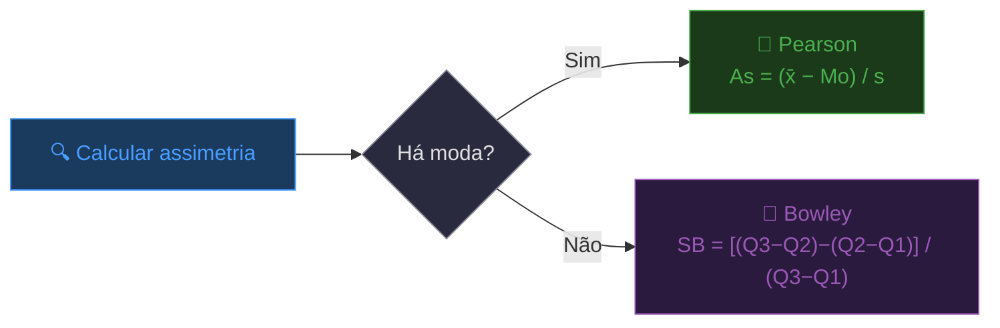

# <center>Assimetria</center>

## Introdução

&emsp;&emsp;&emsp;Dando continuidade ao que estudámos, as medidas de tendência central (média, mediana e moda), as separatrizes (quartis, decis e percentis) e as medidas de dispersão (amplitude, IQR, desvio médio, variância, desvio-padrão e CV) permitem-nos responder a três perguntas fundamentais:

1. **Onde está o centro?** → Média, mediana, moda
2. **Quão espalhados estão os dados?** → Variância, desvio-padrão, IQR
3. **Quão homogéneos são?** → Coeficiente de variação

&emsp;&emsp;&emsp;Mas há uma quarta pergunta igualmente importante que nenhuma destas medidas responde: **"A distribuição é simétrica ou assimétrica?"**, Considera o seguinte problema prático:

**Dois conjuntos de dados:**
- **Conjunto A (simétrico):** `30, 40, 45, 50, 55, 60, 70`
- **Conjunto B (assimétrico à direita):** `10, 20, 30, 40, 50, 60, 190`

**Vamos calcular as medidas que já conhecemos:**

| Medida | Conjunto A | Conjunto B |
|---------|---------|---------|
| **Média** | 50 | 57,14 |
| **Mediana** | 50 | 40 |
| **Moda** | Amodal | Amodal |

&emsp;&emsp;&emsp;Repara: a **média** e a **mediana** do Conjunto A são **iguais** (50), mas no Conjunto B a média (57,14) é **maior** que a mediana (40). Esta diferença é o primeiro sinal de **assimetria**. As medidas que estudámos até agora **não quantificam** esta diferença. Precisamos de uma medida que nos diga **para que lado** a distribuição está "puxada" e **quão forte** é essa assimetria.

<center><details>
<summary>📊 As medidas de forma</summary>
<style>
.r{font:14px system-ui;text-align:center}
.r b{display:inline-block;padding:4px 10px;background:#333;color:#fff;border-radius:6px}
.r i{display:block;width:2px;height:18px;background:#333;margin:0 auto}
.r em{display:flex;gap:8px;justify-content:center;position:relative;padding-top:18px}
.r em::before{content:'';position:absolute;top:0;left:25%;right:25%;height:2px;background:#333}
.r em span{flex:1;padding:8px;border:2px solid #333;border-radius:8px;max-width:140px}
.r em span::before{content:'';position:absolute;top:-18px;left:50%;width:2px;height:18px;background:#333}
.r em span{position:relative}
</style>
<div class="r">
  <b>Medidas de Forma</b>
  <i></i>
  <em>
    <span style="background-color: blue; color: white;">Assimetria<br>(Skewness)</span>
    <span>Curtose<br>(Kurtosis)</span>
  </em>
</div>
</details></center>


> **💡 Dica de Ouro:** A média, a mediana e a moda dizem-te onde está o centro. A variância e o desvio-padrão dizem-te quão espalhados estão. A assimetria diz-te **para que lado** a distribuição está "puxada".

## Tipos de assimetria

&emsp;&emsp;&emsp;Na estatística descritiva, existe um conceito que nos ajuda a perceber **para que lado os dados "puxam"**: a **assimetria** (ou *skewness*). Mas atenção: não se pode dizer que uma distribuição é simétrica ou assimétrica apenas olhando para ela. É preciso **calcular** a assimetria — só depois desse cálculo é que podemos classificá-la como **simétrica**, **assimétrica à direita** ou **assimétrica à esquerda**.

**Fórmulas de Assimetria**

&emsp;&emsp;&emsp;Existem várias formas de calcular a assimetria. As duas mais usadas são o **Coeficiente de Pearson** e o **Coeficiente de Bowley**.

- ***Coeficiente de Assimetria de Pearson***

$$ \color{blue} A_s = \frac{\bar{x} - Mo}{s} $$

Onde:
- **x̄** = média
- **Mo** = moda
- **s** = desvio-padrão<br><br>


- ***Coeficiente de Assimetria de Bowley***

$$ \color{blue} S_B = \frac{(Q_3 - Q_2) - (Q_2 - Q_1)}{Q_3 - Q_1} $$

Onde:
- **Q1, Q2, Q3** = quartis

**Interpretação:**
- SB = 0 → distribuição **simétrica**
- SB > 0 → **assimetria à direita**
- SB < 0 → **assimetria à esquerda**<br><br>

&emsp;&emsp;&emsp;As três tipos de assimetria que importa conhecer: a simétrica, a assimetria à direita (ou positiva) e a assimetria à esquerda (ou negativa).

1. A **simétrica** é o caso ideal — a distribuição é equilibrada, a metade esquerda é o espelho da metade direita. A média, a mediana e a moda coincidem aproximadamente (**Média ≈ Mediana ≈ Moda**). É o caso que muitos métodos estatísticos assumem por padrão.

2. A **assimetria à direita** (ou **positiva**) ocorre quando a cauda da distribuição é longa do lado direito — há valores extremos elevados que "puxam" a média para cima. Imagine uma sala com 10 pessoas: 9 ganham salários modestos e 1 é milionário. O milionário puxa a média para cima, mas a mediana e a moda ficam mais baixas. É por isso que, neste caso, a relação é **Média > Mediana > Moda**. A média é a mais afetada pelos valores extremos, a moda é a menos afetada.

3. A **assimetria à esquerda** (ou **negativa**) ocorre quando a cauda é longa do lado esquerdo — há valores extremos baixos que "puxam" a média para baixo. Imagine uma turma onde quase todos tiram notas altas, mas alguns poucos tiram notas muito baixas. Esses valores baixos puxam a média para baixo, enquanto a mediana e a moda permanecem mais altas. Neste caso, a relação é **Média < Mediana < Moda** — novamente, a média é a mais afetada, a moda é a menos afetada.

> **💡 Vantagem do Bowley:** Usa quartis, que são **robustos a outliers**. O coeficiente de Pearson usa a média, que é sensível a outliers.

## Assimetria para Dados Brutos (Não Agrupados)

**📐 Método (Pearson)**

- **1** --> Calcular a média x̄
- **2** --> Calcular a moda Mo
- **3** --> Calcular o desvio-padrão s
- **4** --> Aplicar: <code>As = (x̄ − Mo) / s</code>

**📐 Método (Bowley)**

- **1** --> Calcular Q1, Q2, Q3
- **2** --> Aplicar: <code>SB = ((Q3 − Q2) − (Q2 − Q1)) / (Q3 − Q1)</code>

<details>
<summary>📌 Exemplo da Assimetria para Dados Não Agrupados (Distribuição Simétrica)</summary>

**Problema:** Calcular a assimetria dos dados: `10, 20, 30, 40, 50, 60, 70`

**Passo 1 — Média:**
$$ x̄ = \frac{(10 + 20 + 30 + 40 + 50 + 60 + 70)}{7} = \frac{280}{7} = 40 $$

**Passo 2 — Moda:** Não há moda (amodal).

**Passo 3 — Mediana:**
n = 7 (ímpar) → posição $\frac{(7+1)}{2}$ = 4 → **40**

**Passo 4 — Desvio-padrão (amostral):**

| xi | xi − 40 | (xi − 40)² |
|---------|---------|---------|
| 10 | −30 | 900 |
| 20 | −20 | 400 |
| 30 | −10 | 100 |
| 40 | 0 | 0 |
| 50 | 10 | 100 |
| 60 | 20 | 400 |
| 70 | 30 | 900 |
| **Total** | - | **2800** |

s² = 2800/6 ≈ 466,67
s ≈ 21,6

**Passo 5 — Assimetria de Bowley:**

$$
Q_k = \frac{k \text{x} (n+1)}{4}
$$

$ Q_1 = \frac{1 \text{x} (7+1)}{4} = \frac{1 \text{x} 8}{4} = 2 $<br>
$ Q_2 = \frac{2 \text{x} (7+1)}{4} = \frac{2 \text{x} 8}{4} = 4 $<br>
$ Q_3 = \frac{3 \text{x} (7+1)}{4} = \frac{3 \text{x} 8}{4} = 6 $<br>
$ Q_4 = \frac{4 \text{x} (7+1)}{4} = \frac{4 \text{x} 8}{4} = 8 $<br>

**Q1:** Posição = 2 → **20** <br>
**Q2:** Posição = 4 → **40**<br>
**Q3:** Posição = 6 → **60**

$$
S_B = \frac{(60 - 40) - (40 - 20)}{60 - 20} = \frac{20 - 20}{40} = \mathbf{0}
$$

✅ A assimetria é **0** — distribuição **simétrica**.

<details>
<summary>Gráfico de Distribuição Simétrica</summary>

<div style="background:#0a0f1e;padding:2rem 1.5rem;border-radius:16px;border:1px solid rgba(255,255,255,0.08);font-family:'Segoe UI',system-ui,sans-serif;max-width:700px;margin:1.5rem auto;text-align:center;">

  <div style="color:#fbbf24;font-size:1rem;font-weight:700;margin-bottom:1.2rem;letter-spacing:0.5px;">
    📊 DISTRIBUIÇÃO SIMÉTRICA
  </div>

  <div style="display:flex;align-items:flex-end;justify-content:center;gap:8px;height:140px;padding:0 1rem;">
    <div style="width:40px;height:20px;background:#1a3a5c;border-radius:4px 4px 0 0;"></div>
    <div style="width:40px;height:40px;background:#1a3a5c;border-radius:4px 4px 0 0;"></div>
    <div style="width:40px;height:70px;background:#2d1b69;border-radius:4px 4px 0 0;"></div>
    <div style="width:40px;height:140px;background:#2d1b69;border-radius:4px 4px 0 0;"></div>
    <div style="width:40px;height:70px;background:#2d1b69;border-radius:4px 4px 0 0;"></div>
    <div style="width:40px;height:40px;background:#1a3a5c;border-radius:4px 4px 0 0;"></div>
    <div style="width:40px;height:20px;background:#1a3a5c;border-radius:4px 4px 0 0;"></div>
  </div>

  <div style="display:flex;justify-content:center;gap:8px;margin-top:0.8rem;padding:0 1rem;">
    <span style="width:40px;color:#93c5fd;font-size:0.7rem;">10</span>
    <span style="width:40px;color:#93c5fd;font-size:0.7rem;">20</span>
    <span style="width:40px;color:#93c5fd;font-size:0.7rem;">30</span>
    <span style="width:40px;color:#93c5fd;font-size:0.7rem;">40</span>
    <span style="width:40px;color:#93c5fd;font-size:0.7rem;">50</span>
    <span style="width:40px;color:#93c5fd;font-size:0.7rem;">60</span>
    <span style="width:40px;color:#93c5fd;font-size:0.7rem;">70</span>
  </div>

  <div style="display:flex;justify-content:center;gap:2rem;margin-top:1rem;font-size:0.75rem;">
    <span style="color:#6ee7b7;">Moda: —</span>
    <span style="color:#93c5fd;">Mediana: 40</span>
    <span style="color:#fca5a5;">Média: 40</span>
  </div>

  <div style="color:#6b7280;font-size:0.65rem;margin-top:0.5rem;">
    Média = Mediana = Moda → distribuição equilibrada
  </div>

</div></details>
> **🔍 Interpretação:** O coeficiente de Bowley é 0, o que confirma que a distribuição é **perfeitamente simétrica**. A distância entre Q1 e Q2 é igual à distância entre Q2 e Q3. A média, a mediana e a moda coincidem.
</details>

<details>
<summary>📌 Exemplo da Assimetria para Dados Não Agrupados (Assimetria à Direita)</summary>

**Problema:** Calcular a assimetria dos dados: `10, 15, 20, 25, 30, 40, 70`

**Passo 1 — Média:**
$$ x̄ = \frac{(10 + 15 + 20 + 25 + 30 + 40 + 70)}{7} = \frac{210}{7} = 30 $$

**Passo 2 — Moda:** Não há moda (amodal).

**Passo 3 — Mediana:**
n = 7 (ímpar) → posição $\frac{(7+1)}{2}$ = 4 → **25**

**Passo 4 — Desvio-padrão (amostral):**

| xi | xi − 30 | (xi − 30)² |
|---------|---------|---------|
| 10 | −20 | 400 |
| 15 | −15 | 225 |
| 20 | −10 | 100 |
| 25 | −5 | 25 |
| 30 | 0 | 0 |
| 40 | 10 | 100 |
| 70 | 40 | 1600 |
| **Total** | - | **2450** |

s² = 2450/6 ≈ 408,33
s ≈ 20,2

**Passo 5 — Assimetria de Bowley:**

$$
Q_k = \frac{k \text{x} (n+1)}{4}
$$

$ Q_1 = \frac{1 \text{x} (7+1)}{4} = \frac{1 \text{x} 8}{4} = 2 $<br>
$ Q_2 = \frac{2 \text{x} (7+1)}{4} = \frac{2 \text{x} 8}{4} = 4 $<br>
$ Q_3 = \frac{3 \text{x} (7+1)}{4} = \frac{3 \text{x} 8}{4} = 6 $<br>
$ Q_4 = \frac{4 \text{x} (7+1)}{4} = \frac{4 \text{x} 8}{4} = 8 $<br>

**Q1:** Posição = 2 → **15** <br>
**Q2:** Posição = 4 → **25**<br>
**Q3:** Posição = 6 → **40**

$$
S_B = \frac{(40 - 25) - (25 - 15)}{40 - 15} = \frac{15 - 10}{25} = \frac{5}{25} = \mathbf{0{,}2}
$$

✅ A assimetria é **0,2** — distribuição **assimétrica à direita** (positiva).

<details>
<summary>Gráfico da Assimetria à Direita</summary>

<div style="background:#0a0f1e;padding:2rem 1.5rem;border-radius:16px;border:1px solid rgba(255,255,255,0.08);font-family:'Segoe UI',system-ui,sans-serif;max-width:700px;margin:1.5rem auto;text-align:center;">

  <div style="color:#fbbf24;font-size:1rem;font-weight:700;margin-bottom:1.2rem;letter-spacing:0.5px;">
    📊 ASSIMETRIA À DIREITA (positiva)
  </div>

  <div style="display:flex;align-items:flex-end;justify-content:center;gap:8px;height:140px;padding:0 1rem;">
    <div style="width:40px;height:20px;background:#1a3a5c;border-radius:4px 4px 0 0;"></div>
    <div style="width:40px;height:30px;background:#1a3a5c;border-radius:4px 4px 0 0;"></div>
    <div style="width:40px;height:40px;background:#2d1b69;border-radius:4px 4px 0 0;"></div>
    <div style="width:40px;height:50px;background:#2d1b69;border-radius:4px 4px 0 0;"></div>
    <div style="width:40px;height:60px;background:#2d1b69;border-radius:4px 4px 0 0;"></div>
    <div style="width:40px;height:80px;background:#5c1a1a;border-radius:4px 4px 0 0;"></div>
    <div style="width:40px;height:140px;background:#5c1a1a;border-radius:4px 4px 0 0;"></div>
  </div>

  <div style="display:flex;justify-content:center;gap:8px;margin-top:0.8rem;padding:0 1rem;">
    <span style="width:40px;color:#93c5fd;font-size:0.7rem;">10</span>
    <span style="width:40px;color:#93c5fd;font-size:0.7rem;">15</span>
    <span style="width:40px;color:#93c5fd;font-size:0.7rem;">20</span>
    <span style="width:40px;color:#93c5fd;font-size:0.7rem;">25</span>
    <span style="width:40px;color:#93c5fd;font-size:0.7rem;">30</span>
    <span style="width:40px;color:#93c5fd;font-size:0.7rem;">40</span>
    <span style="width:40px;color:#fca5a5;font-size:0.7rem;">70</span>
  </div>

  <div style="display:flex;justify-content:center;gap:2rem;margin-top:1rem;font-size:0.75rem;">
    <span style="color:#6ee7b7;">Moda: —</span>
    <span style="color:#93c5fd;">Mediana: 25</span>
    <span style="color:#fca5a5;">Média: 30</span>
  </div>

  <div style="color:#6b7280;font-size:0.65rem;margin-top:0.5rem;">
    Moda &lt; Mediana &lt; Média → cauda longa à direita
  </div>

</div>
</details>

> **🔍 Interpretação:** O coeficiente de Bowley é **positivo** (0,2), o que confirma que a distribuição é **assimétrica à direita**. A distância entre Q2 e Q3 (15) é **maior** que a distância entre Q1 e Q2 (10), o que indica que a cauda se estende para a direita. O valor extremo 70 "puxa" a média para cima — a média (30) é maior que a mediana (25). A relação é **Média > Mediana > Moda**.

</details>

<details>
<summary>📌 Exemplo da Assimetria para Dados Não Agrupados (Assimetria à Esquerda)</summary>

**Problema:** Calcular a assimetria dos dados: `10, 40, 50, 55, 60, 65, 70`

**Passo 1 — Média:**
$$ x̄ = \frac{(10 + 40 + 50 + 55 + 60 + 65 + 70)}{7} = \frac{350}{7} = 50 $$

**Passo 2 — Moda:** Não há moda (amodal).

**Passo 3 — Mediana:**
n = 7 (ímpar) → posição $\frac{(7+1)}{2}$ = 4 → **55**

**Passo 4 — Desvio-padrão (amostral):**

| xi | xi − 50 | (xi − 50)² |
|---------|---------|---------|
| 10 | −40 | 1600 |
| 40 | −10 | 100 |
| 50 | 0 | 0 |
| 55 | 5 | 25 |
| 60 | 10 | 100 |
| 65 | 15 | 225 |
| 70 | 20 | 400 |
| **Total** | - | **2450** |

s² = 2450/6 ≈ 408,33
s ≈ 20,2

**Passo 5 — Assimetria de Bowley:**

$$
Q_k = \frac{k \text{x} (n+1)}{4}
$$

$ Q_1 = \frac{1 \text{x} (7+1)}{4} = \frac{1 \text{x} 8}{4} = 2 $<br>
$ Q_2 = \frac{2 \text{x} (7+1)}{4} = \frac{2 \text{x} 8}{4} = 4 $<br>
$ Q_3 = \frac{3 \text{x} (7+1)}{4} = \frac{3 \text{x} 8}{4} = 6 $<br>
$ Q_4 = \frac{4 \text{x} (7+1)}{4} = \frac{4 \text{x} 8}{4} = 8 $<br>

**Q1:** Posição = 2 → **40** <br>
**Q2:** Posição = 4 → **55**<br>
**Q3:** Posição = 6 → **65**

$$
S_B = \frac{(65 - 55) - (55 - 40)}{65 - 40} = \frac{10 - 15}{25} = \frac{-5}{25} = \mathbf{-0{,}2}
$$

✅ A assimetria é **−0,2** — distribuição **assimétrica à esquerda** (negativa).

> **🔍 Interpretação:** O coeficiente de Bowley é **negativo** (−0,2), o que confirma que a distribuição é **assimétrica à esquerda**. A distância entre Q1 e Q2 (15) é **maior** que a distância entre Q2 e Q3 (10), o que indica que a cauda se estende para a esquerda. O valor extremo 10 "puxa" a média para baixo — a média (50) é menor que a mediana (55). A relação é **Média < Mediana < Moda**.

<div style="background:#0a0f1e;padding:2rem 1.5rem;border-radius:16px;border:1px solid rgba(255,255,255,0.08);font-family:'Segoe UI',system-ui,sans-serif;max-width:700px;margin:1.5rem auto;text-align:center;">

  <div style="color:#fbbf24;font-size:1rem;font-weight:700;margin-bottom:1.2rem;letter-spacing:0.5px;">
    📊 ASSIMETRIA À ESQUERDA (negativa)
  </div>

  <div style="display:flex;align-items:flex-end;justify-content:center;gap:8px;height:140px;padding:0 1rem;">
    <div style="width:40px;height:140px;background:#5c1a1a;border-radius:4px 4px 0 0;"></div>
    <div style="width:40px;height:40px;background:#5c1a1a;border-radius:4px 4px 0 0;"></div>
    <div style="width:40px;height:25px;background:#2d1b69;border-radius:4px 4px 0 0;"></div>
    <div style="width:40px;height:20px;background:#2d1b69;border-radius:4px 4px 0 0;"></div>
    <div style="width:40px;height:15px;background:#2d1b69;border-radius:4px 4px 0 0;"></div>
    <div style="width:40px;height:12px;background:#1a3a5c;border-radius:4px 4px 0 0;"></div>
    <div style="width:40px;height:10px;background:#1a3a5c;border-radius:4px 4px 0 0;"></div>
  </div>

  <div style="display:flex;justify-content:center;gap:8px;margin-top:0.8rem;padding:0 1rem;">
    <span style="width:40px;color:#fca5a5;font-size:0.7rem;">10</span>
    <span style="width:40px;color:#93c5fd;font-size:0.7rem;">40</span>
    <span style="width:40px;color:#93c5fd;font-size:0.7rem;">50</span>
    <span style="width:40px;color:#93c5fd;font-size:0.7rem;">55</span>
    <span style="width:40px;color:#93c5fd;font-size:0.7rem;">60</span>
    <span style="width:40px;color:#93c5fd;font-size:0.7rem;">65</span>
    <span style="width:40px;color:#93c5fd;font-size:0.7rem;">70</span>
  </div>

  <div style="display:flex;justify-content:center;gap:2rem;margin-top:1rem;font-size:0.75rem;">
    <span style="color:#6ee7b7;">Moda: —</span>
    <span style="color:#93c5fd;">Mediana: 55</span>
    <span style="color:#fca5a5;">Média: 50</span>
  </div>

  <div style="color:#6b7280;font-size:0.65rem;margin-top:0.5rem;">
    Média &lt; Mediana &lt; Moda → cauda longa à esquerda
  </div>

</div>

</details>

<details>
<summary>📊 Exemplo da Assimetria para Dados Não Agrupados no R</summary>

**Dados Simétricos:** `10, 20, 30, 40, 50, 60, 70`

**Dados Assimétricos à Direita:** `10, 15, 20, 25, 30, 40, 70`

**Dados Assimétricos à Esquerda:** `10, 40, 50, 55, 60, 65, 70`

- _Opção 1 — Função direta (base R)_

```r
simetrico <- c(10, 20, 30, 40, 50, 60, 70)
direita <- c(10, 15, 20, 25, 30, 40, 70)
esquerda <- c(10, 40, 50, 55, 60, 65, 70)

# Função personalizada para assimetria de Fisher-Pearson
skewness <- function(x) {
  n <- length(x)
  media <- mean(x)
  desvio <- sd(x)
  (n / ((n - 1) * (n - 2))) * sum(((x - media) / desvio)^3)
}

print(paste("Simétrico:", skewness(simetrico)))
print(paste("Assimétrico à direita:", skewness(direita)))
print(paste("Assimétrico à esquerda:", skewness(esquerda)))
```

- _Opção 2 — Função direta (e1071)_

```r
library(e1071)

simetrico <- c(10, 20, 30, 40, 50, 60, 70)
direita <- c(10, 15, 20, 25, 30, 40, 70)
esquerda <- c(10, 40, 50, 55, 60, 65, 70)

print(paste("Simétrico:", skewness(simetrico)))
print(paste("Assimétrico à direita:", skewness(direita)))
print(paste("Assimétrico à esquerda:", skewness(esquerda)))
```

</details>

<details>
<summary>🐍 Exemplo da Assimetria para Dados Não Agrupados no Python (scipy e pandas)</summary>

**Dados Simétricos:** `10, 20, 30, 40, 50, 60, 70`

**Dados Assimétricos à Direita:** `10, 15, 20, 25, 30, 40, 70`

**Dados Assimétricos à Esquerda:** `10, 40, 50, 55, 60, 65, 70`

- _Opção 1 — Função direta (scipy)_

```python
from scipy.stats import skew

simetrico = [10, 20, 30, 40, 50, 60, 70]
direita = [10, 15, 20, 25, 30, 40, 70]
esquerda = [10, 40, 50, 55, 60, 65, 70]

print(f"Simétrico: {skew(simetrico)}")
print(f"Assimétrico à direita: {skew(direita)}")
print(f"Assimétrico à esquerda: {skew(esquerda)}")
```

- _Opção 2 — Função direta (pandas)_

```python
import pandas as pd

simetrico = [10, 20, 30, 40, 50, 60, 70]
direita = [10, 15, 20, 25, 30, 40, 70]
esquerda = [10, 40, 50, 55, 60, 65, 70]

print(f"Simétrico: {pd.Series(simetrico).skew()}")
print(f"Assimétrico à direita: {pd.Series(direita).skew()}")
print(f"Assimétrico à esquerda: {pd.Series(esquerda).skew()}")
```

</details>

## Assimetria para Dados Agrupados por Lista

&emsp;&emsp;&emsp;Quando os dados estão numa **tabela de frequências**, usamos as fórmulas adaptadas para média, moda e desvio-padrão.

<details>
<summary>📌 Exemplo da Assimetria para Dados Agrupados por Lista</summary>

**Problema:** Calcular a assimetria de Bowley da tabela:

| xi | fi | Facum |
|---------|---------|---------|
| 4 | 1 | 1 |
| 5 | 2 | 3 |
| 6 | 3 | 6 |
| 7 | 2 | 8 |
| 8 | 1 | 9 |
| **Total** | **9** | |

**Passo 1 — Quartis:**

**Q1:** Posição (1 × 9) / 4 = 2,25 → **5** (F = 3)
**Q2:** Posição (2 × 9) / 4 = 4,5 → **6** (F = 6)
**Q3:** Posição (3 × 9) / 4 = 6,75 → **7** (F = 8)

**Passo 2 — Assimetria de Bowley:**

$$
S_B = \frac{(7 - 6) - (6 - 5)}{7 - 5} = \frac{1 - 1}{2} = \mathbf{0}
$$

✅ A assimetria é **0** — distribuição **simétrica**.

> **🔍 Interpretação:** A distribuição é simétrica. A distância entre Q1 e Q2 (1) é igual à distância entre Q2 e Q3 (1).
</details>

## Assimetria para Dados Agrupados por Intervalo

&emsp;&emsp;&emsp;Quando os dados estão em **classes**, usamos os **pontos médios** e as **fórmulas de interpolação** para os quartis.

<details>
<summary>📌 Exemplo da Assimetria para Dados Agrupados por Intervalo</summary>

**Problema:** Calcular a assimetria de Bowley das notas agrupadas:

| Classe | Intervalo | fi | Facum |
|---------|---------|---------|---------|
| 1 | [4, 8[ | 7 | 7 |
| 2 | [8, 12[ | 5 | 12 |
| 3 | [12, 16[ | 5 | 17 |
| 4 | [16, 20] | 3 | 20 |
| **Total** | | **20** | |

**Passo 1 — Quartis:**

**Q1:** Posição 5 → classe [4, 8[
Q1 = 4 + (5−0)/7 × 4 = 6,86

**Q2:** Posição 10 → classe [8, 12[
Q2 = 8 + (10−7)/5 × 4 = 10,4

**Q3:** Posição 15 → classe [12, 16[
Q3 = 12 + (15−12)/5 × 4 = 14,4

**Passo 2 — Assimetria de Bowley:**

$$
S_B = \frac{(14{,}4 - 10{,}4) - (10{,}4 - 6{,}86)}{14{,}4 - 6{,}86} = \frac{4 - 3{,}54}{7{,}54} = \frac{0{,}46}{7{,}54} \approx \mathbf{0{,}061}
$$

✅ A assimetria é **0,061** — **ligeiramente à direita**.

> **🔍 Interpretação:** O coeficiente de Bowley é positivo (0,061), indicando uma **ligeira assimetria à direita**. A cauda direita é um pouco mais longa que a esquerda. No entanto, o valor é tão pequeno que a distribuição é **quase simétrica**.
</details>

&emsp;&emsp;&emsp;O **Coeficiente de Pearson** e o **Coeficiente de Bowley** têm vantagens e desvantagens que importa conhecer. O **Pearson** usa a média e o desvio-padrão, o que significa que aproveita **informação completa** sobre a distribuição — todos os dados contribuem para o resultado. No entanto, é **sensível a outliers**: um único valor extremo pode distorcer a média e o desvio-padrão, alterando artificialmente o coeficiente.

&emsp;&emsp;&emsp;O **Bowley**, por outro lado, é **robusto a outliers** — porque usa quartis, que não são afetados por valores extremos. Isto torna-o mais fiável quando há outliers. Mas tem uma desvantagem: **ignora os extremos**. Ao basear-se apenas nos quartis, pode não detetar assimetria causada precisamente por outliers — que são, muitas vezes, a razão pela qual a distribuição é assimétrica.

> **📌 Síntese:** O Pearson é mais **informativo** mas **frágil**; o Bowley é mais **robusto** mas **menos sensível**. A escolha depende do contexto: se os dados tiverem outliers, o Bowley é preferível; se não tiverem, o Pearson dá uma imagem mais completa da assimetria.

## Interpretação da Assimetria

> **💡 A assimetria diz-te para que lado a distribuição está "puxada"**

&emsp;&emsp;&emsp;Para interpretar o valor da assimetria, é útil olhar para exemplos concretos. Salários com **As = +0,84** indicam assimetria à direita — há poucos salários muito altos que puxam a média para cima. Notas com **As = 0** indicam uma distribuição simétrica — equilibrada dos dois lados. Idades com **As = −0,5** indicam assimetria à esquerda — há poucas idades muito baixas que puxam a média para baixo. Alturas com **As = +0,1** indicam uma distribuição quase simétrica, com uma ligeira assimetria à direita.

&emsp;&emsp;&emsp;Para classificar a **intensidade** da assimetria, existe uma regra prática amplamente usada. Se **|As| < 0,5**, a distribuição é considerada **aproximadamente simétrica** — a assimetria é tão pequena que pode ser ignorada na maioria das análises. Se **0,5 ≤ |As| < 1**, a assimetria é **moderada** — já é visível e pode afetar algumas técnicas estatísticas. Se **|As| ≥ 1**, a assimetria é **forte** — a distribuição está claramente desequilibrada e a média, sozinha, pode contar uma história enganadora.

> **📌 Nota:** Estes pontos de corte são **arbitrários** e variam consoante a área de aplicação. Em finanças, por exemplo, valores acima de 1 são comuns e não necessariamente problemáticos. Em controlo de qualidade, valores acima de 0,5 já podem ser motivo de investigação. O importante é **contextualizar** o valor da assimetria com o fenómeno em estudo.

<details>
<summary>Fluxo de decisão para a assimetria</summary>

</details>

## EXERCÍCIOS

<details>
<summary>📗 Exercício 1 — Assimetria de Bowley (Dados Brutos)</summary>

**Enunciado:** Calcule a assimetria de Bowley dos dados: 10, 20, 30, 40, 50, 60, 70

<details>
<summary>💡 Ver resposta</summary>

**Resposta:**

Q1 = 20, Q2 = 40, Q3 = 60

SB = ((60−40) − (40−20)) / (60−20) = (20−20)/40 = **0**

**Interpretação:** Distribuição **simétrica**.

</details>
</details>

<details>
<summary>📗 Exercício 2 — Assimetria de Bowley (Dados Agrupados por Lista)</summary>

**Enunciado:** Calcule a assimetria de Bowley da tabela:

| xi | fi | Facum |
|---------|---------|---------|
| 10 | 2 | 2 |
| 20 | 5 | 7 |
| 30 | 4 | 11 |
| 40 | 1 | 12 |
| **Total** | **12** | |

<details>
<summary>💡 Ver resposta</summary>

**Resposta:**

**Q1:** Posição 3 → **20** (F = 7)
**Q2:** Posição 6 → **20** (F = 7)
**Q3:** Posição 9 → **30** (F = 11)

SB = ((30−20) − (20−20)) / (30−20) = (10−0)/10 = **1**

**Interpretação:** Assimetria **forte à direita** (SB = 1).

</details>
</details>

<details>
<summary>📗 Exercício 3 — Assimetria de Bowley (Dados Agrupados por Intervalo)</summary>

**Enunciado:** Calcule a assimetria de Bowley das notas agrupadas:

| Classe | Intervalo | fi | Facum |
|---------|---------|---------|---------|
| 1 | [0, 5[ | 4 | 4 |
| 2 | [5, 10[ | 8 | 12 |
| 3 | [10, 15[ | 6 | 18 |
| 4 | [15, 20] | 2 | 20 |
| **Total** | | **20** | |

<details>
<summary>💡 Ver resposta</summary>

**Resposta:**

**Q1:** Posição 5 → classe [5, 10[
Q1 = 5 + ((5−4)/8) × 5 = 5,625

**Q2:** Posição 10 → classe [5, 10[
Q2 = 5 + ((10−4)/8) × 5 = 8,75

**Q3:** Posição 15 → classe [10, 15[
Q3 = 10 + ((15−12)/6) × 5 = 12,5

SB = ((12,5−8,75) − (8,75−5,625)) / (12,5−5,625) = (3,75−3,125)/6,875 = 0,625/6,875 ≈ **0,091**

**Interpretação:** Ligeira assimetria à direita.

</details>
</details>

<details>
<summary>📗 Exercício 4 — Interpretação da Assimetria</summary>

**Enunciado:** Um conjunto de dados tem assimetria de Pearson As = −0,75. O que podes concluir?

<details>
<summary>💡 Ver resposta</summary>

**Resposta:**

As = −0,75 indica **assimetria à esquerda** (negativa). Isto significa que:
- A cauda da distribuição é mais longa do lado esquerdo.
- A média é **menor** que a mediana.
- Há valores extremos baixos que "puxam" a média para baixo.

**Interpretação prática:** Se forem salários, há alguns salários muito baixos que reduzem a média.

</details>
</details>

<details>
<summary>📗 Exercício 5 — Comparação de Medidas</summary>

**Enunciado:** Por que o coeficiente de Bowley é preferível ao de Pearson quando os dados têm outliers?

<details>
<summary>💡 Ver resposta</summary>

**Resposta:**

O coeficiente de **Bowley** usa **quartis** (Q1, Q2, Q3), que são **robustos a outliers** — não são afetados por valores extremos. O coeficiente de **Pearson** usa a **média** e a **moda**, que são **sensíveis a outliers**.

**Exemplo:** No conjunto `10, 20, 30, 40, 50, 60, 190`, o Bowley dá 0 (não detecta a assimetria causada pelo 190), enquanto o Pearson dá 0,84 (detecta). Isto mostra que o Bowley é **mais robusto**, mas **menos sensível** a assimetrias causadas por outliers.

</details>
</details>

> A média, a mediana e a moda dizem-te onde está o centro. A variância e o desvio-padrão dizem-te quão espalhados estão. A assimetria diz-te para que lado a distribuição está "puxada" — e é essa direção que revela a verdadeira história dos dados.