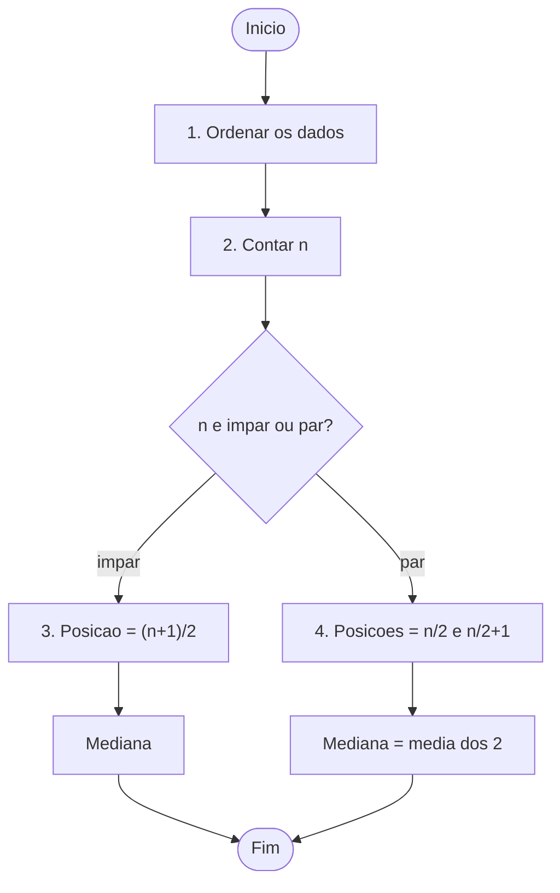
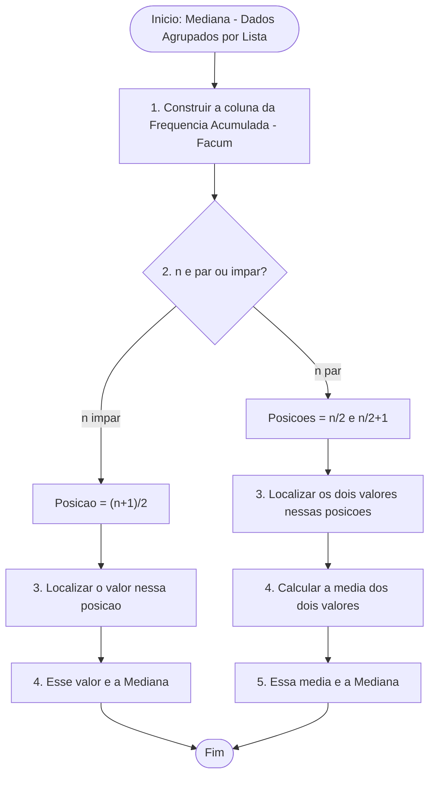
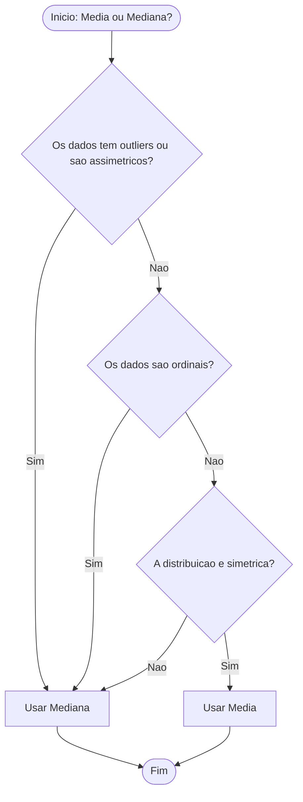

# <center>Mediana</center>

## Introdução

&emsp;&emsp;&emsp;Conforme abordado na aula anterior, a média aritmética funciona como o ponto de equilíbrio de um conjunto de dados — o valor em torno do qual as observações tendem a distribuir-se. No entanto, essa aparente simplicidade esconde uma fragilidade importante: a média é extremamente sensível a valores extremos (outliers), ou seja, basta um único valor muito discrepante para distorcer completamente o resultado.<br><br>

Exemplo: Imaginemos os salários de cinco trabalhadores: 1000kz, 1200kz, 1100kz, 1000kz, 100 000kz<br>

$$
Média = \frac{(1.000 + 1.100 + 1.200 + 1.000 + 100.000)}{5} = 20.860 kz
$$

<center>***interpretação: Cada trabalhador dessa empresa recebe ao redor dos 20 860 kz mensalmente***</center><br>

&emsp;&emsp;&emsp;⚠️ Repare-se que este valor não representa a realidade de nenhum dos trabalhadores do grupo — três deles ganham cerca de ~1000kz somente um ganha 100 000kz, por causa dele a média foi "arrastada" para cima pelo valor extremo, deixando de ser um retrato fiel do conjunto. É precisamente neste contexto que entra a **mediana** — uma medida de tendência central que vem complementar a média e oferecer uma perspetiva alternativa sobre os dados. Enquanto a média é influenciada por todos os valores, a mediana resiste aos extremos, permitindo uma leitura mais equilibrada da realidade.

<center><details>
<summary>MEDIDAS DE TENDÊNCIA CENTRAL</summary>

    <style>
    .t{font:14px system-ui;text-align:center;background:#1a1a2e;padding:30px;border-radius:8px}
    .t b{display:inline-block;padding:8px 30px;border:1.5px solid #8a8a9a;color:#e0e0e0;letter-spacing:1px;margin-bottom:30px}
    .t .linha{display:flex;justify-content:center;position:relative;height:40px}
    .t .linha::before{content:'';position:absolute;top:0;left:50%;width:1.5px;height:20px;background:#8a8a9a}
    .t .linha::after{content:'';position:absolute;top:20px;left:16.6%;right:16.6%;height:1.5px;background:#8a8a9a}
    .t .cols{display:flex;gap:20px;justify-content:center;position:relative}
    .t .col{flex:1;max-width:200px;border:1.5px solid #8a8a9a;border-radius:4px;overflow:hidden}
    .t .col div{padding:10px;border-bottom:1.5px solid #8a8a9a;color:#e0e0e0;min-height:40px;display:flex;align-items:center;justify-content:center}
    .t .col div:last-child{border-bottom:none}
    .t .col>div:first-child{background:#2a2a3e;font-weight:600}
    .t .seta{position:absolute;top:-20px;left:50%;transform:translateX(-50%);width:0;height:0;border-left:6px solid transparent;border-right:6px solid transparent;border-top:8px solid #8a8a9a}
    .t .item{position:relative;padding-top:20px}
    .t .item::before{content:'';position:absolute;top:0;left:50%;width:1.5px;height:20px;background:#8a8a9a}
    .t .mediana{border-color:#4a9eff}
    .t .mediana div{border-bottom-color:#4a9eff;color:#4a9eff}
    .t .mediana>div:first-child{background:#1a3a5e;color:#4a9eff}
    .t .mediana::before{background:#4a9eff}
    </style>
    <div class="t">
    <b>MEDIDAS DE TENDÊNCIA CENTRAL</b>
    <div class="linha"></div>
    <div class="cols">
        <div class="col item">
        <div>MÉDIA</div>
        <div>Ponto de equilíbrio</div>
        <div>Sensível a outliers</div>
        <div>Dados numéricos</div>
        </div>
        <div class="col item mediana">
        <div>MEDIANA</div>
        <div>Valor central que divide os dados ao meio</div>
        <div>Robusta a outliers</div>
        <div>Dados numéricos</div>
        </div>
        <div class="col item">
        <div>MODA</div>
        <div>Valor mais frequente</div>
        <div>Robusta a outliers</div>
        <div>Dados categóricos e numéricos</div>
        </div>
    </div>
    </div>
</details></center>

&emsp;&emsp;&emsp;A **mediana** é o **valor central** de um conjunto de dados ordenados, dividindo o conjunto em **duas partes iguais**: 50% dos dados estão abaixo e 50% estão acima.

> "A mediana é uma medida de posição que não é afetada por valores extremos, sendo recomendada para distribuições assimétricas." — Larson & Farber (2010, p. 56)

### 1. Mediana para Dados Brutos (Não Agrupados)

&emsp;&emsp;&emsp;É o caso mais simples: tens a lista completa de valores. Basta ordená-los e encontrar o valor central.

<center><details>
<summary>📐 Método para calcular à Mediana com Dados Brutos </summary>


</details></center>

<details>
<summary>📌 Exemplo 1 — Quando 'n' é Ímpar</summary>

**Problema:** Idades de 7 pessoas: `23, 19, 31, 27, 22, 35, 29`

- **Passo 1 (Rol):** 19, 22, 23, 27, 29, 31, 35
- **Passo 2 (n):** 7 (ímpar)
- **Passo 3 (posição):** <code>(7+1)/2 = 4</code> → **4ª posição**
- **Passo 4 (valor):** a 4ª posição é **27**

✅ A mediana é **27 anos**.
</details>

<details>
<summary>📌 Exemplo 2 — Quando 'n' é Par</summary>

**Problema:** Idades de 8 pessoas: `23, 19, 31, 27, 22, 35, 29, 24`

- **Passo 1 (Rol):** 19, 22, 23, 24, 27, 29, 31, 35
- **Passo 2 (n):** 8 (par)
- **Passo 3 (posições):**
  - <code>8/2 = 4</code> → 4ª posição = **24**
  - <code>8/2 + 1 = 5</code> → 5ª posição = **27**
- **Passo 4 (média):** <code>(24 + 27)/2 = 25,5</code>

✅ A mediana é **25,5 anos**.
</details>

### 2. Mediana para Dados Agrupados por Lista

&emsp;&emsp;&emsp;Quando os dados estão numa **tabela de frequências** (valores repetidos), não tens a lista completa — tens apenas cada valor e quantas vezes aparece. Para calcular a mediana, usas a **frequência acumulada** para descobrir onde está a posição central.

<center><details>
<summary>📐 Método para calcular à Mediana para Dados Agrupados por Lista</summary>



</details></center>

<details>
<summary>📌 Exemplo da Mediana para Dados Agrupados por Lista **n é ímpar**</summary>

**Problema:** As notas de 9 alunos foram resumidas na tabela. Qual é a mediana?

| Valor (xi) | fi | Facum |
|---------|---------|---------|
| 4 | 1 | 1 |
| 5 | 2 | 3 |
| 6 | 3 | 6 |
| 7 | 2 | 8 |
| 8 | 1 | 9 |
| **Total** | **9** | - |

**Passo 1 — n = 9 (ímpar).** Posição da mediana: <code>(9+1)/2 = 5</code>

**Passo 2 — Procurar a 5ª posição na Facum:**

| Valor | Facum | Atingiu a 5ª posição? |
|---------|---------|---------|
| 4 | 1 | Não |
| 5 | 3 | Não |
| 6 | 6 | **Sim** ✓ |

**Passo 3 — A mediana é 6.**

✅ A mediana é **6**.

> **🔍 Verificação:** A lista completa seria: 4, 5, 5, 6, 6, 6, 7, 7, 8. A 5ª posição é 6. **Confere!**
</details>

<details>
<summary>📌 Exemplo da Mediana para Dados Agrupados por Lista **n é par**</summary>

**Problema:** As notas de 9 alunos foram resumidas na tabela. Qual é a mediana?

Tabela de Dados

| Valor (xi) | fi | Facum |
|---------|---------|---------|
| 4 | 1 | 1 |
| 5 | 2 | 3 |
| 6 | 3 | 6 |
| 7 | 2 | 8 |
| 8 | 2 | 10 |
| **Total** | **10** | - |

**Passo 1 — n = 10 (par)** Para n par, a mediana é a **média dos valores nas posições** `n/2` e `(n/2) + 1`.

$$
\frac{n}{2} = \frac{10}{2} = 5 \quad \text{e} \quad \frac{n}{2} + 1 = 5 + 1 = 6
$$
**Posições: 5ª e 6ª.**

**Passo 2** — Procurar a 5ª e a 6ª Posição na Facum

| Valor | fi | Facum | Atingiu a 5ª posição? | Atingiu a 6ª posição? |
|-------|-----|-------|----------------------|----------------------|
| 4 | 1 | 1 | Não | Não |
| 5 | 2 | 3 | Não | Não |
| 6 | 3 | 6 | **Sim** ✓ | **Sim** ✓ |
| 7 | 2 | 8 | — | — |
| 8 | 2 | 10 | — | — |

**Leitura:**
- A 5ª posição é atingida na linha do valor **6** (Facum = 6 ≥ 5).
- A 6ª posição também é atingida na linha do valor **6** (Facum = 6 ≥ 6).

**Valores encontrados:**
- 5ª posição → **6**
- 6ª posição → **6**

**Passo 3** — Calcular a Média dos Dois Valores

$$
\text{Mediana} = \frac{6 + 6}{2} = \frac{12}{2} = 6
$$

✅ A mediana é **6**.
</details>

### 3. Mediana para Dados Agrupados por Intervalo de Classe

&emsp;&emsp;&emsp;Quando os dados estão em **classes**, a mediana é calculada por **interpolação** dentro da classe mediana — a classe onde a frequência acumulada atinge n/2.

**📐 Fórmula**

$$
\color{blue} \tilde{x} = L_i + \frac{\frac{n}{2} - F_{anterior}}{f_i} \times h_i
$$

Onde:
- **Li** = limite inferior da classe mediana
- **n** = total de dados
- **Fanterior** = frequência acumulada **antes** da classe mediana
- **fi** = frequência da classe mediana
- **hi** = amplitude da classe mediana

<center><details>
<summary>**📌 Exemplo Prático**</summary>

**Problema:** As notas de 20 alunos foram agrupadas. Qual é a mediana?

| Classe | Intervalo | fi | Facum |
|---------|---------|---------|---------|
| 1 | [4, 8[ | 7 | 7 |
| 2 | [8, 12[ | 5 | 12 |
| 3 | [12, 16[ | 5 | 17 |
| 4 | [16, 20] | 3 | 20 |
| **Total** | | **20** | |

**Passo 1 — Posição:** <code>n/2 = 20/2 = 10</code>

**Passo 2 — Descobrir a classe mediana:** a primeira classe cuja Facum ≥ 10 é a **classe 2: [8, 12[** (F = 12)

**Passo 3 — Aplicar a fórmula:**

| Dado | Valor |
|---------|---------|
| Li | 8 |
| n/2 | 10 |
| Fanterior | 7 |
| fi | 5 |
| hi | 4 |

$$
\tilde{x} = 8 + \frac{10 - 7}{5} \times 4 = 8 + \frac{12}{5} = 8 + 2{,}4 = \mathbf{10{,}4}
$$

✅ A mediana é **10,4**.

> **⚠️ Atenção:** Comparando com os dados não agrupados (mediana = 9,5), há uma diferença de 0,9 — é o **erro de agrupamento**. Quanto mais finas forem as classes, menor o erro.
</details></center>

### 4. Comparação com a Média

| Explicação | Média | Mediana |
|---------|---------|---------|
| **Cálculo** | Soma todos os valores e divide por n | Valor central do Rol |
| **Sensível a outliers?** | ✅ Sim (muito) | ❌ Não |
| **Usa todos os dados?** | ✅ Sim | ❌ Não (apenas posição) |
| **Ideal para dados assimétricos?** | ❌ Não | ✅ Sim |

#### 5. Vantagens e Desvantagens da Mediana

&emsp;&emsp;&emsp;A mediana apresenta um conjunto de vantagens que a tornam particularmente útil em determinados contextos, mas também algumas limitações que é preciso reconhecer.<br><br>

**Vantagens:**

- **Robustez a outliers.** A mediana não é afetada por valores extremos. Se um conjunto de dados tiver um valor muito alto ou muito baixo, a mediana permanece praticamente inalterada — ao contrário da média, que é "arrastada" por esses valores.
- **Adequação a dados assimétricos.** Em distribuições assimétricas, a mediana representa melhor o centro dos dados do que a média, porque não é influenciada pela cauda longa da distribuição.
- **Simplicidade de cálculo e interpretação.** A mediana é fácil de entender e de calcular: basta ordenar os dados e encontrar o valor central. Não exige fórmulas complexas.
- **Aplicabilidade a dados ordinais.** A mediana é a medida de tendência central adequada para variáveis ordinais, onde a média não faz sentido (ex.: nível de satisfação, escolaridade).<br><br>

**Desvantagens:**

- **Não utiliza todos os dados.** A mediana depende apenas da posição central, ignorando os restantes valores. Isso significa que dois conjuntos com distribuições muito diferentes podem ter a mesma mediana.
- **Menos adequada para cálculos estatísticos avançados.** A mediana não é facilmente tratável algebricamente, o que a torna menos útil em modelos estatísticos complexos (regressão, ANOVA, etc.).
- **Pode não ser única.** Em conjuntos com poucos dados ou com muitos empates, a mediana pode não ser um valor único, o que dificulta a interpretação.
- **Menos utilizada em modelos preditivos.** Em Machine Learning e estatística inferencial, a média (e o desvio-padrão) são preferidas por serem mais tratáveis matematicamente.<br><br>


&emsp;&emsp;&emsp;A escolha entre média e mediana depende da natureza dos dados e do objetivo da análise. Não há uma resposta única — há contextos em que cada uma é mais adequada.

**Critérios de escolha:**

- **Dados simétricos, sem outliers → Média.** Quando a distribuição é simétrica e não há valores extremos, a média representa bem o centro dos dados. É a medida mais informativa e mais utilizada em cálculos estatísticos.
- **Dados com outliers ou assimetria → Mediana.** Quando há valores extremos ou a distribuição é assimétrica, a mediana é mais robusta e não é "puxada" pelos extremos. Representa melhor o que é típico.
- **Dados ordinais → Mediana.** Para variáveis ordinais (ex.: nível de satisfação, escolaridade), a média não faz sentido — não se pode calcular a "média" de "Bom" e "Regular". A mediana é a medida adequada.
- **Dados quantitativos contínuos → Média ou Mediana.** Depende da distribuição. Se for simétrica, usa-se a média; se for assimétrica, usa-se a mediana. Em caso de dúvida, calculam-se ambas e comparam-se.
- **Dados com poucos elementos → Mediana (ou ambas).** Com poucos dados, a média pode ser enganosa — um único valor extremo distorce-a facilmente. A mediana é mais estável.

**Regra prática:**

> Se a média e a mediana forem **próximas**, a distribuição é aproximadamente simétrica e a média pode ser usada.<br>
 Se a média e a mediana forem **muito diferentes**, a distribuição é assimétrica e a mediana é preferível.


<details>
<summary>Fluxo de Decisão</summary>


</details>

<details>
<summary>🐍 Exemplo Mediana para Dados Não Agrupados, Agrupados por Lista e por Intervalo no Python</summary>

**Dados:** As notas de 9 alunos foram: 4, 5, 5, 6, 6, 6, 7, 7, 8.

- Opção 1 — Dados não agrupados
```python
from statistics import median

notas = [4, 5, 5, 6, 6, 6, 7, 7, 8]
mediana = median(notas)
print(mediana)
```

- Opção 2 — Dados agrupados por lista (tabela de frequências)
```python
from statistics import median

- _Passo 1: Construir a tabela de frequências manualmente_
valores = [4, 5, 6, 7, 8]
frequencias = [1, 2, 3, 2, 1]

- _Passo 2: Expandir a lista a partir das frequências_
notas = []
for valor, freq in zip(valores, frequencias):
    notas.extend([valor] * freq)

- _Passo 3: Calcular a mediana_
mediana = median(notas)
print(f"Lista expandida: {notas}")
print(f"Mediana: {mediana}")
```

- Opção 4 — Dados agrupados por intervalo de classe (com NumPy)
```python
import numpy as np

limites_inferiores = np.array([4, 8, 12, 16])
limites_superiores = np.array([8, 12, 16, 20])
frequencias = np.array([7, 5, 5, 3])

n = np.sum(frequencias)
freq_acumulada = np.cumsum(frequencias)
posicao_mediana = n / 2

classe_mediana = np.searchsorted(freq_acumulada, posicao_mediana)

L_inf = limites_inferiores[classe_mediana]
F_ant = freq_acumulada[classe_mediana - 1] if classe_mediana > 0 else 0
f_med = frequencias[classe_mediana]
h = limites_superiores[classe_mediana] - limites_inferiores[classe_mediana]

mediana = L_inf + ((posicao_mediana - F_ant) / f_med) * h

print(f"Frequências acumuladas: {freq_acumulada}")
print(f"Classe mediana: {classe_mediana + 1}")
print(f"Mediana: {mediana}")
```
</details>


<details>
<summary>📊 Exemplo Mediana para Dados Não Agrupados, Agrupados por Lista e por Intervalo no R</summary>

**Dados:** As notas de 9 alunos foram: 4, 5, 5, 6, 6, 6, 7, 7, 8.

- Opção 1 — Dados não agrupados
```r
notas <- c(4, 5, 5, 6, 6, 6, 7, 7, 8)
mediana <- median(notas)
print(mediana)
```

- Opção 2 — Dados agrupados por lista (tabela de frequências)
```r
- _Passo 1: Construir a tabela de frequências_
valores <- c(4, 5, 6, 7, 8)
frequencias <- c(1, 2, 3, 2, 1)

- _Passo 2: Expandir a lista a partir das frequências_
notas <- rep(valores, frequencias)

- _Passo 3: Calcular a mediana_
mediana <- median(notas)

print(paste("Lista expandida:", paste(notas, collapse = ", ")))
print(paste("Mediana:", mediana))
```

- Opção 3 — Dados agrupados por intervalo de classe
```r
- _Passo 1: Definir os limites e as frequências_
limites_inferiores <- c(4, 8, 12, 16)
limites_superiores <- c(8, 12, 16, 20)
frequencias <- c(7, 5, 5, 3)

- _Passo 2: Calcular o total de observações_
n <- sum(frequencias)

- _Passo 3: Calcular as frequências acumuladas_
freq_acumulada <- cumsum(frequencias)

- _Passo 4: Encontrar a classe mediana (onde n/2 é atingido)_
posicao_mediana <- n / 2
classe_mediana <- which(freq_acumulada >= posicao_mediana)[1]

- _Passo 5: Aplicar a fórmula da mediana para dados agrupados_
L_inf <- limites_inferiores[classe_mediana]
F_ant <- ifelse(classe_mediana > 1, freq_acumulada[classe_mediana - 1], 0)
f_med <- frequencias[classe_mediana]
h <- limites_superiores[classe_mediana] - limites_inferiores[classe_mediana]

mediana <- L_inf + ((posicao_mediana - F_ant) / f_med) * h

print(paste("Frequências acumuladas:", paste(freq_acumulada, collapse = ", ")))
print(paste("Classe mediana:", classe_mediana))
print(paste("Mediana:", mediana))
```

</details>

## EXERCÍCIOS

<details>
<summary>📗 Exercício 1 — Mediana (n ímpar)</summary>

**Enunciado:** Encontre a mediana dos dados: 12, 7, 9, 5, 12, 8, 6

<details>
<summary>💡 Ver resposta</summary>

**Resposta:**

**Rol:** 5, 6, 7, 8, 9, 12, 12

n = 7 (ímpar)

Posição = (7+1)/2 = 4ª posição

**Mediana = 8**

</details>
</details>

<details>
<summary>📗 Exercício 2 — Mediana (n par)</summary>

**Enunciado:** Encontre a mediana dos dados: 15, 8, 12, 15, 9, 11, 8, 13

<details>
<summary>💡 Ver resposta</summary>

**Resposta:**

**Rol:** 8, 8, 9, 11, 12, 13, 15, 15

n = 8 (par)

Posições: 4ª (11) e 5ª (12)

Mediana = (11 + 12) / 2 = **11,5**

</details>
</details>

<details>
<summary>📗 Exercício 3 — Mediana para Dados Agrupados por Lista</summary>

**Enunciado:** Calcule a mediana da tabela de frequências abaixo.

| Valor (xi) | fi |
|---------|---------|
| 10 | 2 |
| 20 | 5 |
| 30 | 4 |
| 40 | 1 |
| **Total** | **12** |

<details>
<summary>💡 Ver resposta</summary>

**Resposta:**

| Valor | fi | Facum |
|---------|---------|---------|
| 10 | 2 | 2 |
| 20 | 5 | 7 |
| 30 | 4 | 11 |
| 40 | 1 | 12 |

n = 12 (par). Posições: 6ª e 7ª.

Facum atinge 6 e 7 na classe do valor **20** (F = 7).

**Mediana = 20**

</details>
</details>

<details>
<summary>📗 Exercício 4 — Mediana para Dados Agrupados por Intervalo</summary>

**Enunciado:** Calcule a mediana das notas agrupadas abaixo.

| Classe | Intervalo | fi | Facum |
|---------|---------|---------|---------|
| 1 | [0, 5[ | 4 | 4 |
| 2 | [5, 10[ | 8 | 12 |
| 3 | [10, 15[ | 6 | 18 |
| 4 | [15, 20] | 2 | 20 |
| **Total** | | **20** | |

<details>
<summary>💡 Ver resposta</summary>

**Resposta:**

Posição: <code>n/2 = 10</code>

Classe mediana: [5, 10[ (F = 12 ≥ 10)

$$
\tilde{x} = 5 + \frac{10 - 4}{8} \times 5 = 5 + \frac{30}{8} = 5 + 3{,}75 = \mathbf{8{,}75}
$$

**Mediana = 8,75**

</details>
</details>

<details>
<summary>📗 Exercício 5 — Escolha da Medida</summary>

**Enunciado:** Você tem os seguintes salários de uma empresa: R$ 1.200, R$ 1.300, R$ 1.400, R$ 1.250, R$ 1.350, R$ 45.000 (diretor). Qual medida de tendência central você usaria para representar o salário típico dos funcionários? Justifique.

<details>
<summary>💡 Ver resposta</summary>

**Resposta:**

Use a **Mediana**. O salário do diretor (R$ 45.000) é um **outlier** que puxaria a média para cima, distorcendo a realidade dos funcionários.

**Rol:** 1.200, 1.250, 1.300, 1.350, 1.400, 45.000

**Mediana =** (1.300 + 1.350) / 2 = **R$ 1.325** → representa muito melhor o grupo!

</details>
</details>

> A mediana resiste aos extremos que a média não suporta — ela é o ponto de equilíbrio robusto que conta a história real dos dados, mesmo quando outliers tentam distorcê-la.