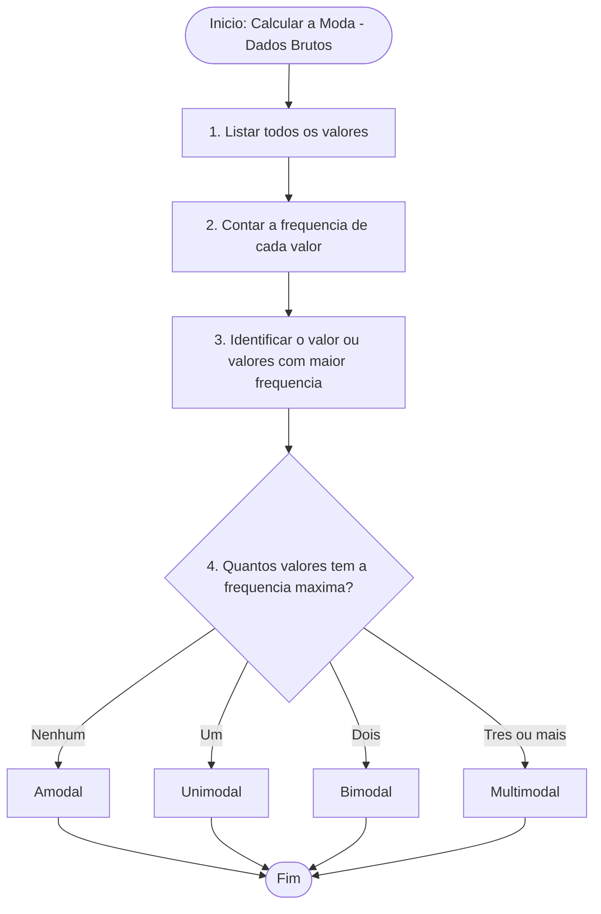
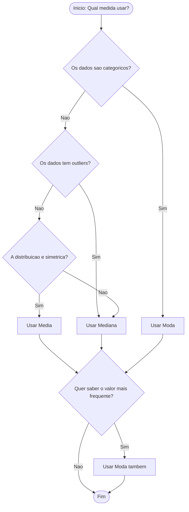

# Moda

## 1. INTRODUÇÃO

&emsp;&emsp;&emsp;Conforme abordado nas aulas anteriores, a média aritmética funciona como o ponto de equilíbrio de um conjunto de dados, mas é extremamente sensível a valores extremos (outliers). A mediana vem resolver esse problema, resistindo aos extremos e representando o valor central. No entanto, ambas — média e mediana — têm uma limitação comum: **só se aplicam a dados numéricos**.<br>

&emsp;&emsp;&emsp;E quando os dados são **categóricos**? Por exemplo: qual o sabor de pizza preferido? Qual a cor mais vendida? Qual o partido mais votado? Nestes casos, não faz sentido calcular uma média nem uma mediana — não há "valor central" numa lista de categorias.<br>

&emsp;&emsp;&emsp;É precisamente aqui que entra a **moda** — a única medida de tendência central que pode ser usada para **dados categóricos** (nominais e ordinais). A moda identifica o **valor que aparece com maior frequência**, dando-nos a "categoria vencedora" ou o "valor mais comum".

<center><details>
<summary>MEDIDAS DE TENDÊNCIA CENTRAL</summary>

    <style>
    .t{font:14px system-ui;text-align:center;background:#1a1a2e;padding:30px;border-radius:8px}
    .t b{display:inline-block;padding:8px 30px;border:1.5px solid #8a8a9a;color:#e0e0e0;letter-spacing:1px;margin-bottom:30px}
    .t .linha{display:flex;justify-content:center;position:relative;height:40px}
    .t .linha::before{content:'';position:absolute;top:0;left:50%;width:1.5px;height:20px;background:#8a8a9a}
    .t .linha::after{content:'';position:absolute;top:20px;left:16.6%;right:16.6%;height:1.5px;background:#8a8a9a}
    .t .cols{display:flex;gap:20px;justify-content:center;position:relative}
    .t .col{flex:1;max-width:200px;border:1.5px solid #8a8a9a;border-radius:4px;overflow:hidden}
    .t .col div{padding:10px;border-bottom:1.5px solid #8a8a9a;color:#e0e0e0;min-height:40px;display:flex;align-items:center;justify-content:center}
    .t .col div:last-child{border-bottom:none}
    .t .col>div:first-child{background:#2a2a3e;font-weight:600}
    .t .seta{position:absolute;top:-20px;left:50%;transform:translateX(-50%);width:0;height:0;border-left:6px solid transparent;border-right:6px solid transparent;border-top:8px solid #8a8a9a}
    .t .item{position:relative;padding-top:20px}
    .t .item::before{content:'';position:absolute;top:0;left:50%;width:1.5px;height:20px;background:#8a8a9a}
    </style>
    <div class="t">
    <b>MEDIDAS DE TENDÊNCIA CENTRAL</b>
    <div class="linha"></div>
    <div class="cols">
        <div class="col item">
        <div>MÉDIA</div>
        <div>Ponto de equilíbrio</div>
        <div>Sensível a outliers</div>
        <div>Dados numéricos</div>
        </div>
        <div class="col item">
        <div>MEDIANA</div>
        <div>Valor central que divide os dados ao meio</div>
        <div>Robusta a outliers</div>
        <div>Dados numéricos</div>
        </div>
        <div class="col item">
        <div>MODA</div>
        <div>Valor mais frequente</div>
        <div>Robusta a outliers</div>
        <div>Dados categóricos e numéricos</div>
        </div>
    </div>
    </div>
</details></center>

## 2. MODA

&emsp;&emsp;&emsp;A **moda** é a medida de tendência central que identifica o **valor que aparece com maior frequência** em um conjunto de dados. É a única medida de tendência central que pode ser usada para **dados categóricos** (nominais e ordinais).

> "A moda é o valor que ocorre com maior frequência em um conjunto de dados. Em estatística, é a única medida que pode ser utilizada com dados de nível nominal." — Larson & Farber (2010, p. 56)

### 2.1 Tipos de Moda

&emsp;&emsp;&emsp;Sabemos que nem todos os conjuntos têm uma única moda — alguns não têm nenhuma, outros têm duas ou até várias. Consoante o número de valores que se repetem com a frequência máxima, a moda classifica-se em quatro tipos:<br>

&emsp;&emsp;&emsp;**🔹 Amodal** — O conjunto não possui moda. Isto acontece quando nenhum valor se repete ou quando todos os valores aparecem o mesmo número de vezes, não havendo, por isso, nenhum que se destaque.<br>

&emsp;&emsp;&emsp;**🔹 Unimodal** — O conjunto possui uma única moda. É o caso mais comum e ocorre quando apenas um valor se repete mais vezes que os restantes.<br>

&emsp;&emsp;&emsp;**🔹 Bimodal** — O conjunto possui duas modas. Ocorre quando dois valores diferentes apresentam a mesma frequência máxima, ambos com o mesmo destaque.<br>

&emsp;&emsp;&emsp;**🔹 Multimodal** — O conjunto possui três ou mais modas. Verifica-se quando vários valores partilham a frequência máxima.

| Tipo | Definição | Exemplo |
|---------|----------|---------|
| Amodal | Nenhum valor se repete, ou todos se repetem com a mesma frequência | {1, 2, 3, 4, 5} → Não há moda |
| Unimodal | Apenas um valor apresenta a frequência máxima | {1, 2, 2, 3, 4} → Moda = 2 |
| Bimodal | Dois valores partilham a frequência máxima | {1, 1, 2, 2, 3} → Modas = 1 e 2 |
| Multimodal | Três ou mais valores partilham a frequência máxima | {1, 1, 2, 2, 3, 3, 4} → Modas = 1, 2 e 3 |

<center><details>
<summary>📊 Ver os tipos principais da moda</summary>
<style>
.r{font:14px system-ui;text-align:center}
.r b{display:inline-block;padding:4px 10px;background:#333;color:#fff;border-radius:6px}
.r i{display:block;width:2px;height:18px;background:#333;margin:0 auto}
.r em{display:flex;gap:8px;justify-content:center;position:relative;padding-top:18px}
.r em::before{content:'';position:absolute;top:0;left:25%;right:25%;height:2px;background:#333}
.r em span{flex:1;padding:8px;border:2px solid #333;border-radius:8px;max-width:140px}
.r em span::before{content:'';position:absolute;top:-18px;left:50%;width:2px;height:18px;background:#333}
.r em span{position:relative}
</style>
<div class="r">
  <b>Tipos Moda</b>
  <i></i>
  <em>
    <span>Amodal</span>
    <span>Unimodal</span>
    <span>Bimodal</span>
    <span>Multimodal</span>
  </em>
</div>
</details></center>

### 2.2 Moda para Dados Brutos (Não Agrupados)

&emsp;&emsp;&emsp;É o caso mais simples: tens a lista completa de valores. Basta contar quantas vezes cada valor aparece e identificar o(s) mais frequente(s).

<center><details>
<summary>📐 Método da Moda para Dados Não Agrupados </summary>
****


</details></center>

<details>
<summary>📌 Exemplo da Moda para Dados Não Agrupados</summary>

**Problema:** Notas de 7 alunos: `7, 8, 8, 9, 9, 9, 10`

**Passo 1 — Contagem:**

| Valor | Frequência |
|---------|---------|
| 7 | 1 |
| 8 | 2 |
| 9 | **3** |
| 10 | 1 |

**Passo 2 — Maior frequência:** o valor 9 aparece 3 vezes.

✅ A moda é **9** (Unimodal).
<hr>

**Problema:** Dados: `4, 6, 4, 8, 6, 4, 8, 6, 9`

**Passo 1 — Contagem:**

| Valor | Frequência |
|---------|---------|
| 4 | **3** |
| 6 | **3** |
| 8 | 2 |
| 9 | 1 |

**Passo 2 — Maior frequência:** os valores 4 e 6 aparecem 3 vezes cada.

✅ As modas são **4 e 6** (Bimodal).
</details>

### 2.3 Moda para Dados Agrupados por Lista

&emsp;&emsp;&emsp;Quando os dados estão numa **tabela de frequências**, a moda é simplesmente o **valor com maior fi**. Não há cálculo adicional — é uma leitura direta da tabela.

<center><details>
<summary>📐 Método da Moda para Dados Agrupados por Lista</summary>
 ```mermaid
flowchart TD
    A([Inicio: Moda - Dados Agrupados por Lista]) --> B[1. Identificar a maior frequencia fi na tabela]
    B --> C[2. O valor correspondente e a Moda]
    C --> D{3. Ha empate na maior frequencia?}
    D -->|Nao| E[Unimodal - uma unica moda]
    D -->|Sim| F[Bimodal ou Multimodal - multiplas modas]
    E --> G([Fim])
    F --> G
```
</details></center>

<details>
<summary>📌 Exemplo da Moda para Dados Agrupados por Lista</summary>

**Problema:** As notas de 10 alunos foram resumidas na tabela. Qual é a moda?

| Valor (xi) | fi |
|---------|---------|
| 5 | 2 |
| 6 | **4** |
| 7 | 3 |
| 8 | 1 |
| **Total** | **10** |

**Passo 1 — Identificar a maior frequência:** o valor 6 tem fi = 4 (a maior).

✅ A moda é **6** (Unimodal).
</details></center>

<hr>

**Problema:** Calcule a moda da tabela abaixo.

| Valor (xi) | fi |
|---------|---------|
| 10 | 3 |
| 20 | **5** |
| 30 | **5** |
| 40 | 2 |
| **Total** | **15** |

**Passo 1 — Maior frequência:** 5 (empate entre 20 e 30).

✅ As modas são **20 e 30** (Bimodal).
</details>

### 2.4 Moda para Dados Agrupados por Intervalo de Classe

&emsp;&emsp;&emsp;Para dados agrupados em classes, a moda pode ser calculada de duas formas:

1. **Classe Modal** (sem interpolação) — apenas identificas a classe com maior frequência
2. **Moda Interpolada** (fórmula de Czuber) — calculas um valor único dentro da classe modal

#### 2.4.1 Classe Modal (sem interpolação)

&emsp;&emsp;&emsp;A **classe modal** é simplesmente a classe com a **maior frequência**. É útil quando queres saber "onde está a maioria dos dados", sem precisar de um valor exato.

<details>
<summary>📌 Exemplo Moda para Dados Agrupados por Intervalo de Classe **(sem interpolação)**</summary>

| Classe | Intervalo (anos) | Frequência |
|---------|------------------|------------|
| 1 | 18 — 22 | **65** |
| 2 | 22 — 26 | 33 |
| 3 | 26 — 30 | 14 |
| 4 | 30 — 34 | 6 |
| 5 | 34 — 38 | 2 |
| **Total** | | **120** |

🔵 Classe Modal: **18 — 22** (maior frequência = 65)

**Interpretação:** A maioria dos alunos (65 em 120) tem idade entre **18 e 22 anos**.
</details>

#### 2.4.2 Moda Interpolada — Fórmula de Czuber

&emsp;&emsp;&emsp;Quando queres um **valor único** dentro da classe modal, usas a **fórmula de Czuber**. Esta fórmula interpola dentro da classe, tendo em conta as frequências das classes vizinhas.

**📐 Fórmula da Moda Interpolada — Fórmula de Czuber**

$$
\color{blue} Mo = L_i + \frac{\Delta_1}{\Delta_1 + \Delta_2} \times h_i
$$

Onde:
- **Li** = limite inferior da classe modal
- **Δ1** = f_modal − f_anterior (diferença para a classe anterior)
- **Δ2** = f_modal − f_posterior (diferença para a classe posterior)
- **hi** = amplitude da classe modal

> **⚠️ Nota:** A moda interpolada só faz sentido quando a classe modal **não é a primeira nem a última** (para ter Δ1 e Δ2 positivos). Se for, considera-se apenas a classe modal.

<details>
<summary>📌 Exemplo Exemplo Moda para Dados Agrupados por Intervalo de Classe **Fórmula de Czuber**</summary>

**Problema:** Calcular a moda interpolada das notas de 20 alunos:

| Classe | Intervalo | fi |
|---------|---------|-----|
| 1 | [4, 8[ | **7** |
| 2 | [8, 12[ | 5 |
| 3 | [12, 16[ | 5 |
| 4 | [16, 20] | 3 |
| **Total** | | **20** |

**Passo 1 — Classe modal:** a de maior frequência é a **classe 1: [4, 8[** (f = 7)

**Passo 2 — Identificar os dados:**

| Dado | Valor |
|---------|---------|
| Li | 4 |
| f_modal | 7 |
| f_anterior | 0 (não há classe antes) |
| f_posterior | 5 |
| Δ1 = 7 − 0 | 7 |
| Δ2 = 7 − 5 | 2 |
| hi | 4 |

**Passo 3 — Aplicar a fórmula:**

$$
Mo = 4 + \frac{7}{7 + 2} \times 4 = 4 + \frac{28}{9} = 4 + 3{,}11 = \mathbf{7{,}11}
$$

✅ A moda interpolada é **7,11**.

> **🔍 Nota:** A moda interpolada é uma **aproximação** — assume distribuição uniforme dentro da classe modal.
</details>


### 2.5 Vantagens e Desvantagens da Moda

&emsp;&emsp;&emsp;A moda é a única medida de tendência central aplicável a **dados categóricos**, mas apresenta vantagens e limitações que devem ser reconhecidas.<br><br>

**Vantagens:**

- **Única medida para dados categóricos.** A moda é a única medida de tendência central que pode ser usada para variáveis nominais (ex.: cor dos olhos, estado civil, marca de carro). A média e a mediana não fazem sentido para estas variáveis.
- **Fácil de identificar.** Basta contar as frequências e ver qual o valor que aparece mais vezes. Não exige cálculos complexos.
- **Não é afetada por outliers.** Valores extremos não alteram a moda, porque ela depende apenas da frequência, não dos valores em si.
- **Intuitiva e de fácil compreensão.** O conceito de "valor mais comum" é imediatamente compreensível, mesmo para quem não tem formação estatística.<br><br>

**Desvantagens:**

- **Pode não existir.** Em conjuntos onde nenhum valor se repete, ou onde todos se repetem com a mesma frequência, não há moda (amodal).
- **Pode ter mais de um valor.** Em conjuntos com empate na frequência máxima, há duas modas (bimodal) ou mais (multimodal), o que dificulta a interpretação.
- **Não considera todos os dados.** A moda depende apenas da frequência, ignorando os restantes valores. Dois conjuntos muito diferentes podem ter a mesma moda.
- **Menos útil em análises avançadas.** A moda não é tratável algebricamente e é pouco usada em modelos estatísticos complexos (regressão, ANOVA, etc.).<br><br>


### 2.6 Quando Usar — Média × Mediana × Moda

&emsp;&emsp;&emsp;A escolha entre média, mediana e moda depende da **natureza dos dados** e do **objetivo da análise**. Não há uma medida universalmente superior — cada uma tem o seu contexto de aplicação.<br><br>

**Critérios de escolha:**

- **Dados simétricos → Média (ideal), Mediana (bom), Moda (bom).** Quando a distribuição é simétrica, as três medidas coincidem ou são próximas. A média é a mais informativa e a mais usada em cálculos estatísticos.
- **Dados com outliers → Mediana (robusta), Moda (robusta), Média (sensível).** Quando há valores extremos, a média é distorcida. A mediana e a moda não são afetadas.
- **Dados assimétricos → Mediana (ideal), Moda (bom), Média (distorce).** Em distribuições assimétricas, a mediana representa melhor o centro. A média é "puxada" pela cauda longa.
- **Dados categóricos → Moda (única).** Para variáveis nominais ou ordinais, a média e a mediana não se aplicam. A moda é a única medida possível.
- **Dados quantitativos → Média (ideal), Mediana (ideal), Moda (bom).** Para variáveis numéricas, a média e a mediana são as mais usadas. A moda é útil quando se quer identificar o valor mais frequente.
- **Objetivo: identificar o valor mais comum → Moda (ideal).** Se a pergunta é "qual é o valor que aparece mais vezes?", a moda é a resposta direta.

<center><details>
<summary>Fluxo de Decisão</summary>

</details></center>

<details>
<summary> Exemplo no R</summary>
```R
Dados de exemplo
notas <- c(4, 5, 5, 6, 6, 6, 7, 7, 8)

- _Moda para Dados Brutos_
moda <- function(x) {
  valores_unicos <- unique(x)
  valores_unicos[which.max(tabulate(match(x, valores_unicos)))]
}
moda(notas)
```
</details>

<details>
<summary>🐍 Exemplo no Python</summary>

```python
import pandas as pd
import numpy as np

- _Dados de exemplo_
notas = pd.Series([4, 5, 5, 6, 6, 6, 7, 7, 8])

- _Moda para Dados Brutos_
moda = notas.mode()
print(moda)
```
</details>

## 3. EXERCÍCIOS

<details>
<summary>📗 Exercício 1 — Moda (Unimodal)</summary>

**Enunciado:** Identifique a moda: 3, 5, 3, 7, 8, 3, 9, 3

<details>
<summary>💡 Ver resposta</summary>

**Resposta:**

Contagem: 3 aparece 4 vezes, 5 (1x), 7 (1x), 8 (1x), 9 (1x)

**Moda = 3** (Unimodal)

</details>
</details>

<details>
<summary>📗 Exercício 2 — Moda (Bimodal)</summary>

**Enunciado:** Identifique a moda: 4, 6, 4, 8, 6, 4, 8, 6, 9

<details>
<summary>💡 Ver resposta</summary>

**Resposta:**

Contagem: 4 aparece 3 vezes, 6 aparece 3 vezes, 8 aparece 2 vezes, 9 (1x)

**Modas = 4 e 6** (Bimodal)

</details>
</details>

<details>
<summary>📗 Exercício 3 — Moda para Dados Agrupados por Lista</summary>

**Enunciado:** Calcule a moda da tabela abaixo.

| Valor (xi) | fi |
|---------|---------|
| 15 | 3 |
| 20 | **7** |
| 25 | 2 |
| 30 | 1 |
| **Total** | **13** |

<details>
<summary>💡 Ver resposta</summary>

**Resposta:**

Maior frequência: 7 → valor **20**

**Moda = 20** (Unimodal)

</details>
</details>

<details>
<summary>📗 Exercício 4 — Moda para Dados Agrupados por Intervalo (Czuber)</summary>

**Enunciado:** Calcule a moda interpolada da tabela abaixo.

| Classe | Intervalo | fi |
|---------|---------|-----|
| 1 | [10, 20[ | 3 |
| 2 | [20, 30[ | **8** |
| 3 | [30, 40[ | 5 |
| 4 | [40, 50] | 2 |
| **Total** | | **18** |

<details>
<summary>💡 Ver resposta</summary>

**Resposta:**

Classe modal: [20, 30[ (f = 8)

| Dado | Valor |
|---------|---------|
| Li | 20 |
| Δ1 = 8 − 3 | 5 |
| Δ2 = 8 − 5 | 3 |
| hi | 10 |

$$
Mo = 20 + \frac{5}{5 + 3} \times 10 = 20 + \frac{50}{8} = 20 + 6{,}25 = \mathbf{26{,}25}
$$

**Moda = 26,25**

</details>
</details>

<details>
<summary>📗 Exercício 5 — Moda com Dados Categóricos</summary>

**Enunciado:** Uma pesquisa perguntou aos clientes qual sabor de pizza preferem. Os resultados foram: Mussarela, Calabresa, Mussarela, Portuguesa, Calabresa, Calabresa, Mussarela, Frango. Qual é a moda?

<details>
<summary>💡 Ver resposta</summary>

**Resposta:**

Contagem: Mussarela (3x), Calabresa (3x), Portuguesa (1x), Frango (1x)

**Modas = Mussarela e Calabresa** (Bimodal)

</details>
</details>

<details>
<summary>📗 Exercício 6 — Classe Modal (sem interpolação)</summary>

**Enunciado:** Identifique a classe modal da tabela abaixo.

| Classe | Intervalo | Frequência |
|---------|---------|---------|
| 1 | [0, 10[ | 12 |
| 2 | [10, 20[ | **25** |
| 3 | [20, 30[ | 18 |
| 4 | [30, 40] | 5 |
| **Total** | | **60** |

<details>
<summary>💡 Ver resposta</summary>

**Resposta:**

Maior frequência: 25 → classe **[10, 20[**

**Classe Modal = [10, 20[**

</details>
</details>

## 4. RESUMO GERAL DAS FÓRMULAS DA MODA

| Tipo de Dados | Método | Fórmula / Procedimento |
|---------|---------|---------|
| **Dados Brutos** | Contagem | Valor com maior frequência |
| **Agrupados por Lista** | Leitura da tabela | Valor com maior fi |
| **Agrupados por Intervalo (classe modal)** | Identificação | Classe com maior fi |
| **Agrupados por Intervalo (interpolada)** | Fórmula de Czuber | `Mo = Li + (Δ1 / (Δ1 + Δ2)) × hi` |

> Em **dados brutos**, a moda é o valor que mais se repete.
> Em **dados agrupados por lista**, é o valor com maior frequência na tabela.
> Em **dados agrupados por intervalo**, podes identificar apenas a classe modal ou calcular um valor interpolado com a fórmula de Czuber.

> A moda revela o que mais se repete — é a única medida que fala a linguagem das categorias e a voz da maioria.