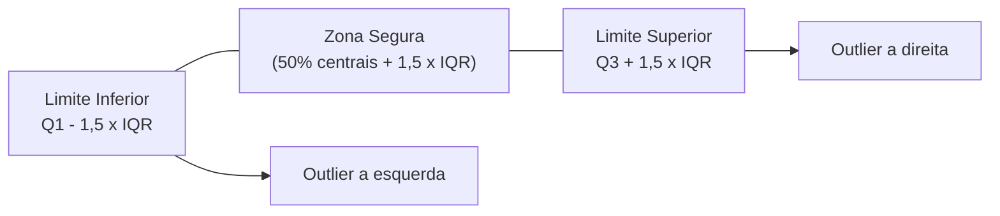
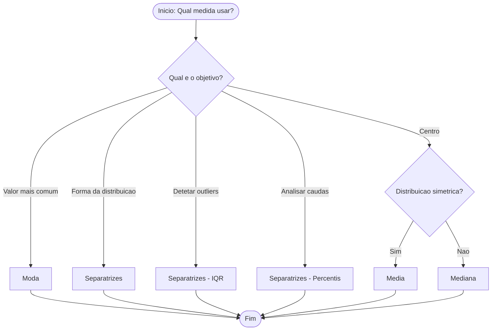

# <center>Separatrizes</center>

## Introdução

&emsp;&emsp;&emsp;As três medidas de tendência central — média (ponto de equilíbrio), mediana (valor central) e moda (valor mais frequente) — dão-nos cada uma um único valor que resume o conjunto de dados. Mas um único valor é insuficiente para descrever a forma de uma distribuição.<br>

&emsp;&emsp;&emsp;Imagina dois conjuntos de dados com a **mesma média, mesma mediana e mesma moda**:

- **Conjunto A:** `4, 5, 5, 5, 5, 5, 5, 5, 5, 6`
- **Conjunto B:** `1, 2, 3, 4, 5, 5, 6, 7, 8, 9`

| Medida | Conjunto A | Conjunto B |
|---------|---------|---------|
| Média | 5 | 5 |
| Mediana | 5 | 5 |
| Moda | 5 | 5 |

As três medidas de tendência central **não distinguem** estes conjuntos. Mas eles são radicalmente diferentes: o Conjunto A é **ultra-concentrado** (quase todos os valores são 5), enquanto o Conjunto B é **espalhado** (valores de 1 a 9).<br>

&emsp;&emsp;&emsp;É precisamente aqui que entram as **separatrizes** — medidas que dividem os dados em **partes iguais** e revelam a **forma da distribuição**: onde estão os 25% mais baixos, os 10% mais altos, os 1% extremos, etc.

## Tipos de Separatrizes

&emsp;&emsp;&emsp;As **separatrizes** são valores que dividem um conjunto de dados ordenado em **partes iguais** (ou em proporções definidas). A mediana é a separatriz mais simples (divide em 2 partes). As restantes são generalizações:

| Separatriz | Divide em | Nº de cortes | Nomes |
|---------|---------|---------|---------|
| **Mediana** | 2 partes | 1 | Q2 = P50 = D5 |
| **Quartis** | 4 partes | 3 | Q1, Q2, Q3 |
| **Decis** | 10 partes | 9 | D1, D2, ..., D9 |
| **Percentis** | 100 partes | 99 | P1, P2, ..., P99 |

<center><details>
<summary>📊 Tipos de separatrizes</summary>
<style>
.r{font:14px system-ui;text-align:center}
.r b{display:inline-block;padding:4px 10px;background:#333;color:#fff;border-radius:6px}
.r i{display:block;width:2px;height:18px;background:#333;margin:0 auto}
.r em{display:flex;gap:8px;justify-content:center;position:relative;padding-top:18px}
.r em::before{content:'';position:absolute;top:0;left:12.5%;right:12.5%;height:2px;background:#333}
.r em span{flex:1;padding:8px;border:2px solid #333;border-radius:8px;max-width:120px}
.r em span::before{content:'';position:absolute;top:-18px;left:50%;width:2px;height:18px;background:#333}
.r em span{position:relative}
</style>
<div class="r">
  <b>Separatrizes</b>
  <i></i>
  <em>
    <span>Mediana<br>(2 partes)</span>
    <span>Quartis<br>(4 partes)</span>
    <span>Decis<br>(10 partes)</span>
    <span>Percentis<br>(100 partes)</span>
  </em>
</div>
</details></center>

#### Relação Fundamental

$$
Q_1 = P_{25} = D_{2{,}5}, 
\quad Q_2 = P_{50} = D_5 = \text{Mediana}, 
\quad Q_3 = P_{75} = D_{7{,}5}
$$

### 1. Quartis
&emsp;&emsp;&emsp;Os **quartis** dividem os dados em **4 partes iguais**, cada uma com 25% dos dados. São os mais utilizados depois da mediana. Os quartis (Q₁, Q₂, Q₃) dividem os dados em 4 partes iguais (cada uma com 25%).<br>

- **Q₁** --> Primeiro Quartil --> 25% dos dados estão abaixo deste valor 
- **Q₂** --> Segundo Quartil --> 50% dos dados estão abaixo (= Mediana) 
- **Q₃** --> Terceiro Quartil --> 75% dos dados estão abaixo <br><br>

#### Quartis para Dados Não Agrupados
&emsp;&emsp;&emsp;Quando os dados são brutos, sem organização, usamos o Rol e calculamos os quartis<br>

**📐 Fórmula para Dados Não Agrupados**
$$
\color{blue} \text{Posição de } Q_k = \frac{k}{4} \times (n + 1)
$$

Onde k = 1, 2, 3 e n = número de dados.

**Regra:**
- Posição **inteira** → o quartil é o valor dessa posição
- Posição **decimal** → interpola entre as duas posições vizinhas

**Interpolação:**

$$
Q_k = \text{valor inferior} + (\text{parte decimal}) \times (\text{valor superior} - \text{valor inferior})
$$


<details>
<summary>📌 Exemplo para Dados Não Agrupados</summary>

**Problema:** Considere o conjunto bruto, **das notas de 20 alunos**:

13, 5, 20, 8, 2, 17, 11, 6, 14, 9, 4, 18, 7, 25, 10, 3, 16, 5, 12, 19

Temos **20 valores** (n = 20).


_🔹 Passo 1: Ordenar os dados_

**Por quê?** Porque os quartis dependem da **posição** dos valores. Sem ordenar, não sabemos quem está no começo, no meio ou no fim.

Ordenando do menor para o maior:

Posição:  1   2   3   4   5   6   7   8   9  10  11  12  13  14  15  16  17  18  19  20
Valor:    2   3   4   5   5   6   7   8   9  10  11  12  13  14  16  17  18  19  20  25

***⚠️ Repare que o **15** não aparece; no lugar dele temos **16** na posição 15. Isso é normal, os dados são assim.***<br><br>


 _🔹 Passo 2: Calcular Q2 (mediana)_

Como n = 20 é **par**, a mediana é a **média dos dois valores centrais**.

Posições centrais:

Posições centrais:

$$ 
\frac{n}{2} = 10 \quad \text{e} \quad \frac{n}{2} + 1 = 11 
$$

Valores:

- 10ª posição → **10**
- 11ª posição → **11**

Posições centrais:

$$ 
Q_1 = \frac{10 + 11}{2} = 10,5 
$$

**Por quê?** Com 20 valores, não existe um único valor central; os dois do meio representam juntos o centro.<br><br>


_🔹 Passo 3: Calcular Q1 (primeiro quartil)_

Q1 é a mediana da **primeira metade** dos dados.

**Primeira metade (posições 1 a 10):**

2, 3, 4, 5, 5, 6, 7, 8, 9, 10

Temos 10 valores (par), então pegamos os dois centrais: posições 5ª e 6ª dessa metade.

Posição na metade:  1   2   3   4   5   6   7   8   9  10
Valor:              2   3   4   5   5   6   7   8   9  10

$$ 
Q_2 = \frac{5 + 6}{2} = 5,5 
$$

**Por quê?** Q1 deve deixar 25% dos dados abaixo dele. A mediana da primeira metade garante isso.<br><br>

🔹 Passo 4: Calcular Q3 (terceiro quartil)

Q3 é a mediana da **segunda metade** dos dados.

**Segunda metade (posições 11 a 20):**

11, 12, 13, 14, 16, 17, 18, 19, 20, 25

Temos 10 valores (par), então pegamos os dois centrais: posições 5ª e 6ª dessa metade.

Posição na metade:  1   2   3   4   5   6   7   8   9  10
Valor:             11  12  13  14  16  17  18  19  20  25

$$ 
Q_3 = \frac{16 + 17}{2} = 16,5 
$$

**Por quê?** Q3 deve deixar 75% dos dados abaixo dele. A mediana da segunda metade garante isso.<br><br>


**✅ Resultado final**

- Q1 --> 5,5
- Q2 (mediana) --> 10,5
- Q3 --> 16,5


**📌 Resumo do raciocínio**

1. **Ordenar** os dados → passo obrigatório quando estão desordenados.
2. Achar **Q2** = mediana geral (média dos dois centrais, pois n é par).
3. Dividir em **duas metades** de 10 valores cada.
4. Achar **Q1** = mediana da primeira metade.
5. Achar **Q3** = mediana da segunda metade.

</details>

<details>
<summary>📊 Exemplo dos Quartis para Dados Não Agrupados no Excel</summary>

**Problema:** Calcular os quartis das notas de 10 alunos:

| - | A |
|---|---|
| **1** | Notas |
| **2** | 4 |
| **3** | 5 |
| **4** | 5 |
| **5** | 6 |
| **6** | 6 |
| **7** | 7 |
| **8** | 7 |
| **9** | 8 |
| **10** | 8 |

**Passo 1 — Calcular cada quartil:**

| Quartil | Fórmula (Português) | Resultado |
|---------|---------------------|-----------|
| Q1 | `=QUARTIL.INC(A2:A10;1)` | 5,25 |
| Q2 | `=QUARTIL.INC(A2:A10;2)` | 6,5 |
| Q3 | `=QUARTIL.INC(A2:A10;3)` | 7,75 |

✅ Os quartis são **Q1 = 5,25; Q2 = 6,5; Q3 = 7,75**.

> **⚠️ Atenção:** A função `QUARTIL.INC` usa o método inclusivo, que corresponde ao cálculo manual com interpolação. A função `QUARTIL.EXC` usa o método exclusivo e pode dar resultados diferentes.

**📌 Resumo das Fórmulas no Excel**

| Função | Inglês | Português | Resultado |
|--------|--------|-----------|-----------|
| Q1 | `=QUARTILE.INC(A2:A10,1)` | `=QUARTIL.INC(A2:A10;1)` | 5,25 |
| Q2 | `=QUARTILE.INC(A2:A10,2)` | `=QUARTIL.INC(A2:A10;2)` | 6,5 |
| Q3 | `=QUARTILE.INC(A2:A10,3)` | `=QUARTIL.INC(A2:A10;3)` | 7,75 |

> **💡 Dica:** Use `QUARTIL.INC` quando quiser o método inclusivo (padrão). Use `PERCENTIL.INC(A2:A10;0,25)` para o mesmo resultado que `QUARTIL.INC(A2:A10;1)`.

</details>


<details>
<summary>🐍 Exemplo dos Quartis para Dados Não Agrupados no Python</summary>

**Problema:** Calcular os quartis das notas de 10 alunos:

- Opção 1 — Função direta (NumPy)
```python
import numpy as np

notas = [4, 5, 5, 6, 6, 7, 7, 8, 8]
q1 = np.percentile(notas, 25)
q2 = np.percentile(notas, 50)
q3 = np.percentile(notas, 75)

print(f"Q1: {q1}")
print(f"Q2: {q2}")
print(f"Q3: {q3}")
```

- Opção 2 — Função direta (pandas)
```python
import pandas as pd

notas = [4, 5, 5, 6, 6, 7, 7, 8, 8]
q1 = pd.Series(notas).quantile(0.25)
q2 = pd.Series(notas).quantile(0.50)
q3 = pd.Series(notas).quantile(0.75)

print(f"Q1: {q1}")
print(f"Q2: {q2}")
print(f"Q3: {q3}")
```

- Opção 3 — Função direta (estatística)
```python
from statistics import quantiles

notas = [4, 5, 5, 6, 6, 7, 7, 8, 8]
q1, q2, q3 = quantiles(notas, n=4)

print(f"Q1: {q1}")
print(f"Q2: {q2}")
print(f"Q3: {q3}")
```
</details>


<details>
<summary>📊 Exemplo dos Quartis para Dados Não Agrupados no R</summary>

**Problema:** Calcular os quartis das notas de 10 alunos:

- Opção 1 — Função direta (base R)

```r
notas <- c(4, 5, 5, 6, 6, 7, 7, 8, 8)
q1 <- quantile(notas, 0.25)
q2 <- quantile(notas, 0.50)
q3 <- quantile(notas, 0.75)

print(q1)
print(q2)
print(q3)
```

- Opção 2 — Função direta (dplyr)

```r
library(dplyr)

notas <- c(4, 5, 5, 6, 6, 7, 7, 8, 8)
quartis <- data.frame(notas) %>%
  summarise(
    Q1 = quantile(notas, 0.25),
    Q2 = quantile(notas, 0.50),
    Q3 = quantile(notas, 0.75)
  )
print(quartis)
```

</details>

#### Quartis para Dados Agrupados por Lista

&emsp;&emsp;&emsp;Quando os dados estão numa **tabela de frequências**, usamos a **frequência acumulada** para localizar a posição do quartil.

**📐 Método para Dados Agrupados por Lista**

- **1** --> Construir a coluna da **frequência acumulada** (Facum) 
- **2** --> Calcular a posição: <code>k × n / 4</code> 
- **3** --> Localizar o valor cuja Facum **iguala ou ultrapassa** essa posição 
- **4** --> Esse valor é o quartil 

<details>
<summary>📌 Exemplo para Quartis para Dados Agrupados por Lista</summary>

**Problema:** Calcular os quartis da tabela de frequências:

| Valor (xi) | fi | Facum |
|---------|---------|---------|
| 4 | 1 | 1 |
| 5 | 2 | 3 |
| 6 | 3 | 6 |
| 7 | 2 | 8 |
| 8 | 1 | 9 |
| **Total** | **9** | |

**Q1 — Posição:** <code>(1 × 9) / 4 = 2,25</code>

Procurar a 2,25ª posição na Facum:

| Valor | Facum | Atingiu 2,25? |
|---------|---------|---------|
| 4 | 1 | Não |
| 5 | 3 | **Sim** ✓ |

$$
Q_1 = \mathbf{5}
$$

**Q2 — Posição:** <code>(2 × 9) / 4 = 4,5</code>

| Valor | Facum | Atingiu 4,5? |
|---------|---------|---------|
| 6 | 6 | **Sim** ✓ |

$$
Q_2 = \mathbf{6}
$$

**Q3 — Posição:** <code>(3 × 9) / 4 = 6,75</code>

| Valor | Facum | Atingiu 6,75? |
|---------|---------|---------|
| 7 | 8 | **Sim** ✓ |

$$
Q_3 = \mathbf{7}
$$

✅ Os quartis são **Q1 = 5; Q2 = 6; Q3 = 7**.

> **🔍 Verificação:** A lista completa seria: 4, 5, 5, 6, 6, 6, 7, 7, 8. Os quartis reais seriam: Q1 = 5, Q2 = 6, Q3 = 7. **Confere!**
</details>

### Quartis para Dados Agrupados por Intervalo de Classe

&emsp;&emsp;&emsp;Quando os dados estão em **classes**, o quartil é calculado por **interpolação** dentro da classe onde a frequência acumulada atinge a posição.

**📐 Fórmula para Dados Agrupados por Intervalo de Classe**

$$
\color{blue} Q_k = L_i + \frac{\frac{k \cdot n}{4} - F_{anterior}}{f_i} \times h_i
$$

Onde:
- **Li** = limite inferior da classe do quartil
- **k** = 1, 2 ou 3
- **n** = total de dados
- **Fanterior** = frequência acumulada **antes** da classe do quartil
- **fi** = frequência da classe do quartil
- **hi** = amplitude da classe

<details>
<summary>📌 Exemplo para Quartis para Dados Agrupados por Intervalo de Classe</summary>

**Problema:** Calcular os quartis das notas de 20 alunos agrupadas:

| Classe | Intervalo | fi | Facum |
|---------|---------|---------|---------|
| 1 | [4, 8[ | 7 | 7 |
| 2 | [8, 12[ | 5 | 12 |
| 3 | [12, 16[ | 5 | 17 |
| 4 | [16, 20] | 3 | 20 |
| **Total** | | **20** | |

**Q1 — Posição:** <code>(1 × 20) / 4 = 5</code>

Classe onde Facum ≥ 5: **[4, 8[** (F = 7)

| Dado | Valor |
|---------|---------|
| Li | 4 |
| k × n / 4 | 5 |
| Fanterior | 0 |
| fi | 7 |
| hi | 4 |

$$
Q_1 = 4 + \frac{5 - 0}{7} \times 4 = 4 + \frac{20}{7} = 4 + 2{,}857 = \mathbf{6{,}86}
$$

**Q2 — Posição:** <code>(2 × 20) / 4 = 10</code>

Classe onde Facum ≥ 10: **[8, 12[** (F = 12)

| Dado | Valor |
|---------|---------|
| Li | 8 |
| k × n / 4 | 10 |
| Fanterior | 7 |
| fi | 5 |
| hi | 4 |

$$
Q_2 = 8 + \frac{10 - 7}{5} \times 4 = 8 + \frac{12}{5} = 8 + 2{,}4 = \mathbf{10{,}4}
$$

**Q3 — Posição:** <code>(3 × 20) / 4 = 15</code>

Classe onde Facum ≥ 15: **[12, 16[** (F = 17)

| Dado | Valor |
|---------|---------|
| Li | 12 |
| k × n / 4 | 15 |
| Fanterior | 12 |
| fi | 5 |
| hi | 4 |

$$
Q_3 = 12 + \frac{15 - 12}{5} \times 4 = 12 + \frac{12}{5} = 12 + 2{,}4 = \mathbf{14{,}4}
$$

✅ Os quartis são **Q1 = 6,86; Q2 = 10,4; Q3 = 14,4**.

> **⚠️ Atenção:** Comparando com os dados não agrupados (Q1 = 6,25; Q2 = 9,5; Q3 = 14,75), há diferenças — é o **erro de agrupamento**. Quanto mais finas forem as classes, menor o erro.
</details>

## 2. Decis

&emsp;&emsp;&emsp;Os **decis** dividem os dados em **10 partes iguais**, cada uma com 10% dos dados.**Os decis (D₂,₅, D₅, D₇,₅) dividem os dados em 10 partes iguais (cada uma com 10%).** O índice pode ser decimal (2,5; 7,5)<br>

- **D₂,₅** --> 2,5º Decil --> 25% dos dados estão abaixo (= Q₁)
- **D₅** --> 5º Decil --> 50% dos dados estão abaixo (= Mediana)
- **D₇,₅** --> 7,5º Decil --> 75% dos dados estão abaixo (= Q₃)

### Decis para Dados Não Agrupados

**📐 Fórmula do Decis para Dados Não Agrupados**

$$
\color{blue} \text{Posição de } D_k = \frac{k}{10} \times (n + 1)
$$

Onde k = 1, 2, ..., 9.

<details>
<summary>📌 Exemplo do Decis para Dados Não Agrupados</summary>

**Problema** Consideremos o seguinte conjunto de dados, já ordenado:

```
Posição:  1   2   3   4   5   6   7   8   9  10  11  12  13  14  15  16  17  18  19  20
Valor:    4   5   5   6   6   7   7   8   8   9  10  11  12  13  14  15  16  17  18  20
```
Temos **n = 20** observações.

**D1 — Posição:**

$$ P_1 = \frac{1 \cdot 21}{10} = 2{,}1 $$

&emsp;&emsp;&emsp;Está entre a posição 2 (valor 5) e a posição 3 (valor 5).

$$ D_1 = 5 + 0{,}1 \times (5 - 5) = 5 + 0 = \mathbf{5} $$<br><br>

**D2 — Posição:**

$$ P_2 = \frac{2 \cdot 21}{10} = 4{,}2 $$

&emsp;&emsp;&emsp;Está entre a posição 4 (valor 6) e a posição 5 (valor 6).

$$ D_2 = 6 + 0{,}2 \times (6 - 6) = 6 + 0 = \mathbf{6} $$<br><br>

**D3 — Posição:**

$$ P_3 = \frac{3 \cdot 21}{10} = 6{,}3 $$

&emsp;&emsp;&emsp;Está entre a posição 6 (valor 7) e a posição 7 (valor 7).

$$ D_3 = 7 + 0{,}3 \times (7 - 7) = 7 + 0 = \mathbf{7} $$<br><br>

**D4 — Posição:**

$$ P_4 = \frac{4 \cdot 21}{10} = 8{,}4 $$

&emsp;&emsp;&emsp;Está entre a posição 8 (valor 8) e a posição 9 (valor 8).

$$ D_4 = 8 + 0{,}4 \times (8 - 8) = 8 + 0 = \mathbf{8} $$<br><br>

** D5 — Posição:**

$$ P_5 = \frac{5 \cdot 21}{10} = 10{,}5 $$

&emsp;&emsp;&emsp;Está entre a posição 10 (valor 9) e a posição 11 (valor 10).

$$ D_5 = \frac{9 + 10}{2} = \mathbf{9{,}5} $$

> *(D5 é igual à mediana Q2)*<br><br>

**D6 — Posição:**

$$ P_6 = \frac{6 \cdot 21}{10} = 12{,}6 $$

&emsp;&emsp;&emsp;Está entre a posição 12 (valor 11) e a posição 13 (valor 12).

$$ D_6 = 11 + 0{,}6 \times (12 - 11) = 11 + 0{,}6 = \mathbf{11{,}6} $$<br><br>

**D7 — Posição:**

$$ P_7 = \frac{7 \cdot 21}{10} = 14{,}7 $$

&emsp;&emsp;&emsp;Está entre a posição 14 (valor 13) e a posição 15 (valor 14).

$$ D_7 = 13 + 0{,}7 \times (14 - 13) = 13 + 0{,}7 = \mathbf{13{,}7} $$<br><br>

**D8 — Posição:**

$$ P_8 = \frac{8 \cdot 21}{10} = 16{,}8 $$

&emsp;&emsp;&emsp;Está entre a posição 16 (valor 15) e a posição 17 (valor 16).

$$ D_8 = 15 + 0{,}8 \times (16 - 15) = 15 + 0{,}8 = \mathbf{15{,}8} $$<br><br>


**D9 — Posição:**

$$ P_9 = \frac{9 \cdot 21}{10} = 18{,}9 $$

&emsp;&emsp;&emsp;Está entre a posição 18 (valor 17) e a posição 19 (valor 18).

$$ D_9 = 17 + 0{,}9 \times (18 - 17) = 17 + 0{,}9 = \mathbf{17{,}9} $$


RESULTADO FINAL (DECIS)

| Decil | Posição | Valor |
|-------|---------|-------|
| D1 | 2,1 | 5 |
| D2 | 4,2 | 6 |
| D3 | 6,3 | 7 |
| D4 | 8,4 | 8 |
| D5 | 10,5 | 9,5 |
| D6 | 12,6 | 11,6 |
| D7 | 14,7 | 13,7 |
| D8 | 16,8 | 15,8 |
| D9 | 18,9 | 17,9 |


> **🔍 Nota:** A fórmula P = k(n+1)/10 é a mais usada para decis. Como n = 20, n+1 = 21, então cada decil cai em posições como 2,1 / 4,2 / 6,3 / ... / 18,9. Quando a posição não é inteira, faz-se **interpolação linear** entre os dois valores vizinhos.


</details>

### Decis para Dados Agrupados por Lista

**📐 Método do Decis para Dados Agrupados por Lista**

- **1** --> Construir a coluna da **frequência acumulada**
- **2** --> Calcular a posição: <code>k × n / 10</code>
- **3** --> Localizar o valor cuja Facum **iguala ou ultrapassa** essa posição
- **4** --> Esse valor é o decil

<details>
<summary>📌 Exemplo do Decis para Dados Agrupados por Lista</summary>

**Problema:** Calcular D3 e D7 da tabela:

| Valor (xi) | fi | Facum |
|---------|---------|---------|
| 4 | 1 | 1 |
| 5 | 2 | 3 |
| 6 | 3 | 6 |
| 7 | 2 | 8 |
| 8 | 1 | 9 |
| **Total** | **9** | |

**D3 — Posição:** <code>(3 × 9) / 10 = 2,7</code>

| Valor | Facum | Atingiu 2,7? |
|---------|---------|---------|
| 4 | 1 | Não |
| 5 | 3 | **Sim** ✓ |

$$
D_3 = \mathbf{5}
$$

**D7 — Posição:** <code>(7 × 9) / 10 = 6,3</code>

| Valor | Facum | Atingiu 6,3? |
|---------|---------|---------|
| 6 | 6 | Não |
| 7 | 8 | **Sim** ✓ |

$$
D_7 = \mathbf{7}
$$

✅ D3 = 5 e D7 = 7.
</details>

### Decis para Dados Agrupados por Intervalo de Classe

**📐 Fórmula do Decis para Dados Agrupados por Intervalo de Classe**

$$
\color{blue} D_k = L_i + \frac{\frac{k \cdot n}{10} - F_{anterior}}{f_i} \times h_i
$$

Onde k = 1, 2, ..., 9.

<details>
<summary>📌 Exemplo do Decis para Dados Agrupados por Intervalo de Classe</summary>

**Problema:** Calcular D3 das notas agrupadas:

| Classe | Intervalo | fi | Facum |
|---------|---------|---------|---------|
| 1 | [4, 8[ | 7 | 7 |
| 2 | [8, 12[ | 5 | 12 |
| 3 | [12, 16[ | 5 | 17 |
| 4 | [16, 20] | 3 | 20 |
| **Total** | | **20** | |

**D3 — Posição:** <code>(3 × 20) / 10 = 6</code>

Classe onde Facum ≥ 6: **[4, 8[** (F = 7)

$$
D_3 = 4 + \frac{6 - 0}{7} \times 4 = 4 + \frac{24}{7} = 4 + 3{,}43 = \mathbf{7{,}43}
$$

✅ D3 = 7,43.
</details>

## 3. Percentis

&emsp;&emsp;&emsp;Os **percentis** dividem os dados em **100 partes iguais**, cada uma com 1% dos dados. São a separatriz mais fina e permitem analisar as **caudas** da distribuição. Os percentis (P₂₅, P₅₀, P₇₅) dividem os dados em 100 partes iguais (cada uma com 1%): <br>

- **P₂₅** --> 25º Percentil --> 25% dos dados estão abaixo deste valor
- **P₅₀** --> 50º Percentil --> 50% dos dados estão abaixo (= Mediana)
- **P₇₅** --> 75º Percentil --> 75% dos dados estão abaixo <br><br>

### Percentis para Dados Não Agrupados

$$
\color{blue} \text{Posição de } P_k = \frac{k}{100} \times (n + 1)
$$

Onde k = 1, 2, ..., 99.

<details>
<summary>📌 Exemplo do Percentis para Dados Não Agrupados</summary>

**Problema:** Calcular P10, P25, P75, P90 das notas de 20 alunos:

**Cálculo:**

| Percentil | Posição k/100 × 21 | Cálculo | Valor |
|---------|---------|---------|---------|
| P10 | 2,1 | entre pos 2 (5) e pos 3 (5) | **5** |
| P25 | 5,25 | entre pos 5 (6) e pos 6 (7) | **6,25** |
| P50 | 10,5 | entre pos 10 (9) e pos 11 (10) | **9,5** |
| P75 | 15,75 | entre pos 15 (14) e pos 16 (15) | **14,75** |
| P90 | 18,9 | entre pos 18 (17) e pos 19 (18) | **17,9** |

✅ P25 = Q1, P50 = Q2, P75 = Q3. **Confere!**
</details>

### Percentis para Dados Agrupados por Lista

**📐 Método do Percentis para Dados Agrupados por Lista**


- **1** --> Construir a coluna da **frequência acumulada**
- **2** --> Calcular a posição: <code>k × n / 100</code>
- **3** --> Localizar o valor cuja Facum **iguala ou ultrapassa** essa posição
- **4** --> Esse valor é o percentil

<details>
<summary>📌 Exemplo do Percentis para Dados Agrupados por Lista</summary>

**Problema:** Calcular P40 da tabela:

| Valor (xi) | fi | Facum |
|---------|---------|---------|
| 4 | 1 | 1 |
| 5 | 2 | 3 |
| 6 | 3 | 6 |
| 7 | 2 | 8 |
| 8 | 1 | 9 |
| **Total** | **9** | |

**P40 — Posição:** <code>(40 × 9) / 100 = 3,6</code>

| Valor | Facum | Atingiu 3,6? |
|---------|---------|---------|
| 5 | 3 | Não |
| 6 | 6 | **Sim** ✓ |

$$
P_{40} = \mathbf{6}
$$

✅ P40 = 6.
</details> 

### Percentis para Dados Agrupados por Intervalo de Classe

**📐 Fórmula do Percentis para Dados Agrupados por Intervalo de Classe**

$$
\color{blue} P_k = L_i + \frac{\frac{k \cdot n}{100} - F_{anterior}}{f_i} \times h_i
$$

Onde k = 1, 2, ..., 99.

<details>
<summary>📌 Exemplo do Percentis para Dados Agrupados por Intervalo de Classe</summary>

**Problema:** Calcular P90 das notas agrupadas:

| Classe | Intervalo | fi | Facum |
|---------|---------|---------|---------|
| 1 | [4, 8[ | 7 | 7 |
| 2 | [8, 12[ | 5 | 12 |
| 3 | [12, 16[ | 5 | 17 |
| 4 | [16, 20] | 3 | 20 |
| **Total** | | **20** | |

**P90 — Posição:** <code>(90 × 20) / 100 = 18</code>

Classe onde Facum ≥ 18: **[16, 20]** (F = 20)

$$
P_{90} = 16 + \frac{18 - 17}{3} \times 4 = 16 + \frac{4}{3} = 16 + 1{,}33 = \mathbf{17{,}33}
$$

✅ P90 = 17,33.
</details> 

### Amplitude Interquartil (IQR)

&emsp;&emsp;&emsp;A Amplitude Interquartil (em inglês, Interquartile Range — IQR) é uma medida de dispersão que representa a diferença entre o terceiro quartil (Q₃) e o primeiro quartil (Q₁). Em outras palavras, é a amplitude dos 50% centrais dos dados, ignorando os 25% mais baixos e os 25% mais altos.

**📐 Fórmula da Amplitude Interquartil (IQR)**

$$
\color{blue} \text{IQR} = Q_3 - Q_1
$$

<details>
<summary>📌 Exemplo da Amplitude Interquartil</summary>

Com Q1 = 6,25, Q2 = 9,5, Q3 = 14,75:

$$
\text{IQR} = 14{,}75 - 6{,}25 = \mathbf{8{,}5}
$$

$$
S_B = \frac{(14{,}75 - 9{,}5) - (9{,}5 - 6{,}25)}{14{,}75 - 6{,}25} = \frac{5{,}25 - 3{,}25}{8{,}5} = \frac{2}{8{,}5} = \mathbf{0{,}235}
$$

Como SB > 0, a distribuição é **assimétrica à direita**.
</details>
### Deteção de Outliers (Regra de Tukey)


&emsp;&emsp;&emsp;A **Regra de Tukey** é um critério estatístico que permite identificar **valores atípicos** (outliers) num conjunto de dados, com base na **Amplitude Interquartil (IQR)**. Define uma "zona segura" em torno dos 50% centrais dos dados; qualquer valor fora dessa zona é considerado outlier.<br>

&emsp;&emsp;&emsp;O IQR mede a dispersão dos 50% centrais. A Regra de Tukey estende essa zona central em **1,5 vezes o IQR** para cada lado (inferior e superior). Valores que caem fora desses limites são considerados anómalos — tão distantes do centro que provavelmente não pertencem ao padrão dos dados. É um critério **robusto**, porque não depende da média nem do desvio-padrão.<br>

**📐 Fórmula da Regra de Tukey**

$$
\color{blue} x < Q_1 - 1{,}5 \times \text{IQR} \quad \text{ou} \quad x > Q_3 + 1{,}5 \times \text{IQR}
$$

<centro><details>
<summary>Diagrama — Limites da Regra de Tukey</summary>


</details></centro>

**Onde:**

- **Q₁** = primeiro quartil
- **Q₃** = terceiro quartil
- **IQR** = Q₃ − Q₁

<details>
<summary>📌 Exemplo da Regra de Tukey</summary>

**Dados:** `5, 6, 7, 8, 9, 10, 11, 12, 13, 100`

**Passo 1 — Calcular Q₁, Q₃ e IQR:**

- Q₁ = 6,75
- Q₃ = 12,25
- IQR = 12,25 − 6,75 = 5,5

**Passo 2 — Calcular os limites:**

- Limite Inferior: 6,75 − 1,5 × 5,5 = 6,75 − 8,25 = **−1,5**
- Limite Superior: 12,25 + 1,5 × 5,5 = 12,25 + 8,25 = **20,5**

**Passo 3 — Verificar:**

Como 100 > 20,5, **100 é outlier**.

</details>

### Assimetria de Bowley

&emsp;&emsp;&emsp;A **Assimetria de Bowley** é uma medida de assimetria baseada em **quartis**. Mede o grau de desvio de uma distribuição em relação à simetria, comparando as distâncias entre Q₁, Q₂ e Q₃. É **robusta a outliers**, porque não usa a média nem o desvio-padrão.<br>

&emsp;&emsp;&emsp;Se a mediana (Q₂) estiver **exatamente no meio** entre Q₁ e Q₃, a distribuição é **simétrica**. Se Q₂ estiver **mais próxima de Q₁**, a cauda direita é mais longa → **assimetria à direita**. Se Q₂ estiver **mais próxima de Q₃**, a cauda esquerda é mais longa → **assimetria à esquerda**. O coeficiente de Bowley quantifica esta diferença.<br>

**📐Fórmula da Assimetria de Bowley**

$$
\color{blue} S_B = \frac{(Q_3 - Q_2) - (Q_2 - Q_1)}{Q_3 - Q_1}
$$

**Onde:**

- **Q₁** = primeiro quartil (25%)
- **Q₂** = segundo quartil = Mediana (50%)
- **Q₃** = terceiro quartil (75%)
- **S_B** = coeficiente de assimetria de Bowley

**Interpretação:**

| Valor de S_B | Interpretação |
|--------------|---------------|
| **S_B = 0** | Distribuição **simétrica** |
| **S_B > 0** | Assimetria **à direita** (positiva) |
| **S_B < 0** | Assimetria **à esquerda** (negativa) |

<details>
<summary>📌 Exemplo da Assimetria de Bowley</summary>

**Dados:** Q₁ = 10, Q₂ = 15, Q₃ = 25

$$
S_B = \frac{(25 - 15) - (15 - 10)}{25 - 10} = \frac{10 - 5}{15} = \frac{5}{15} = \mathbf{0{,}333}
$$

Como S_B > 0, a distribuição é **assimétrica à direita**.

**Interpretação:** A distância entre Q₂ e Q₃ (10) é maior que a distância entre Q₁ e Q₂ (5). A metade superior dos dados está mais espalhada — a cauda direita é mais longa.

</details>

### 5. Vantagens e Desvantagens das Separatrizes

&emsp;&emsp;&emsp;As separatrizes (quartis, decis e percentis) são ferramentas poderosas para descrever a forma de uma distribuição, mas apresentam vantagens e limitações que devem ser reconhecidas.

**Vantagens:**

- **Revelam a forma da distribuição.** As separatrizes mostram como os dados se distribuem ao longo da escala — se estão concentrados, espalhados, simétricos ou assimétricos. A mediana, os quartis e os percentis dão uma imagem detalhada da estrutura dos dados.
- **Robustas a outliers.** Como se baseiam em posições (e não em valores), as separatrizes não são distorcidas por valores extremos. O IQR, em particular, é uma medida de dispersão robusta.
- **Permitem deteção de outliers.** A Regra de Tukey, baseada no IQR, é um critério simples e eficaz para identificar valores atípicos.
- **Base do boxplot.** O boxplot — uma das representações visuais mais usadas em Estatística Descritiva — é construído inteiramente a partir de separatrizes (mínimo, Q₁, Q₂, Q₃, máximo).
- **Fundamentais em Machine Learning.** Técnicas como RobustScaler (que usa o IQR) e Quantile Regression (que usa percentis) dependem diretamente de separatrizes.

**Desvantagens:**

- **Não usam todos os dados.** As separatrizes dependem apenas de posições específicas, ignorando os restantes valores. Dois conjuntos muito diferentes podem ter as mesmas separatrizes.
- **Menos adequadas para cálculos algébricos avançados.** As separatrizes não são facilmente tratáveis algebricamente, o que as torna menos úteis em modelos estatísticos complexos (regressão, ANOVA, etc.).
- **Podem ser ambíguas.** Existem pelo menos **9 métodos diferentes** para calcular quartis, e cada um pode dar resultados ligeiramente diferentes. Isto pode gerar inconsistências entre softwares.
- **Requerem dados ordenados.** Para calcular separatrizes, os dados têm de estar ordenados (Rol), o que exige um passo adicional.
- **Perdem informação ao agrupar.** Quando os dados estão agrupados em classes, as separatrizes são calculadas por interpolação, o que introduz erro de agrupamento.


### 6. Quando Usar — Média × Mediana × Moda × Separatrizes

&emsp;&emsp;&emsp;A escolha entre média, mediana, moda e separatrizes depende da **natureza dos dados** e do **objetivo da análise**. Cada medida tem o seu contexto de aplicação.

**Critérios de escolha:**

- **Dados simétricos → Média (ideal), Mediana (bom), Moda (bom), Separatrizes (bom).** Quando a distribuição é simétrica, todas as medidas são informativas. A média é a mais usada em cálculos estatísticos.
- **Dados com outliers → Mediana (robusta), Moda (robusta), Separatrizes (robusta), Média (sensível).** Quando há valores extremos, a média é distorcida. A mediana, a moda e as separatrizes não são afetadas.
- **Dados assimétricos → Mediana (ideal), Separatrizes (ideal), Moda (bom), Média (distorce).** Em distribuições assimétricas, a mediana e as separatrizes representam melhor o centro e a forma. A média é "puxada" pela cauda longa.
- **Dados categóricos → Moda (única).** Para variáveis nominais ou ordinais, a média, a mediana e as separatrizes não se aplicam. A moda é a única medida possível.
- **Forma da distribuição → Separatrizes (única).** Se o objetivo é entender a forma da distribuição (concentração, dispersão, assimetria), as separatrizes são a ferramenta adequada.
- **Deteção de outliers → Separatrizes (ideal).** A Regra de Tukey, baseada no IQR, é o critério padrão para identificar valores atípicos.
- **Caudas (top 1%, 10%) → Separatrizes (única).** Para analisar as caudas da distribuição (ex.: os 10% mais ricos, os 1% mais altos), só os percentis permitem essa análise.

</center><details>
<summary>Diagrama Mermaid — Fluxo de Decisão</summary>



</details></center>

<details>
<summary> Exemplo no R</summary>
```R
Dados de exemplo
notas <- c(4, 5, 5, 6, 6, 7, 7, 8, 8, 9, 10, 11, 12, 13, 14, 15, 16, 17, 18, 20)

- _Quartis (Dados Brutos)_
Q1 <- quantile(notas, 0.25)
Q2 <- quantile(notas, 0.50)
Q3 <- quantile(notas, 0.75)
Q1
Q2
Q3

- _Decis (Dados Brutos)_
D1 <- quantile(notas, 0.10)
D3 <- quantile(notas, 0.30)
D5 <- quantile(notas, 0.50)
D7 <- quantile(notas, 0.70)
D9 <- quantile(notas, 0.90)
D1
D3
D5
D7
D9

- _Percentis (Dados Brutos)_
P10 <- quantile(notas, 0.10)
P25 <- quantile(notas, 0.25)
P50 <- quantile(notas, 0.50)
P75 <- quantile(notas, 0.75)
P90 <- quantile(notas, 0.90)
P10
P25
P50
P75
P90

```
</details>

<details>
<summary>🐍 Exemplo no Python</summary>

```python
import numpy as np
import pandas as pd

- _Dados de exemplo_
notas = np.array([4, 5, 5, 6, 6, 7, 7, 8, 8, 9, 10, 11, 12, 13, 14, 15, 16, 17, 18, 20])

- _Quartis (Dados Brutos)_
Q1 = np.percentile(notas, 25)
Q2 = np.percentile(notas, 50)
Q3 = np.percentile(notas, 75)
print(Q1)
print(Q2)
print(Q3)

- _Decis (Dados Brutos)_
D1 = np.percentile(notas, 10)
D3 = np.percentile(notas, 30)
D5 = np.percentile(notas, 50)
D7 = np.percentile(notas, 70)
D9 = np.percentile(notas, 90)
print(D1)
print(D3)
print(D5)
print(D7)
print(D9)

- _Percentis (Dados Brutos)_
P10 = np.percentile(notas, 10)
P25 = np.percentile(notas, 25)
P50 = np.percentile(notas, 50)
P75 = np.percentile(notas, 75)
P90 = np.percentile(notas, 90)
print(P10)
print(P25)
print(P50)
print(P75)
print(P90)

```
</details>


## EXERCÍCIOS

<details>
<summary>📗 Exercício 1 — Quartis (Dados Brutos)</summary>

**Enunciado:** Calcule os quartis dos dados: 12, 7, 9, 5, 12, 8, 6, 10, 11, 13, 14, 15

<details>
<summary>💡 Ver resposta</summary>

**Resposta:**

**Rol:** 5, 6, 7, 8, 9, 10, 11, 12, 12, 13, 14, 15

n = 12

**Q1:** Posição <code>(1/4) × 13 = 3,25</code> → entre pos 3 (7) e pos 4 (8)
Q1 = 7 + 0,25 × 1 = **7,25**

**Q2:** Posição <code>(2/4) × 13 = 6,5</code> → entre pos 6 (10) e pos 7 (11)
Q2 = (10+11)/2 = **10,5**

**Q3:** Posição <code>(3/4) × 13 = 9,75</code> → entre pos 9 (12) e pos 10 (13)
Q3 = 12 + 0,75 × 1 = **12,75**

</details>
</details>

<details>
<summary>📗 Exercício 2 — Quartis (Dados Agrupados por Lista)</summary>

**Enunciado:** Calcule os quartis da tabela:

| Valor (xi) | fi | Facum |
|---------|---------|---------|
| 10 | 2 | 2 |
| 20 | 5 | 7 |
| 30 | 4 | 11 |
| 40 | 1 | 12 |
| **Total** | **12** | |

<details>
<summary>💡 Ver resposta</summary>

**Resposta:**

**Q1:** Posição <code>(1 × 12) / 4 = 3</code> → valor **20** (F = 7)

**Q2:** Posição <code>(2 × 12) / 4 = 6</code> → valor **20** (F = 7)

**Q3:** Posição <code>(3 × 12) / 4 = 9</code> → valor **30** (F = 11)

**Q1 = 20; Q2 = 20; Q3 = 30**

</details>
</details>

<details>
<summary>📗 Exercício 3 — Quartis (Dados Agrupados por Intervalo)</summary>

**Enunciado:** Calcule os quartis das notas agrupadas:

| Classe | Intervalo | fi | Facum |
|---------|---------|---------|---------|
| 1 | [0, 5[ | 4 | 4 |
| 2 | [5, 10[ | 8 | 12 |
| 3 | [10, 15[ | 6 | 18 |
| 4 | [15, 20] | 2 | 20 |
| **Total** | | **20** | |

<details>
<summary>💡 Ver resposta</summary>

**Resposta:**

**Q1:** Posição <code>(1 × 20) / 4 = 5</code> → classe [5, 10[ (F = 12)
Q1 = 5 + ((5−4)/8) × 5 = 5 + 0,625 = **5,625**

**Q2:** Posição <code>(2 × 20) / 4 = 10</code> → classe [5, 10[ (F = 12)
Q2 = 5 + ((10−4)/8) × 5 = 5 + 3,75 = **8,75**

**Q3:** Posição <code>(3 × 20) / 4 = 15</code> → classe [10, 15[ (F = 18)
Q3 = 10 + ((15−12)/6) × 5 = 10 + 2,5 = **12,5**

</details>
</details>

<details>
<summary>📗 Exercício 4 — Decis (Dados Brutos)</summary>

**Enunciado:** Calcule D3 e D7 dos dados: 2, 4, 4, 5, 6, 7, 8, 8, 9, 10

<details>
<summary>💡 Ver resposta</summary>

**Resposta:**

n = 10

**D3:** Posição <code>(3/10) × 11 = 3,3</code> → entre pos 3 (4) e pos 4 (5)
D3 = 4 + 0,3 × 1 = **4,3**

**D7:** Posição <code>(7/10) × 11 = 7,7</code> → entre pos 7 (8) e pos 8 (8)
D7 = **8**

</details>
</details>

<details>
<summary>📗 Exercício 5 — Percentis (Dados Brutos)</summary>

**Enunciado:** Calcule P25 e P75 dos dados: 10, 20, 30, 40, 50, 60, 70, 80

<details>
<summary>💡 Ver resposta</summary>

**Resposta:**

n = 8

**P25:** Posição <code>(25/100) × 9 = 2,25</code> → entre pos 2 (20) e pos 3 (30)
P25 = 20 + 0,25 × 10 = **22,5**

**P75:** Posição <code>(75/100) × 9 = 6,75</code> → entre pos 6 (60) e pos 7 (70)
P75 = 60 + 0,75 × 10 = **67,5**

</details>
</details>

<details>
<summary>📗 Exercício 6 — IQR e Outliers</summary>

**Enunciado:** Para os dados: 5, 6, 7, 8, 9, 10, 11, 12, 13, 100, calcule o IQR e verifique se 100 é outlier.

<details>
<summary>💡 Ver resposta</summary>

**Resposta:**

n = 10

**Q1:** Posição <code>(1/4) × 11 = 2,75</code> → entre pos 2 (6) e pos 3 (7)
Q1 = 6 + 0,75 × 1 = **6,75**

**Q3:** Posição <code>(3/4) × 11 = 8,25</code> → entre pos 8 (12) e pos 9 (13)
Q3 = 12 + 0,25 × 1 = **12,25**

**IQR:** 12,25 − 6,75 = **5,5**

**Limite superior:** Q3 + 1,5 × IQR = 12,25 + 8,25 = **20,5**

Como 100 > 20,5, **100 é outlier**.

</details>
</details>

<details>
<summary>📗 Exercício 7 — Assimetria de Bowley</summary>

**Enunciado:** Com Q1 = 10, Q2 = 15, Q3 = 25, calcule a assimetria de Bowley e interprete.

<details>
<summary>💡 Ver resposta</summary>

**Resposta:**

SB = ((25 − 15) − (15 − 10)) / (25 − 10) = (10 − 5) / 15 = 5 / 15 = **0,333**

Como SB > 0, a distribuição é **assimétrica à direita**.

</details>
</details>

> A mediana é o começo. As separatrizes são o mapa completo. A média, a mediana e a moda dão-te pontos. As separatrizes dão-te a forma.