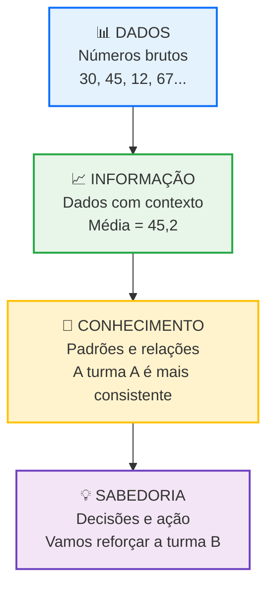
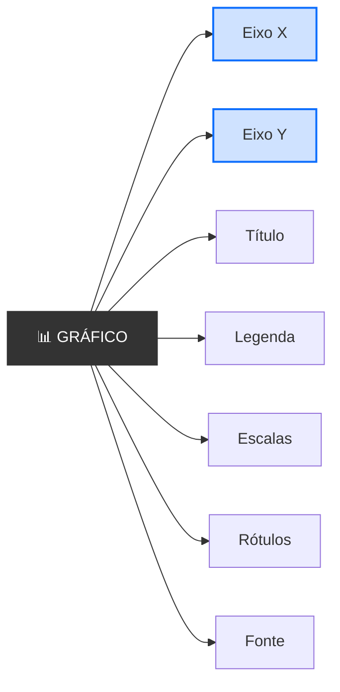
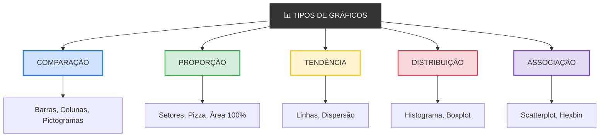
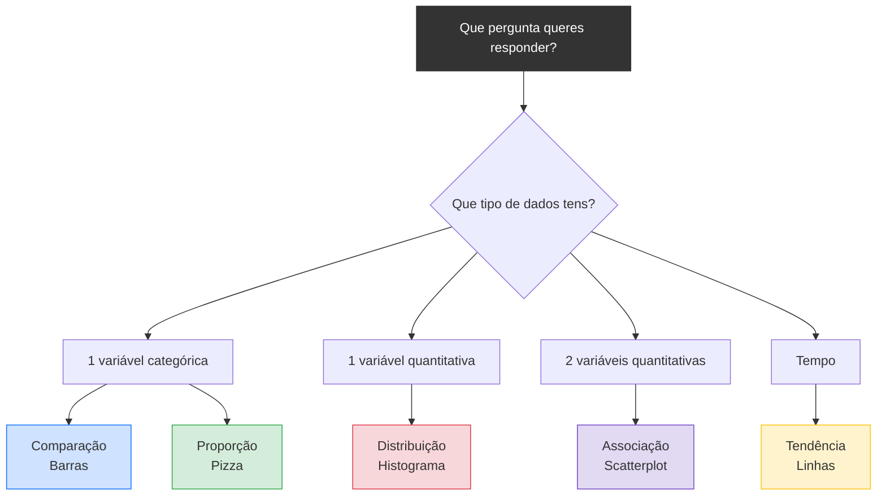

# 
Introdução Aos Gráficos

## Introdução

&emsp;&emsp;&emsp;Imagina que és o professor de uma turma de 30 alunos. No final do ano, tens uma tabela com as notas de todos eles. São 30 linhas e 5 colunas — 150 números. Agora pergunta-te: **consegues ver rapidamente quem melhorou? Quem piorou? Qual foi a turma mais consistente?** A resposta é não. Os números estão lá, mas a informação está escondida.  

&emsp;&emsp;&emsp;Agora imagina que transformas essa tabela num gráfico de linhas. Cada aluno é uma linha. Num instante, vês quem subiu, quem desceu, quem se manteve estável. **A mesma informação, mas compreendida em segundos.** É isto que a **visualização de dados** faz: transforma números em compreensão. E é por isso que esta aula existe — antes de aprenderes a calcular médias, desvios-padrão ou correlações, precisas de saber **olhar** para os dados. Porque um gráfico bem feito responde a perguntas que uma tabela nem sequer consegue formular.

> 💡 **Regra de Ouro:** Um gráfico não é decoração. É uma ferramenta de pensamento. Serve para ver o que os números escondem.

## O que é um Gráficos?

> Um **gráfico** é uma representação visual de dados que usa elementos geométricos (pontos, linhas, barras, áreas, cores) para mostrar relações, padrões, tendências e comparações entre variáveis.

&emsp;&emsp;&emsp;Um gráfico é, na sua essência, uma **tradução**. Traduz números para uma linguagem que o cérebro humano processa naturalmente: a linguagem visual. O cérebro humano é uma máquina visual. Cerca de **30% do córtex cerebral** está dedicado ao processamento visual. Reconhecemos uma face em 100 milissegundos. Detetamos um padrão numa imagem quase instantaneamente. Mas ler uma tabela de 50 números? Isso exige esforço consciente, atenção sustentada, memória de trabalho. Os gráficos existem para **explorar essa capacidade natural**. Em vez de forçar o cérebro a ler números, damos-lhe formas. E as formas são processadas sem esforço.  

&emsp;&emsp;&emsp;Os dados são números brutos, sem contexto, como 30, 45, 12, 67, 23. Quando ganham contexto, transformam-se em informação, como "A média das notas é 45,2". A partir da informação extraem-se conhecimento — padrões e relações, como "A turma A é mais consistente que a B". E quando esse conhecimento orienta decisões e ações, chegamos à sabedoria, como "Vamos reforçar a turma B com apoio extra".

📊 A Pirâmide: Dados → Informação → Conhecimento → Sabedoria 

 

&emsp;&emsp;&emsp;Os gráficos vivem entre a **informação** e o **conhecimento**. Transformam dados em informação visual e revelam padrões que se tornam conhecimento. Sem gráficos, ficamos presos nos dados. Com gráficos, damos o primeiro passo para a sabedoria.

### Anatomia de um Gráficos

&emsp;&emsp;&emsp;A anatomia de um gráfico organiza-se em torno de sete elementos essenciais:

- **Eixo X** — variável independente, disposta na horizontal; representa aquilo que controlamos ou que serve de base à observação.
- **Eixo Y** — variável dependente, disposta na vertical; representa aquilo que medimos ou que responde à variável do eixo X.
- **Título** — indica, de forma clara e direta, o que o gráfico mostra, permitindo ao leitor saber imediatamente o que está a ver.
- **Legenda** — explica o significado das cores, formas e símbolos utilizados; é essencial quando o gráfico representa mais do que uma série de dados.
- **Escalas** — definem os intervalos dos eixos, determinando a amplitude e o espaçamento dos valores apresentados.
- **Rótulos** — identificam os nomes das categorias ou das variáveis em cada eixo, garantindo que o leitor sabe o que está a ser representado.
- **Fonte** — indica a origem dos dados, conferindo credibilidade e permitindo ao leitor verificar ou aprofundar a informação.

&emsp;&emsp;&emsp;Em conjunto, estes sete elementos transformam um conjunto de pontos ou barras numa representação visual completa, clara e honesta.

Anatomia de um Gráficos
 

Um gráfico bem construído tem **sete elementos essenciais**. Sem eles, o gráfico é incompleto ou enganador.

### Os Tipos De Gráficos

&emsp;&emsp;&emsp;Nem todos os gráficos servem para tudo. Cada tipo de gráfico responde a uma **pergunta diferente**. Ao longo deste módulo, vais estudar cinco tipos — cada um com a sua função: 

1. Gráficos de Comparação
1. Gráficos de Proporção
1. Gráficos de Distribuição
1. Gráficos de Tendencia
1. Gráficos de Associação

📊 Tipos De Gráficos

### Como escolher um Gráficos certo? 

&emsp;&emsp;&emsp;A escolha do gráfico não é arbitrária. Depende da **pergunta** que queres responder e do **tipo de variáveis** que tens.

📊 Escolha do Gráficos

## EXERCÍCIOS

📗 Exercício 1 — Identificar o tipo de gráfico (Fácil)

**Enunciado:** Para cada situação, indica que tipo de gráfico usarias (comparação, proporção, tendência, distribuição ou associação):

a) Mostrar a evolução da temperatura ao longo de uma semana

b) Comparar as notas de 4 turmas

c) Mostrar a percentagem de cada rede social usada por adolescentes

d) Ver se há relação entre horas de sono e concentração

e) Mostrar como se distribuem as alturas de 100 pessoas

💡 Ver resposta

a) **Tendência** — Linhas (evolução temporal)

b) **Comparação** — Barras (comparar grupos)

c) **Proporção** — Pizza ou Setores (partes de um todo)

d) **Associação** — Scatterplot (relação entre duas variáveis)

e) **Distribuição** — Histograma (forma da distribuição)

📗 Exercício 2 — Detetar erros (Médio)

**Enunciado:** Observa o gráfico abaixo e identifica três erros de visualização.

📊 Gráfico com erros

<svg width="350" height="200" style="background:#f8f9fa;border-radius:8px">
  <text x="175" y="20" text-anchor="middle" font-size="12" font-weight="700" fill="#333">Gráfico 1</text>
  <line x1="40" y1="170" x2="330" y2="170" stroke="#333" stroke-width="2"/>
  <line x1="40" y1="50" x2="40" y2="170" stroke="#333" stroke-width="2"/>
  <rect x="60" y="80" width="50" height="90" fill="#ff0000" opacity="0.8"/>
  <rect x="130" y="75" width="50" height="95" fill="#00ff00" opacity="0.8"/>
  <rect x="200" y="70" width="50" height="100" fill="#0000ff" opacity="0.8"/>
  <rect x="270" y="65" width="50" height="105" fill="#ffff00" opacity="0.8"/>
  <text x="85" y="185" text-anchor="middle" font-size="11" fill="#666">A</text>
  <text x="155" y="185" text-anchor="middle" font-size="11" fill="#666">B</text>
  <text x="225" y="185" text-anchor="middle" font-size="11" fill="#666">C</text>
  <text x="295" y="185" text-anchor="middle" font-size="11" fill="#666">D</text>
</svg>

💡 Ver resposta

1. **Título vago** — "Gráfico 1" não diz nada. Deveria ser "Vendas por Região" ou similar.
2. **Eixo Y truncado** — começa em 50, não em 0. Isto exagera as diferenças.
3. **Cores sem significado** — vermelho, verde, azul e amarelo não têm relação com os dados. Deveriam ser todas da mesma cor ou ter um propósito.
4. **Falta de rótulos nos eixos** — não sabemos o que o eixo Y representa.
5. **Falta de fonte** — não sabemos de onde vêm os dados.

📗 Exercício 3 — Escolher o gráfico certo (Médio)

**Enunciado:** Tens os seguintes dados: população de 5 países ao longo de 10 anos. Que gráfico usarias para mostrar:

a) Qual país tem mais população em 2024?

b) Como evoluiu a população de cada país?

c) Que percentagem da população mundial cada país representa?

💡 Ver resposta

a) **Barras** — comparação entre países num ano específico

b) **Linhas** — evolução temporal de cada país

c) **Pizza** — proporção de cada país no total mundial

📗 Exercício 4 — Interpretar um gráfico (Médio)

**Enunciado:** Observa o scatterplot abaixo e responde:

📊 Scatterplot — Horas de Estudo vs. Nota

<svg width="350" height="200" style="background:#f8f9fa;border-radius:8px">
  <text x="175" y="20" text-anchor="middle" font-size="12" font-weight="700" fill="#333">Horas de Estudo vs. Nota</text>
  <line x1="40" y1="170" x2="330" y2="170" stroke="#333" stroke-width="2"/>
  <line x1="40" y1="30" x2="40" y2="170" stroke="#333" stroke-width="2"/>
  <circle cx="70" cy="150" r="5" fill="#0d6efd" opacity="0.7"/>
  <circle cx="100" cy="140" r="5" fill="#0d6efd" opacity="0.7"/>
  <circle cx="130" cy="120" r="5" fill="#0d6efd" opacity="0.7"/>
  <circle cx="160" cy="110" r="5" fill="#0d6efd" opacity="0.7"/>
  <circle cx="190" cy="90" r="5" fill="#0d6efd" opacity="0.7"/>
  <circle cx="220" cy="80" r="5" fill="#0d6efd" opacity="0.7"/>
  <circle cx="250" cy="60" r="5" fill="#0d6efd" opacity="0.7"/>
  <circle cx="280" cy="50" r="5" fill="#0d6efd" opacity="0.7"/>
  <circle cx="310" cy="40" r="5" fill="#0d6efd" opacity="0.7"/>
  <text x="185" y="190" text-anchor="middle" font-size="11" fill="#666">Horas de Estudo →</text>
  <text x="20" y="100" text-anchor="middle" font-size="11" fill="#666" transform="rotate(-90,20,100)">Nota →</text>
</svg>

a) Qual é a direção da relação?

b) Qual é a força da relação?

c) Há outliers?

d) Que coeficiente usarias para quantificar esta relação?

💡 Ver resposta

a) **Positiva** — os pontos sobem da esquerda para a direita

b) **Forte** — os pontos estão apertados em torno de uma linha imaginária

c) **Não** — não há pontos isolados

d) **Pearson** — relação linear, sem outliers

> **Em resumo:** um gráfico não é decoração. É uma ferramenta de pensamento. Serve para ver o que os números escondem. E um gráfico bem feito vale mais que mil números.