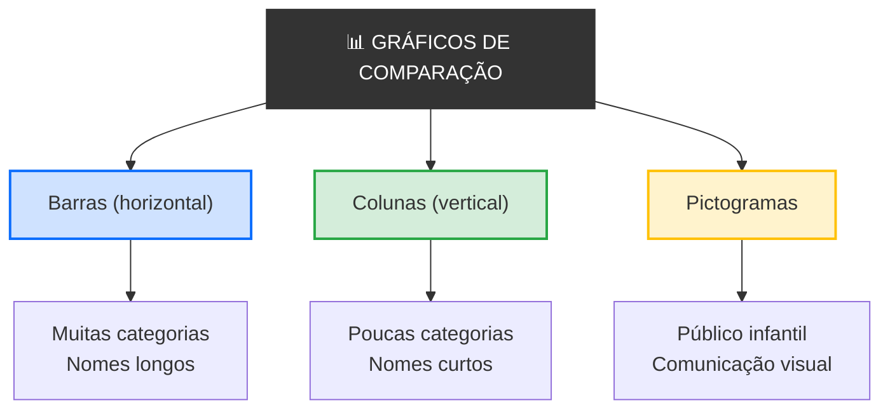

# 
Gráficos de Comparação

## Introdução

&emsp;&emsp;&emsp;Suponhamos que és o diretor de uma escola com 4 turmas do 9º ano. No final do ano, recebes uma tabela com a média de cada turma: Turma A — 14,2; Turma B — 12,8; Turma C — 15,1; Turma D — 13,5. Agora pergunta-te: **qual é a melhor turma? Qual precisa de mais apoio?** A resposta está lá, mas exige que compares quatro números mentalmente.  

&emsp;&emsp;&emsp;Agora imagina que transformas esses quatro números em quatro barras. Num instante, vês que a Turma C é a melhor e a Turma B precisa de atenção. **A mesma informação, mas compreendida em segundos.** É isto que os **gráficos de comparação** fazem: colocam valores lado a lado para que as diferenças sal tem à vista. E é por isso que esta aula existe — depois de aprenderes o que é um gráfico e quais os seus elementos, precisas de saber qual usar quando a pergunta é *"qual é maior?"*.

> 💡 **Regra de Ouro:** Um gráfico de comparação não mostra evolução nem proporção. Mostra diferenças. Serve para responder à pergunta *"qual é maior?"* — e nada mais.

## O que é um Gráfico de Comparação?

> Um **gráfico de comparação** é uma representação visual que coloca **categorias distintas** lado a lado, usando elementos geométricos com **comprimento proporcional** aos valores, para facilitar a comparação direta entre elas.

&emsp;&emsp;&emsp;Os gráficos de comparação são os mais antigos e os mais usados de todos. Aparecem em jornais, relatórios, apresentações e livros escolares. A sua lógica é simples: se queres comparar valores, coloca-os lado a lado com o mesmo ponto de partida. O cérebro humano é excelente a comparar comprimentos — muito melhor do que a comparar números abstratos.  

&emsp;&emsp;&emsp;Existem três tipos principais de gráficos de comparação: **barras** (horizontais), **colunas** (verticais) e **pictogramas** (com ícones). Cada um tem o seu contexto ideal.

📊 Mapa dos Gráficos de Comparação

## Gráfico de Barras

### O que é?

> Um **gráfico de barras** é um gráfico de comparação em que as categorias são dispostas **horizontalmente** e o comprimento de cada barra representa o valor da categoria.

&emsp;&emsp;&emsp;No gráfico de barras, as categorias ficam no eixo Y (vertical) e os valores no eixo X (horizontal). Cada barra começa sempre no zero e estende-se até ao valor correspondente. O comprimento da barra é proporcional ao valor — se uma barra é o dobro do comprimento de outra, o valor é o dobro.

### Quando usar?

- Quando tens **muitas categorias** (mais de 6)
- Quando os **nomes das categorias são longos**
- Quando queres ordenar as barras do maior para o menor
- Quando o espaço horizontal é limitado

### Exemplo visual

📊 Gráfico de Barras — População por Distrito

  
População por Distrito (milhares)

  

    

      Lisboa
      

        

      

      280
    

    

      Porto
      

        

      

      220
    

    

      Braga
      

        

      

      150
    

    

      Coimbra
      

        

      

      100
    

    

      Faro
      

        

      

      70
    

  

  

    População (milhares)
  

**Interpretação:** Lisboa é o distrito com mais população (280 mil), seguido do Porto (220 mil), Braga (150 mil), Coimbra (100 mil) e Faro (70 mil). As barras estão ordenadas da maior para a menor, o que facilita a leitura.

## Gráfico de Colunas

### O que é?

> Um **gráfico de colunas** é um gráfico de comparação em que as categorias são dispostas **verticalmente** e a altura de cada coluna representa o valor da categoria.

&emsp;&emsp;&emsp;No gráfico de colunas, as categorias ficam no eixo X (horizontal) e os valores no eixo Y (vertical). É o gráfico de comparação mais comum e o mais intuitivo para a maioria das pessoas. Cada coluna começa sempre no zero e cresce para cima.

### Quando usar?

- Quando tens **poucas categorias** (até 6)
- Quando os **nomes das categorias são curtos**
- Quando queres comparar valores em **apresentações**
- Quando o espaço vertical é limitado

### Exemplo visual

📊 Gráfico de Colunas — Vendas por Trimestre

  
Vendas por Trimestre (milhares €)

  

    

      

        120
      

      Q1
    

    

      

        150
      

      Q2
    

    

      

        140
      

      Q3
    

    

      

        180
      

      Q4
    

  

**Interpretação:** O Q4 foi o trimestre com mais vendas (180 mil €), seguido do Q2 (150 mil €), Q3 (140 mil €) e Q1 (120 mil €). Uma comparação clara entre os quatro trimestres.

## Pictograma

### O que é?

> Um **pictograma** é um gráfico de comparação que usa **ícones ou imagens** repetidas para representar quantidades. Cada ícone representa um número fixo de unidades.

&emsp;&emsp;&emsp;O pictograma é a forma mais antiga e mais visual de comparar dados. Em vez de barras, usa símbolos — pessoas, carros, maçãs, estrelas. É especialmente útil para comunicação com públicos não técnicos, crianças, ou em contextos publicitários.

### Quando usar?

- Quando o **público é infantil** ou não técnico
- Quando queres **comunicar visualmente** uma mensagem
- Quando os dados são **simples e poucos**
- Quando a **estética** é importante

### Exemplo visual

📊 Pictograma — Livros Lidos por Turma

  
Livros Lidos por Turma

  
Cada 📚 = 5 livros

  

    

      Turma A
      📚📚📚📚📚📚📚📚
      40 livros
    

    

      Turma B
      📚📚📚📚📚📚
      30 livros
    

    

      Turma C
      📚📚📚📚📚📚📚📚📚
      45 livros
    

    

      Turma D
      📚📚📚📚📚
      25 livros
    

  

**Interpretação:** A Turma C leu mais livros (45), seguida da Turma A (40), Turma B (30) e Turma D (25). Cada ícone de livro representa 5 livros lidos. A mensagem é imediata e visual.

## Barras vs. Colunas 

&emsp;&emsp;&emsp;A escolha entre barras e colunas não é arbitrária. Depende do contexto e das categorias.

| Critério | Barras (horizontal) | Colunas (vertical) |
|----------|---------------------|---------------------|
| **Número de categorias** | Muitas (6+) | Poucas (até 6) |
| **Nomes das categorias** | Longos | Curtos |
| **Ordenação** | Fácil (maior → menor) | Possível, mas menos comum |
| **Contexto** | Relatórios, análises | Apresentações, slides |
| **Leitura** | Esquerda → direita | Baixo → cima |
| **Espaço** | Ocupa mais altura | Ocupa mais largura |

**Regra prática:** Se os nomes das categorias são longos ou há muitas categorias → **barras**. Se são poucas categorias com nomes curtos → **colunas**.

## Gráfico de Barras Agrupadas

### O que é?

> Um **gráfico de barras agrupadas** (ou colunas agrupadas) mostra **duas ou mais séries de dados** lado a lado dentro de cada categoria, permitindo comparar não só entre categorias, mas também entre séries.

&emsp;&emsp;&emsp;Imagina que queres comparar as vendas de duas lojas em quatro regiões diferentes. Com barras simples, terias de fazer dois gráficos separados. Com barras agrupadas, colocas as duas barras lado a lado em cada região. Isto permite ver não só qual região vende mais, mas também qual loja se sai melhor em cada região.

### Exemplo visual

📊 Barras Agrupadas — Vendas por Região e Loja

  
Vendas por Região e Loja (milhares €)

  

    

      

        

          120
        

        

          80
        

      

      Norte
    

    

      

        

          150
        

        

          110
        

      

      Sul
    

    

      

        

          180
        

        

          140
        

      

      Centro
    

    

      

        

          100
        

        

          90
        

      

      Ilhas
    

  

  

    

      

      Loja A
    

    

      

      Loja B
    

  

**Interpretação:** Em todas as regiões, a Loja A vende mais que a Loja B. O Centro é a região com mais vendas totais, seguido do Sul, Norte e Ilhas. As barras agrupadas permitem comparar duas dimensões ao mesmo tempo.

### Exemplo Prático

&emsp;&emsp;&emsp;Vamos construir um gráfico de comparação passo a passo.

**Dados:** Notas médias de 5 turmas.

| Turma | Nota Média |
|-------|-----------|
| A | 14,2 |
| B | 12,8 |
| C | 15,1 |
| D | 13,5 |
| E | 11,9 |

**Passo 1 — Escolher o tipo de gráfico**

Temos 5 categorias com nomes curtos. **Colunas** é a escolha ideal.

**Passo 2 — Definir os eixos**

- Eixo X: Turmas (A, B, C, D, E)
- Eixo Y: Nota Média (0 a 20)

**Passo 3 — Desenhar as colunas**

📊 Colunas — Nota Média por Turma

  
Nota Média por Turma

  

    

      

        14,2
      

      A
    

    

      

        12,8
      

      B
    

    

      

        15,1
      

      C
    

    

      

        13,5
      

      D
    

    

      

        11,9
      

      E
    

  

  

    Nota Média
  

**Passo 4 — Interpretar**

A Turma C tem a melhor média (15,1), seguida da Turma A (14,2), Turma D (13,5), Turma B (12,8) e Turma E (11,9). A Turma E precisa de mais apoio.

## Exercícios

📗 Exercício 1 — Identificar o tipo de gráfico de comparação (Fácil)

**Enunciado:** Para cada situação, indica se usarias barras, colunas ou pictogramas:

a) Comparar a população de 10 países

b) Comparar as vendas de 4 produtos num slide de apresentação

c) Mostrar a quantidade de fruta comida por crianças numa escola primária

d) Comparar o PIB de 8 regiões com nomes longos

e) Comparar a altura de 3 edifícios famosos

💡 Ver resposta

a) **Barras** — muitas categorias (10) e nomes potencialmente longos

b) **Colunas** — poucas categorias (4), nomes curtos, contexto de apresentação

c) **Pictogramas** — público infantil, comunicação visual

d) **Barras** — muitas categorias (8) e nomes longos

e) **Colunas** — poucas categorias (3), nomes curtos

📗 Exercício 2 — Detetar erros (Médio)

**Enunciado:** Observa o gráfico abaixo e identifica três erros de visualização.

📊 Gráfico com erros

  
Vendas

  

    

      

      A
    

    

      

      B
    

    

      

      C
    

    

      

      D
    

  

💡 Ver resposta

1. **Título vago** — "Vendas" não diz o que está a ser comparado. Deveria ser "Vendas por Produto" ou similar.

2. **Eixo Y truncado** — começa em 50, não em 0. Isto exagera as diferenças entre as barras.

3. **Cores sem significado** — vermelho, verde, azul e amarelo não têm relação com os dados. Deveriam ser todas da mesma cor ou ter um propósito claro.

4. **Falta de rótulos nos eixos** — não sabemos o que o eixo Y representa.

5. **Falta de fonte** — não sabemos de onde vêm os dados.

📗 Exercício 3 — Escolher o gráfico certo (Médio)

**Enunciado:** Tens os seguintes dados: número de alunos em 6 cursos diferentes. Que gráfico de comparação usarias para mostrar:

a) Os dados num relatório anual

b) Os dados numa apresentação para pais

c) Os dados num cartaz para crianças

💡 Ver resposta

a) **Barras** — relatório anual, nomes de cursos podem ser longos, mais formal

b) **Colunas** — apresentação para pais, 6 categorias, nomes curtos, visual

c) **Pictogramas** — cartaz para crianças, comunicação visual, apelativo

📗 Exercício 4 — Interpretar um gráfico (Médio)

**Enunciado:** Observa o gráfico abaixo e responde:

📊 Gráfico — Temperatura Média por Cidade

  
Temperatura Média por Cidade (°C)

  

    

      

        28
      

      Lisboa
    

    

      

        22
      

      Porto
    

    

      

        30
      

      Faro
    

    

      

        18
      

      Braga
    

  

a) Qual é a cidade mais quente?

b) Qual é a cidade mais fria?

c) Qual é a diferença de temperatura entre Faro e Braga?

d) Que tipo de gráfico é este?

💡 Ver resposta

a) **Faro** — 30°C

b) **Braga** — 18°C

c) **12°C** — Faro (30) − Braga (18) = 12

d) **Gráfico de colunas** — categorias no eixo X, valores no eixo Y

📗 Exercício 5 — Construir um gráfico (Difícil)

**Enunciado:** Tens os seguintes dados sobre o número de livros lidos por 4 turmas:

| Turma | Livros Lidos |
|-------|-------------|
| A | 40 |
| B | 30 |
| C | 45 |
| D | 25 |

a) Que tipo de gráfico de comparação usarias?

b) Desenha o gráfico mentalmente (ou num papel) com todos os elementos da anatomia.

c) Interpreta o gráfico.

💡 Ver resposta

a) **Colunas** — 4 categorias, nomes curtos (A, B, C, D)

b) O gráfico deve ter:
- Título: "Livros Lidos por Turma"
- Eixo X: Turmas (A, B, C, D)
- Eixo Y: Número de Livros (0 a 50)
- Colunas de altura proporcional: A=40, B=30, C=45, D=25
- Cores consistentes
- Rótulos com os valores
- Fonte dos dados

c) A Turma C leu mais livros (45), seguida da Turma A (40), Turma B (30) e Turma D (25). A Turma D precisa de incentivo à leitura.

> **Em resumo:** os gráficos de comparação colocam categorias lado a lado para responder à pergunta *"qual é maior?"*. As **barras** são horizontais e ideais para muitas categorias com nomes longos; as **colunas** são verticais e ideais para poucas categorias com nomes curtos; os **pictogramas** usam ícones e são ideais para públicos infantis. Em todos, o comprimento ou altura é proporcional ao valor, e o eixo começa sempre em zero. Um gráfico de comparação bem feito transforma uma tabela de números numa resposta visual imediata.