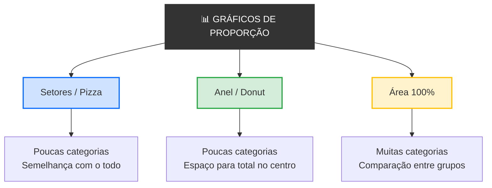

# 
Gráficos de Proporção

## Introdução

&emsp;&emsp;&emsp;Um certo gestor de uma empresa e queres saber como se distribui o orçamento anual: 40% para salários, 25% para infraestrutura, 20% para marketing, 10% para investigação e 5% para reservas. Agora pergunta-te: **consegues ver rapidamente que parte do total vai para cada área?** Com números, tens de fazer contas mentais. Com um gráfico de proporção, vês imediatamente que os salários dominam e que as reservas são uma fatia mínima.  

&emsp;&emsp;&emsp;Agora imagina que queres mostrar a quota de mercado de 4 empresas concorrentes. A Empresa A tem 45%, a B tem 30%, a C tem 15% e a D tem 10%. Num gráfico de setores, as fatias mostram a relação de cada empresa com o todo. **A mesma informação, mas compreendida em segundos.** É isto que os **gráficos de proporção** fazem: mostram como um total se divide em partes. E é por isso que esta aula existe — depois de aprenderes a comparar valores, precisas de saber mostrar **que parte do todo** cada valor representa.

> 💡 **Regra de Ouro:** Um gráfico de proporção não compara valores entre si. Mostra a relação de cada parte com o todo. Serve para responder à pergunta *"que fração do total é isto?"* — e as partes têm de somar 100%.

## O que é um Gráfico de Proporção?

> Um **gráfico de proporção** é uma representação visual que mostra como um **todo** se divide em **partes**, usando áreas ou ângulos proporcionais à fração que cada parte representa do total.

&emsp;&emsp;&emsp;Os gráficos de proporção são diferentes dos gráficos de comparação. Num gráfico de comparação, cada barra é independente — não têm de somar nada. Num gráfico de proporção, as partes **têm de somar 100%**. Isto muda tudo: já não estás a comparar valores isolados, estás a mostrar a **composição de um todo**.  

&emsp;&emsp;&emsp;Existem três tipos principais de gráficos de proporção: **gráfico de setores** (ou pizza), **gráfico de anel** (donut) e **gráfico de área 100%** (barras empilhadas). Cada um tem o seu contexto ideal.

📊 Mapa dos Gráficos de Proporção

## Gráfico de Setores (Pizza)

### O que é?

> Um **gráfico de setores** é um círculo dividido em fatias, em que cada fatia representa uma categoria e o **ângulo** de cada fatia é proporcional à fração que essa categoria representa do total.

&emsp;&emsp;&emsp;O gráfico de setores é o gráfico de proporção mais conhecido e o mais usado. A lógica é simples: o círculo representa o todo (100%), e cada fatia representa uma parte. Se uma categoria representa 25% do total, a sua fatia ocupa um quarto do círculo (90 graus).  

&emsp;&emsp;&emsp;O gráfico de setores é excelente para mostrar **poucas categorias** com diferenças claras. Mas é terrível para muitas categorias ou diferenças pequenas — o olho humano não consegue comparar ângulos com precisão.

### Quando usar?

- Quando tens **poucas categorias** (idealmente até 5)
- Quando as diferenças entre as fatias são **claras**
- Quando queres mostrar a **relação com o todo**
- Quando o público é **não técnico**

### Exemplo visual

📊 Gráfico de Setores — Distribuição do Orçamento Anual

  
Distribuição do Orçamento Anual

  

    

      

    

    

      

        

        Salários — 40%
      

      

        

        Infraestrutura — 25%
      

      

        

        Marketing — 20%
      

      

        

        Investigação — 10%
      

      

        

        Reservas — 5%
      

    

  

**Interpretação:** Os salários consomem 40% do orçamento — a maior fatia. A infraestrutura representa 25%, o marketing 20%, a investigação 10% e as reservas apenas 5%. As cinco fatias somam 100%.

## Gráfico de Anel (Donut)

### O que é?

> Um **gráfico de anel** é uma variante do gráfico de setores em que o centro do círculo é removido, criando um anel. As fatias funcionam da mesma forma, mas o espaço central pode ser usado para mostrar o total ou uma informação adicional.

&emsp;&emsp;&emsp;O gráfico de anel resolve um problema do gráfico de setores: o centro vazio. Em vez de um círculo maciço, tens um anel com um espaço no meio que podes usar para mostrar o valor total, uma percentagem-chave, ou simplesmente para tornar o gráfico mais leve visualmente.

### Quando usar?

- Quando queres mostrar o **total no centro**
- Quando queres um visual **mais moderno**
- Quando tens **poucas categorias**
- Quando queres **destacar uma categoria** específica

### Exemplo visual

📊 Gráfico de Anel — Quota de Mercado por Empresa

  
Quota de Mercado por Empresa

  

    

      

        100%
        Mercado
      

    

    

      

        

        Empresa A — 45%
      

      

        

        Empresa B — 30%
      

      

        

        Empresa C — 15%
      

      

        

        Empresa D — 10%
      

    

  

**Interpretação:** A Empresa A domina o mercado com 45%, seguida da B (30%), C (15%) e D (10%). O centro do anel mostra que o total é 100% do mercado. O visual é mais leve que o gráfico de setores tradicional.

## Gráfico de Área 100% (Barras Empilhadas)

### O que é?

> Um **gráfico de área 100%** é um gráfico de barras empilhadas em que cada barra representa 100% de um grupo, e as secções dentro de cada barra representam a proporção de cada categoria dentro desse grupo.

&emsp;&emsp;&emsp;O gráfico de área 100% é a solução quando tens **muitas categorias** ou quando queres **comparar proporções entre grupos**. Em vez de um círculo, tens barras verticais empilhadas. Cada barra tem a mesma altura (100%), mas as secções internas variam.  

&emsp;&emsp;&emsp;Imagina que queres comparar a distribuição de gastos de três famílias diferentes. Com um gráfico de setores, precisarias de três círculos. Com um gráfico de área 100%, tens três barras lado a lado, cada uma dividida nas mesmas categorias.

### Quando usar?

- Quando tens **muitas categorias** (mais de 5)
- Quando queres **comparar proporções entre grupos**
- Quando queres mostrar **evolução temporal** de proporções
- Quando o espaço horizontal é limitado

### Exemplo visual

📊 Gráfico de Área 100% — Distribuição de Gastos por Família

  
Distribuição de Gastos por Família

  

    

      

        

        

        

        

      

      Família A

    

    

      

        

        

        

        

      

      Família B

    

    

      

        

        

        

        

      

      Família C

    

  

  

    

      

      Casa
    

    

      

      Alimentação
    

    

      

      Transporte
    

    

      

      Outros
    

  

**Interpretação:** As três famílias distribuem os gastos de forma diferente. A Família A gasta mais em "Outros" e "Transporte"; a Família B gasta mais em "Casa"; a Família C gasta mais em "Alimentação". Cada barra soma 100%, permitindo comparar as proporções entre famílias.

### Setores vs. Anel vs. Área

| Critério | Setores (Pizza) | Anel (Donut) | Área 100% |
|----------|-----------------|--------------|-----------|
| **Nº de categorias** | Poucas (até 5) | Poucas (até 5) | Muitas (5+) |
| **Comparação entre grupos** | Difícil | Difícil | Excelente |
| **Mostra o total** | Sim (círculo) | Sim (centro) | Sim (barra) |
| **Precisão** | Baixa | Baixa | Média |
| **Estética** | Clássica | Moderna | Funcional |
| **Uso comum** | Relatórios, jornais | Apresentações | Análise de dados |

**Regra prática:** Se tens poucas categorias e queres mostrar a relação com o todo → **setores** ou **anel**. Se tens muitas categorias ou queres comparar grupos → **área 100%**.

### Exemplo Prático

&emsp;&emsp;&emsp;Vamos construir um gráfico de proporção passo a passo.

**Dados:** Distribuição das despesas mensais de uma família.

| Categoria | Valor (€) | Percentagem |
|-----------|-----------|-------------|
| Casa | 800 | 40% |
| Alimentação | 500 | 25% |
| Transporte | 300 | 15% |
| Educação | 200 | 10% |
| Lazer | 200 | 10% |
| **Total** | **2000** | **100%** |

**Passo 1 — Escolher o tipo de gráfico**

Temos 5 categorias com diferenças claras. **Setores** é a escolha ideal.

**Passo 2 — Calcular os ângulos**

- Casa: 40% × 360° = 144°
- Alimentação: 25% × 360° = 90°
- Transporte: 15% × 360° = 54°
- Educação: 10% × 360° = 36°
- Lazer: 10% × 360° = 36°

**Passo 3 — Desenhar o gráfico**

📊 Setores — Despesas Mensais de uma Família

  
Despesas Mensais de uma Família

  

    

      

    

    

      

        

        Casa — 40% (800€)
      

      

        

        Alimentação — 25% (500€)
      

      

        

        Transporte — 15% (300€)
      

      

        

        Educação — 10% (200€)
      

      

        

        Lazer — 10% (200€)
      

    

  

**Passo 4 — Interpretar**

A casa consome 40% do orçamento familiar — a maior fatia. A alimentação representa 25%, o transporte 15%, e a educação e o lazer representam 10% cada. As cinco categorias somam 100% das despesas mensais.

## Exercícios

📗 Exercício 1 — Identificar o tipo de gráfico de proporção (Fácil)

**Enunciado:** Para cada situação, indica se usarias setores, anel ou área 100%:

a) Mostrar a quota de mercado de 4 empresas

b) Comparar a distribuição de gastos de 5 países diferentes

c) Mostrar a distribuição de idades numa turma (crianças, jovens, adultos, idosos)

d) Comparar a composição étnica de 3 cidades

e) Mostrar as preferências partidárias num país com 6 partidos

💡 Ver resposta

a) **Setores ou anel** — 4 categorias, relação com o todo, diferenças claras

b) **Área 100%** — comparar proporções entre 5 grupos diferentes

c) **Setores** — 4 categorias, relação com o todo

d) **Área 100%** — comparar proporções entre 3 grupos diferentes

e) **Área 100%** — 6 categorias, muitas para setores

📗 Exercício 2 — Detetar erros (Médio)

**Enunciado:** Observa o gráfico abaixo e identifica três erros de visualização.

📊 Gráfico com erros

  
Gráfico 1

  

    

    

      

        

        A
      

      

        

        B
      

      

        

        C
      

      

        

        D
      

      

        

        E
      

    

  

💡 Ver resposta

1. **Título vago** — "Gráfico 1" não diz nada. Deveria ser "Distribuição de Vendas por Produto" ou similar.

2. **Muitas categorias** — 5 fatias sem valores nem percentagens. Idealmente, um gráfico de setores deve ter no máximo 5 categorias com diferenças claras.

3. **Cores sem significado** — vermelho, verde, azul, amarelo e magenta não têm relação com os dados.

4. **Falta de legenda com valores** — não sabemos o que cada letra representa nem as percentagens.

5. **Falta de fonte** — não sabemos de onde vêm os dados.

📗 Exercício 3 — Escolher o gráfico certo (Médio)

**Enunciado:** Tens os seguintes dados: distribuição de 1000 respostas a um inquérito sobre o meio de transporte usado. Carro — 45%, Transporte público — 30%, Bicicleta — 15%, A pé — 8%, Outros — 2%. Que gráfico de proporção usarias para mostrar:

a) Os dados num relatório anual

b) Os dados numa apresentação para a câmara municipal

c) Comparar estes dados com os de outra cidade

💡 Ver resposta

a) **Setores** — relatório anual, 5 categorias, relação com o todo

b) **Anel** — apresentação, visual moderno, espaço para o total no centro

c) **Área 100%** — comparar proporções entre duas cidades

📗 Exercício 4 — Interpretar um gráfico (Médio)

**Enunciado:** Observa o gráfico abaixo e responde:

📊 Gráfico — Distribuição de Alunos por Curso

  
Distribuição de Alunos por Curso

  

    

    

      

        

        Ciências — 35%
      

      

        

        Letras — 25%
      

      

        

        Artes — 22%
      

      

        

        Desporto — 18%
      

    

  

a) Qual é o curso com mais alunos?

b) Qual é o curso com menos alunos?

c) Qual é a diferença entre Ciências e Desporto?

d) Que tipo de gráfico é este?

💡 Ver resposta

a) **Ciências** — 35%

b) **Desporto** — 18%

c) **17%** — Ciências (35%) − Desporto (18%) = 17%

d) **Gráfico de setores (pizza)** — círculo dividido em fatias proporcionais

📗 Exercício 5 — Construir um gráfico (Difícil)

**Enunciado:** Tens os seguintes dados sobre as despesas mensais de uma família:

| Categoria | Valor (€) | Percentagem |
|-----------|-----------|-------------|
| Casa | 800 | 40% |
| Alimentação | 500 | 25% |
| Transporte | 300 | 15% |
| Educação | 200 | 10% |
| Lazer | 200 | 10% |
| **Total** | **2000** | **100%** |

a) Que tipo de gráfico de proporção usarias?

b) Calcula os ângulos de cada fatia.

c) Desenha o gráfico mentalmente (ou num papel) com todos os elementos da anatomia.

d) Interpreta o gráfico.

💡 Ver resposta

a) **Setores** — 5 categorias, diferenças claras, relação com o todo

b) Ângulos:
- Casa: 40% × 360° = 144°
- Alimentação: 25% × 360° = 90°
- Transporte: 15% × 360° = 54°
- Educação: 10% × 360° = 36°
- Lazer: 10% × 360° = 36°

c) O gráfico deve ter:
- Título: "Despesas Mensais de uma Família"
- Círculo dividido em 5 fatias com os ângulos calculados
- Legenda com as categorias, percentagens e valores
- Fonte dos dados

d) A casa consome 40% do orçamento — a maior fatia. A alimentação representa 25%, o transporte 15%, e a educação e o lazer representam 10% cada. As cinco categorias somam 100% das despesas mensais.

> **Em resumo:** os gráficos de proporção mostram como um todo se divide em partes, respondendo à pergunta *"que fração do total é isto?"*. Os **setores** usam um círculo dividido em fatias e são ideais para poucas categorias com diferenças claras; os **anéis** são uma variante moderna que deixa espaço para o total no centro; os **gráficos de área 100%** usam barras empilhadas e são ideais para muitas categorias ou para comparar proporções entre grupos. Em todos, as partes têm de somar 100%, e o tamanho de cada parte é proporcional à sua fração do todo. Um gráfico de proporção bem feito transforma uma lista de percentagens numa história visual sobre a composição de um todo.