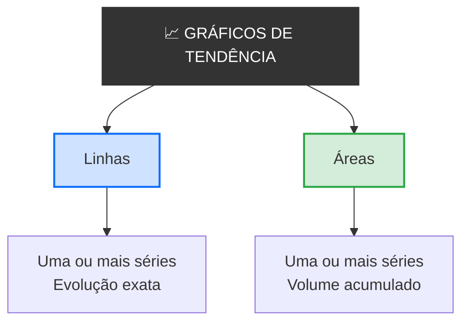

# 
Gráficos de Tendência

## Introdução

&emsp;&emsp;&emsp;Imagina que és o diretor financeiro de uma empresa e tens os dados de vendas dos últimos 12 meses. Janeiro: 120 mil €; Fevereiro: 135 mil €; Março: 128 mil €; Abril: 150 mil €; e por aí adiante. Agora pergunta-te: **as vendas estão a crescer ou a diminuir? Há alguma sazonalidade? Qual foi o melhor mês?** Com uma tabela de 12 números, tens de fazer contas mentais. Com um gráfico de linhas, vês a resposta imediatamente: a linha sobe, desce, ou oscila.  

&emsp;&emsp;&emsp;Agora imagina que queres comparar a evolução das vendas de três produtos diferentes ao longo do mesmo ano. Com uma tabela, seria um caos. Com três linhas no mesmo gráfico, vês qual cresce mais rápido, qual estagnou, qual caiu. **A mesma informação, mas compreendida em segundos.** É isto que os **gráficos de tendência** fazem: mostram como uma ou mais variáveis evoluem ao longo do tempo. E é por isso que esta aula existe — depois de aprenderes a comparar valores e a mostrar proporções, precisas de saber mostrar **evolução**.

> 💡 **Regra de Ouro:** Um gráfico de tendência não compara categorias nem mostra proporções. Mostra evolução. Serve para responder à pergunta *"como mudou ao longo do tempo?"* — e o eixo X é sempre o tempo.

## O que é um Gráfico de Tendência?

> Um **gráfico de tendência** é uma representação visual que mostra a **evolução de uma ou mais variáveis ao longo do tempo**, ligando pontos de dados consecutivos por linhas ou preenchendo áreas sob essas linhas.

&emsp;&emsp;&emsp;Os gráficos de tendência são diferentes dos gráficos de comparação e de proporção. Num gráfico de comparação, as categorias são independentes. Num gráfico de proporção, as partes somam 100%. Num gráfico de tendência, o eixo X é **sempre o tempo** — meses, anos, dias, horas. E o que interessa não é o valor isolado de cada ponto, mas a **direção** e a **forma** da evolução.  

&emsp;&emsp;&emsp;Existem dois tipos principais de gráficos de tendência: **gráfico de linhas** e **gráfico de áreas**. Cada um tem o seu contexto ideal.

📊 Mapa dos Gráficos de Tendência

### Gráfico de Linhas

### O que é?

> Um **gráfico de linhas** é um gráfico de tendência em que cada ponto representa um valor num instante de tempo, e os pontos são ligados por segmentos de reta, formando uma linha que mostra a evolução da variável.

&emsp;&emsp;&emsp;O gráfico de linhas é o gráfico de tendência mais comum e o mais intuitivo. A lógica é simples: o eixo X é o tempo; o eixo Y é a variável. Cada ponto é um valor num momento específico. A linha que os une mostra a evolução.

### Quando usar?

- Quando queres mostrar a **evolução de uma variável** ao longo do tempo
- Quando queres **comparar várias séries** no mesmo gráfico
- Quando o tempo é **contínuo** (meses, anos, dias)
- Quando queres **detetar tendências** (crescimento, declínio, estagnação)

### Exemplo visual

📊 Gráfico de Linhas — Vendas Mensais em 2024

  
Vendas Mensais em 2024 (milhares €)

  

    

    

    

    

    

    

    

    

    

    

    

    

    

    <svg style="position: absolute; top: 0; left: 0; width: 100%; height: 100%;" viewBox="0 0 100 100" preserveAspectRatio="none">
      <polyline points="5,80 14,70 23,65 32,50 41,35 50,25 59,18 68,12 77,8 86,3" fill="none" stroke="#60a5fa" stroke-width="0.5" vector-effect="non-scaling-stroke"/>
    </svg>

  

  

    JanFevMarAbrMaiJunJulAgoSetOut
  

**Interpretação:** As vendas crescem de forma consistente ao longo do ano. Começam em cerca de 40 mil € em janeiro e terminam em cerca de 150 mil € em outubro. A tendência é claramente positiva.

### Gráfico de Áreas

### O que é?

> Um **gráfico de áreas** é uma variante do gráfico de linhas em que a área sob a linha é preenchida com cor, dando ênfase ao **volume acumulado** ao longo do tempo.

&emsp;&emsp;&emsp;O gráfico de áreas é como um gráfico de linhas com preenchimento. A linha continua a mostrar a evolução, mas a área colorida dá uma sensação de volume. É especialmente útil quando queres mostrar a **magnitude** da variável, não apenas a sua direção.

### Quando usar?

- Quando queres enfatizar o **volume** ao longo do tempo
- Quando tens **uma única série** (ou séries empilhadas)
- Quando queres um visual **mais apelativo**
- Quando o espaço é limitado

### Exemplo visual

📊 Gráfico de Áreas — Vendas Mensais em 2024

  
Vendas Mensais em 2024 (milhares €)

  

    

    

    

    

    

    

    

    

    

    

    

    

    

    

  

  

    JanFevMarAbrMaiJunJulAgoSetOut
  

**Interpretação:** A área colorida dá uma sensação de volume acumulado. As vendas crescem de forma consistente, e a área sob a linha representa o total acumulado ao longo do tempo. É a mesma informação do gráfico de linhas, mas com mais ênfase na magnitude.

### Gráfico de Linhas Múltiplas

> Um **gráfico de linhas múltiplas** mostra **duas ou mais séries** no mesmo gráfico, permitindo comparar a evolução de várias variáveis ao longo do mesmo período de tempo.

&emsp;&emsp;&emsp;O gráfico de linhas múltiplas é uma das ferramentas mais poderosas da estatística descritiva. Permite ver, num único olhar, como diferentes grupos evoluem em paralelo. Cada linha tem uma cor diferente, e a legenda identifica cada série.

### Quando usar?

- Quando queres **comparar a evolução** de várias variáveis
- Quando tens **poucas séries** (idealmente até 5)
- Quando as séries têm a **mesma unidade** de medida
- Quando queres **detetar divergências** ou convergências

### Exemplo visual

📊 Gráfico de Linhas Múltiplas — Vendas por Produto

  
Vendas por Produto em 2024 (milhares €)

  

    <svg style="position: absolute; top: 0; left: 0; width: 100%; height: 100%;" viewBox="0 0 100 100" preserveAspectRatio="none">
      <polyline points="5,80 14,70 23,65 32,50 41,35 50,25 59,18 68,12 77,8 86,3" fill="none" stroke="#60a5fa" stroke-width="0.5" vector-effect="non-scaling-stroke"/>
      <polyline points="5,85 14,80 23,75 32,68 41,60 50,52 59,45 68,38 77,30 86,22" fill="none" stroke="#6ee7b7" stroke-width="0.5" vector-effect="non-scaling-stroke"/>
      <polyline points="5,90 14,87 23,84 32,80 41,76 50,72 59,68 68,64 77,60 86,56" fill="none" stroke="#fcd34d" stroke-width="0.5" vector-effect="non-scaling-stroke"/>
    </svg>

  

  

    JanFevMarAbrMaiJunJulAgoSetOut
  

  

    

      

      Produto A
    

    

      

      Produto B
    

    

      

      Produto C
    

  

**Interpretação:** O Produto A cresce mais rapidamente e termina com o valor mais alto. O Produto B cresce de forma mais moderada. O Produto C cresce lentamente e mantém-se o mais baixo dos três. As três linhas permitem comparar as trajetórias num único olhar.

### Gráfico de Áreas Empilhadas

> Um **gráfico de áreas empilhadas** mostra várias séries empilhadas umas sobre as outras, de modo que a altura total representa a soma de todas as séries num dado momento.

&emsp;&emsp;&emsp;O gráfico de áreas empilhadas é útil quando queres mostrar não só a evolução de cada série, mas também a **evolução do total** e a **composição do total** ao longo do tempo. Cada área representa uma categoria, e a altura total representa a soma de todas.

### Quando usar?

- Quando queres mostrar **evolução do total** e **composição**
- Quando tens **poucas categorias** (até 5)
- Quando as categorias têm a **mesma unidade**
- Quando queres **detetar mudanças na composição** ao longo do tempo

### Exemplo visual

📊 Gráfico de Áreas Empilhadas — Vendas por Região

  
Vendas por Região em 2024 (milhares €)

  

    

    

    

  

  

    JanFevMarAbrMaiJunJulAgoSetOut
  

  

    

      

      Norte
    

    

      

      Sul
    

    

      

      Centro
    

  

**Interpretação:** A altura total das áreas empilhadas representa as vendas totais. As três regiões contribuem para o total, e a composição mantém-se relativamente estável ao longo do ano. A região Norte é a que mais contribui, seguida do Sul e do Centro.

### Linhas vs. Áreas 

| Critério | Linhas | Áreas |
|----------|--------|-------|
| **Foco** | Evolução exata | Volume acumulado |
| **Séries** | Muitas (até 5) | Poucas (até 3) |
| **Comparação entre séries** | Excelente | Difícil (sobreposição) |
| **Estética** | Simples e clara | Mais apelativa |
| **Precisão** | Alta | Média |
| **Uso comum** | Análise, relatórios | Apresentações, dashboards |

**Regra prática:** Se queres comparar várias séries com precisão → **linhas**. Se queres enfatizar o volume de uma ou duas séries → **áreas**.

## Exemplo Prático — Do Dado ao Gráfico

&emsp;&emsp;&emsp;Vamos construir um gráfico de tendência passo a passo.

**Dados:** Temperatura média mensal em Lisboa ao longo de 2024.

| Mês | Temperatura (°C) |
|-----|-----------------|
| Jan | 12 |
| Fev | 13 |
| Mar | 15 |
| Abr | 17 |
| Mai | 20 |
| Jun | 24 |
| Jul | 27 |
| Ago | 28 |
| Set | 25 |
| Out | 21 |
| Nov | 16 |
| Dez | 13 |

**Passo 1 — Escolher o tipo de gráfico**

Temos uma série única ao longo do tempo. **Linhas** é a escolha ideal.

**Passo 2 — Definir os eixos**

- Eixo X: Meses (Jan a Dez)
- Eixo Y: Temperatura (0 a 30°C)

**Passo 3 — Desenhar o gráfico**

📊 Linhas — Temperatura Média Mensal em Lisboa

  
Temperatura Média Mensal em Lisboa (2024)

  

    

    

    

    <svg style="position: absolute; top: 0; left: 0; width: 100%; height: 100%;" viewBox="0 0 100 100" preserveAspectRatio="none">
      <polyline points="5,60 12,57 19,50 26,43 33,33 40,20 47,10 54,7 61,17 68,27 75,43 82,57" fill="none" stroke="#f87171" stroke-width="0.5" vector-effect="non-scaling-stroke"/>
    </svg>

  

  

    JanFevMarAbrMaiJunJulAgoSetOutNovDez
  

**Passo 4 — Interpretar**

A temperatura em Lisboa segue um padrão sazonal claro: começa baixa em janeiro (12°C), sobe gradualmente até agosto (28°C), e desce novamente até dezembro (13°C). O pico é em agosto e o vale é em janeiro. Há uma clara sazonalidade.

## Exercícios

📗 Exercício 1 — Identificar o tipo de gráfico de tendência (Fácil)

**Enunciado:** Para cada situação, indica se usarias linhas, áreas ou áreas empilhadas:

a) Mostrar a evolução da população de um país ao longo de 50 anos

b) Mostrar a evolução das vendas de 3 produtos ao longo de 12 meses

c) Mostrar a evolução da composição do PIB por setor ao longo de 10 anos

d) Mostrar a evolução da temperatura média global ao longo de 100 anos

e) Mostrar a evolução do número de habitantes por região ao longo de 20 anos

💡 Ver resposta

a) **Linhas** — série única, evolução de longo prazo

b) **Linhas múltiplas** — comparação de 3 séries ao longo do tempo

c) **Áreas empilhadas** — evolução da composição do total

d) **Linhas** — série única, evolução de longo prazo

e) **Áreas empilhadas** — evolução da composição por região

📗 Exercício 2 — Detetar erros (Médio)

**Enunciado:** Observa o gráfico abaixo e identifica três erros de visualização.

📊 Gráfico com erros

  
Gráfico 1

  

    <svg style="position: absolute; top: 0; left: 0; width: 100%; height: 100%;" viewBox="0 0 100 100" preserveAspectRatio="none">
      <polyline points="5,20 20,30 35,25 50,40 65,35 80,50" fill="none" stroke="#ff0000" stroke-width="0.6" vector-effect="non-scaling-stroke"/>
      <polyline points="5,30 20,25 35,35 50,30 65,45 80,40" fill="none" stroke="#00ff00" stroke-width="0.6" vector-effect="non-scaling-stroke"/>
      <polyline points="5,40 20,45 35,40 50,50 65,55 80,60" fill="none" stroke="#0000ff" stroke-width="0.6" vector-effect="non-scaling-stroke"/>
    </svg>

  

💡 Ver resposta

1. **Título vago** — "Gráfico 1" não diz nada. Deveria ser "Vendas por Produto" ou similar.

2. **Eixo Y truncado** — começa em 50, não em 0. Isto exagera as variações.

3. **Cores sem significado** — vermelho, verde e azul não têm relação com os dados.

4. **Falta de legenda** — não sabemos o que cada linha representa.

5. **Falta de rótulos nos eixos** — não sabemos o que o eixo Y representa.

6. **Falta de fonte** — não sabemos de onde vêm os dados.

📗 Exercício 3 — Escolher o gráfico certo (Médio)

**Enunciado:** Tens os seguintes dados: população de 5 países ao longo de 10 anos. Que gráfico de tendência usarias para mostrar:

a) A evolução da população de cada país individualmente

b) A evolução da população total dos 5 países

c) A evolução da composição da população total por país

💡 Ver resposta

a) **Linhas múltiplas** — 5 linhas, uma por país

b) **Linhas** — uma linha com a soma dos 5 países

c) **Áreas empilhadas** — 5 áreas empilhadas, uma por país

📗 Exercício 4 — Interpretar um gráfico (Médio)

**Enunciado:** Observa o gráfico abaixo e responde:

📊 Gráfico — Evolução das Vendas

  
Evolução das Vendas (milhares €)

  

    <svg style="position: absolute; top: 0; left: 0; width: 100%; height: 100%;" viewBox="0 0 100 100" preserveAspectRatio="none">
      <polyline points="5,75 18,65 31,70 44,50 57,40 70,30 83,15" fill="none" stroke="#60a5fa" stroke-width="0.6" vector-effect="non-scaling-stroke"/>
      <polyline points="5,80 18,77 31,72 44,67 57,62 70,58 83,50" fill="none" stroke="#6ee7b7" stroke-width="0.6" vector-effect="non-scaling-stroke"/>
    </svg>

  

  

    2019202020212022202320242025
  

  

    

      

      Empresa A
    

    

      

      Empresa B
    

  

a) Qual é a empresa com maior crescimento?

b) Qual é a empresa com maior valor em 2025?

c) Em que ano a Empresa A ultrapassou a Empresa B?

d) Que tipo de gráfico é este?

💡 Ver resposta

a) **Empresa A** — a linha sobe de forma mais acentuada

b) **Empresa A** — termina com o valor mais alto

c) **2022** — a partir de 2022, a linha da Empresa A fica acima da Empresa B

d) **Gráfico de linhas múltiplas** — duas séries ao longo do tempo

📗 Exercício 5 — Construir um gráfico (Difícil)

**Enunciado:** Tens os seguintes dados sobre a temperatura média mensal em Lisboa:

| Mês | Temperatura (°C) |
|-----|-----------------|
| Jan | 12 |
| Fev | 13 |
| Mar | 15 |
| Abr | 17 |
| Mai | 20 |
| Jun | 24 |
| Jul | 27 |
| Ago | 28 |
| Set | 25 |
| Out | 21 |
| Nov | 16 |
| Dez | 13 |

a) Que tipo de gráfico de tendência usarias?

b) Desenha o gráfico mentalmente (ou num papel) com todos os elementos da anatomia.

c) Interpreta o gráfico.

💡 Ver resposta

a) **Linhas** — série única ao longo do tempo

b) O gráfico deve ter:
- Título: "Temperatura Média Mensal em Lisboa (2024)"
- Eixo X: Meses (Jan a Dez)
- Eixo Y: Temperatura (0 a 30°C)
- Linha a ligar os 12 pontos
- Rótulos com os valores
- Fonte dos dados

c) A temperatura segue um padrão sazonal claro: começa baixa em janeiro (12°C), sobe gradualmente até agosto (28°C), e desce novamente até dezembro (13°C). O pico é em agosto e o vale é em janeiro.

> **Em resumo:** os gráficos de tendência mostram como uma ou mais variáveis evoluem ao longo do tempo, respondendo à pergunta *"como mudou?"*. Os **gráficos de linhas** ligam pontos consecutivos e são ideais para mostrar evolução exata e comparar séries; os **gráficos de áreas** preenchem a área sob a linha e são ideais para enfatizar volume; os **gráficos de áreas empilhadas** mostram a evolução do total e da sua composição. Em todos, o eixo X é sempre o tempo, e a direção e a forma da linha contam a história. Um gráfico de tendência bem feito transforma uma tabela de números numa narrativa visual sobre a mudança.