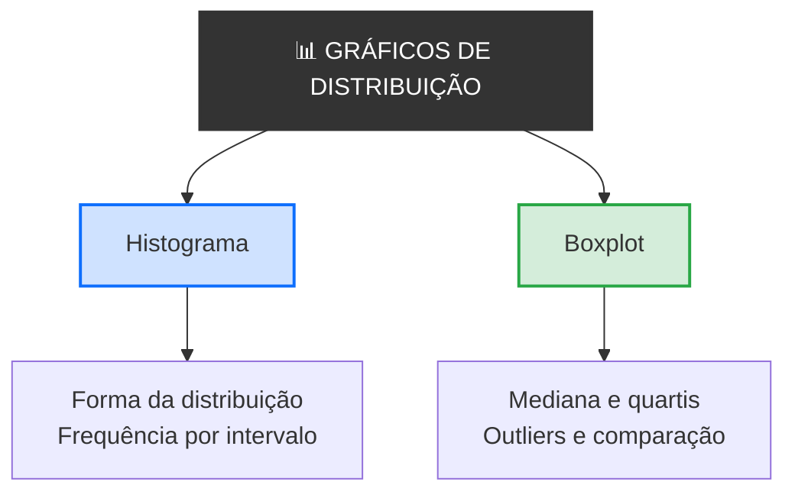
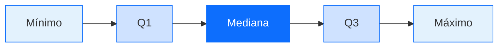

# 
Gráficos de Distribuição

## Introdução

&emsp;&emsp;&emsp;Imagina que és o professor de uma turma de 40 alunos e recebes as notas do exame final. Tens 40 números: 8, 9, 10, 10, 11, 11, 11, 12, 12, 12, 13, 13, 13, 13, 14, 14, 14, 14, 15, 15, 15, 15, 15, 16, 16, 16, 17, 17, 18, 18, 18, 19, 19, 20 e por aí adiante. Agora pergunta-te: **como se distribuem estas notas? A maioria está perto da média ou espalhada? Há muitos alunos com notas baixas? Há outliers?** Com uma lista de 40 números, é quase impossível responder. Com um histograma, vês a forma da distribuição imediatamente. Com um boxplot, vês a mediana, os quartis e os outliers num único olhar.  

&emsp;&emsp;&emsp;Agora imagina que queres comparar a distribuição das notas de duas turmas diferentes. Com dois histogramas lado a lado, vês qual é mais consistente, qual tem mais outliers, qual tem a mediana mais alta. **A mesma informação, mas compreendida em segundos.** É isto que os **gráficos de distribuição** fazem: mostram como os valores de uma variável se espalham. E é por isso que esta aula existe — depois de aprenderes a comparar, a mostrar proporções e a ver tendências, precisas de saber mostrar **distribuições**.

> 💡 **Regra de Ouro:** Um gráfico de distribuição não compara categorias, não mostra proporções e não mostra tendências. Mostra a **forma** como os valores de uma variável se distribuem. Serve para responder à pergunta *"como se espalham os dados?"* — e o eixo Y é quase sempre a frequência.

## O que é um Gráfico de Distribuição?

> Um **gráfico de distribuição** é uma representação visual que mostra **como os valores de uma variável se distribuem** — onde se concentram, como se espalham, se são simétricos ou assimétricos, e se há valores extremos (outliers).

&emsp;&emsp;&emsp;Os gráficos de distribuição são diferentes dos gráficos de comparação, de proporção e de tendência. Num gráfico de comparação, cada barra é uma categoria. Num gráfico de proporção, as partes somam 100%. Num gráfico de tendência, o eixo X é o tempo. Num gráfico de distribuição, o eixo X é a **variável em estudo** (notas, alturas, salários) e o eixo Y é a **frequência** (quantas vezes cada valor aparece).  

&emsp;&emsp;&emsp;Existem dois tipos principais de gráficos de distribuição: **histograma** e **boxplot**. Cada um tem o seu contexto ideal.

📊 Mapa dos Gráficos de Distribuição

### Histograma

#### O que é?

> Um **histograma** é um gráfico de distribuição em que o eixo X é dividido em **intervalos** (classes) e a altura de cada barra representa a **frequência** (número de observações) nesse intervalo.

&emsp;&emsp;&emsp;O histograma é o gráfico de distribuição mais comum. É como um gráfico de barras, mas com uma diferença fundamental: as barras são **coladas umas às outras**, porque representam intervalos contínuos, não categorias separadas. A forma do histograma revela a distribuição dos dados.

#### Quando usar?

- Quando queres ver a **forma da distribuição**
- Quando queres identificar **onde se concentram** os valores
- Quando queres detetar **assimetria** ou **bimodalidade**
- Quando tens **muitos dados** (mais de 30 observações)

#### Exemplo visual

📊 Histograma — Distribuição das Notas de uma Turma

  
Distribuição das Notas de uma Turma

  

    

    

    

    

    

    

    

  

  

    0-5
    5-10
    10-12
    12-14
    14-16
    16-18
    18-20
  

**Interpretação:** A maioria das notas concentra-se entre 12 e 14 — é aí que está a barra mais alta. Há poucas notas muito baixas (0-5) e poucas muito altas (18-20). A distribuição é aproximadamente simétrica, com um pico central.

#### Como construir um histograma

**Passo 1 — Definir as classes (intervalos)**

&emsp;&emsp;&emsp;Divide o intervalo dos dados em classes. Por exemplo, se as notas vão de 0 a 20, podes usar classes de 2 em 2: 0-2, 2-4, 4-6, ..., 18-20. O número de classes depende do número de dados — regra prática: entre 5 e 20 classes.

**Passo 2 — Contar as frequências**

&emsp;&emsp;&emsp;Conta quantas observações caem em cada classe.

**Passo 3 — Desenhar as barras**

&emsp;&emsp;&emsp;Cada barra tem a altura proporcional à frequência. As barras são coladas umas às outras.

#### Formas típicas de histogramas

| Forma | Descrição | Exemplo |
|-------|-----------|---------|
| **Simétrica** | Os dados distribuem-se igualmente em torno do centro | Alturas de pessoas |
| **Assimétrica à direita** | Cauda longa à direita | Salários (maioria ganha pouco, poucos ganham muito) |
| **Assimétrica à esquerda** | Cauda longa à esquerda | Notas de um exame fácil |
| **Bimodal** | Dois picos | Alturas de homens e mulheres juntos |
| **Uniforme** | Todas as classes com frequência semelhante | Lançamento de um dado |

📊 Histograma Simétrico — Alturas de Pessoas

  
Distribuição Simétrica

  
Alturas de pessoas — os dados distribuem-se igualmente em torno do centro

  

    

    

    

    

    

    

    

  

  

    150
    155
    160
    165
    170
    175
    180
  

  

    ✅ Pico central, caudas simétricas
  

📊 Histograma Assimétrico à Direita — Salários

  
Assimétrica à Direita

  
Salários — maioria ganha pouco, poucos ganham muito

  

    

    

    

    

    

    

    

  

  

    1k
    2k
    3k
    4k
    5k
    6k
    7k+
  

  

    ⚠️ Cauda longa à direita
  

📊 Histograma Assimétrico à Esquerda — Notas de Exame Fácil

  
Assimétrica à Esquerda

  
Notas de um exame fácil — cauda longa à esquerda

  

    

    

    

    

    

    

    

  

  

    0-5
    5-10
    10-12
    12-14
    14-16
    16-18
    18-20
  

  

    ⚠️ Cauda longa à esquerda
  

📊 Histograma Bimodal — Alturas de Homens e Mulheres

  
Bimodal

  
Alturas de homens e mulheres juntos — dois picos

  

    

    

    

    

    

    

    

    

    

  

  

    145
    150
    155
    160
    165
    170
    175
    180
    185
  

  

    ⚠️ Dois picos — um para mulheres (155-160) e outro para homens (175-180)
  

📊 Histograma Uniforme — Lançamento de um Dado

  
Uniforme

  
Lançamento de um dado — todas as classes com frequência semelhante

  

    

    

    

    

    

    

  

  

    1
    2
    3
    4
    5
    6
  

  

    ✅ Todas as barras com a mesma altura
  

#### Resumo Visual das 5 Formas

📊 Comparação das 5 Formas de Histograma

  
As 5 Formas Típicas de Histograma

  

    

      
SIMÉTRICA

      

        

        

        

        

        

        

        

      

    

    

      
ASSIM. DIREITA

      

        

        

        

        

        

        

        

      

    

    

      
ASSIM. ESQUERDA

      

        

        

        

        

        

        

        

      

    

    

      
BIMODAL

      

        

        

        

        

        

        

        

      

    

    

      
UNIFORME

      

        

        

        

        

        

        

        

      

    

  

### Boxplot (Diagrama de Caixa)

#### O que é?

> Um **boxplot** é um gráfico de distribuição que resume cinco medidas num único desenho: o **mínimo**, o **primeiro quartil (Q1)**, a **mediana (Q2)**, o **terceiro quartil (Q3)** e o **máximo**. Os outliers são desenhados como pontos isolados.

&emsp;&emsp;&emsp;O boxplot é uma das ferramentas mais poderosas da estatística descritiva. Num único desenho, vês a mediana, a dispersão, a simetria e os outliers. É especialmente útil para **comparar distribuições** entre grupos.

#### O que é um Quartil?

> Um **quartil** divide os dados ordenados em **4 partes iguais**. Cada parte contém 25% dos dados.

- **Q1** (primeiro quartil) → 25% dos dados estão abaixo dele
- **Q2** (segundo quartil = mediana) → 50% dos dados estão abaixo dele
- **Q3** (terceiro quartil) → 75% dos dados estão abaixo dele

📊 Divisão dos Dados em 4 Partes Iguais

  
Divisão dos Dados em 4 Partes Iguais

  

    

      25% dos dados
    

    

      25% dos dados
    

    

      25% dos dados
    

    

      25% dos dados
    

  

  

    Mínimo
    Q1
    Q2 (Mediana)
    Q3
    Máximo
  

#### Anatomia de um boxplot

| Elemento | Significado |
|----------|-------------|
| **Mínimo** | O menor valor (excluindo outliers) |
| **Q1** | 25% dos dados estão abaixo deste valor |
| **Mediana (Q2)** | 50% dos dados estão abaixo deste valor |
| **Q3** | 75% dos dados estão abaixo deste valor |
| **Máximo** | O maior valor (excluindo outliers) |
| **Outliers** | Pontos fora do intervalo [Q1 − 1,5×IQR, Q3 + 1,5×IQR] |

&emsp;&emsp;&emsp;O **IQR** (intervalo interquartil) é a distância entre Q3 e Q1: IQR = Q3 − Q1. É uma medida de dispersão robusta.

### Explicação Detalhada do Boxplot — Ponto por Ponto

&emsp;&emsp;&emsp;Vamos explicar cada elemento do boxplot com **gráficos visuais** e **exemplos concretos**. Vamos usar um conjunto de dados simples para que possas ver exatamente onde cada ponto fica.

#### Os Dados de Exemplo

&emsp;&emsp;&emsp;Imagina que tens as notas de **11 alunos**:

| Aluno | Nota |
|-------|------|
| 1 | 4 |
| 2 | 6 |
| 3 | 7 |
| 4 | 8 |
| 5 | 9 |
| 6 | 10 |
| 7 | 12 |
| 8 | 13 |
| 9 | 15 |
| 10 | 18 |
| 11 | 20 |

**Passo 1 — Ordenar os dados (do menor para o maior):**

`4, 6, 7, 8, 9, 10, 12, 13, 15, 18, 20`

Temos **n = 11** valores.

#### Elemento 1 — Mínimo

> O **mínimo** é o **menor valor** do conjunto de dados — **excluindo outliers**.

**No nosso exemplo:**

- Dados ordenados: `4, 6, 7, 8, 9, 10, 12, 13, 15, 18, 20`
- O menor valor é **4**
- Como não há outliers (vamos verificar depois), o mínimo é **4**

📊 Mínimo = 4

  
Mínimo = 4

  

    

    4

    

    6

    

    7

    

    8

    

    9

    

    10

    

    12

    

    13

    

    15

    

    18

    

    20

  

O mínimo é o **primeiro ponto** da linha — o valor 4.

#### Elemento 2 — Q1 (Primeiro Quartil)

> O **Q1** é o valor abaixo do qual estão **25% dos dados**. É a fronteira entre o primeiro quarto e o resto.

**Como calcular Q1 (com n = 11):**

- Posição de Q1 = (n + 1) × 0,25 = (11 + 1) × 0,25 = 12 × 0,25 = **3ª posição**
- O 3º valor nos dados ordenados é **7**

**Verificação:** 25% de 11 = 2,75. Aproximadamente 3 valores estão abaixo de Q1. Os valores abaixo de 7 são: 4, 6 → 2 valores. O Q1 está entre o 2º e o 3º valor.

📊 Q1 = 7 → 25% dos dados estão abaixo

  
Q1 = 7 → 25% dos dados estão abaixo

  

    

    

    4

    

    6

    

    7

    

    8

    

    9

    

    10

    

    12

    

    13

    

    15

    

    18

    

    20

  

  

    25% dos dados estão abaixo de Q1 = 7
  

O Q1 = **7**. Os valores 4 e 6 estão abaixo dele (25% dos dados).

#### Elemento 3 — Mediana (Q2)

> A **mediana** é o valor que divide os dados em **duas metades iguais**. 50% dos dados estão abaixo, 50% estão acima.

**Como calcular a mediana (com n = 11):**

- Posição da mediana = (n + 1) / 2 = (11 + 1) / 2 = **6ª posição**
- O 6º valor nos dados ordenados é **10**

📊 Mediana = 10 → 50% dos dados estão abaixo e 50% acima

  
Mediana = 10 → 50% dos dados estão abaixo e 50% acima

  

    

    

    

    4

    

    6

    

    7

    

    8

    

    9

    

    10

    

    12

    

    13

    

    15

    

    18

    

    20

  

  

    50% dos dados
    50% dos dados
  

A mediana = **10**. Cinco valores estão abaixo (4, 6, 7, 8, 9) e cinco estão acima (12, 13, 15, 18, 20).

#### Elemento 4 — Q3 (Terceiro Quartil)

> O **Q3** é o valor abaixo do qual estão **75% dos dados**. É a fronteira entre os três primeiros quartos e o último.

**Como calcular Q3 (com n = 11):**

- Posição de Q3 = (n + 1) × 0,75 = (11 + 1) × 0,75 = 12 × 0,75 = **9ª posição**
- O 9º valor nos dados ordenados é **15**

📊 Q3 = 15 → 75% dos dados estão abaixo

  
Q3 = 15 → 75% dos dados estão abaixo

  

    

    

    4

    

    6

    

    7

    

    8

    

    9

    

    10

    

    12

    

    13

    

    15

    

    18

    

    20

  

  

    75% dos dados estão abaixo de Q3 = 15
  

O Q3 = **15**. Oito valores estão abaixo dele (4, 6, 7, 8, 9, 10, 12, 13) — 75% dos dados.

#### Elemento 5 — Máximo

> O **máximo** é o **maior valor** do conjunto de dados — **excluindo outliers**.

**No nosso exemplo:**

- Dados ordenados: `4, 6, 7, 8, 9, 10, 12, 13, 15, 18, 20`
- O maior valor é **20**
- Como não há outliers (vamos verificar a seguir), o máximo é **20**

📊 Máximo = 20

  
Máximo = 20

  

    

    4

    

    6

    

    7

    

    8

    

    9

    

    10

    

    12

    

    13

    

    15

    

    18

    

    20

  

O máximo = **20**. É o último ponto da linha.

#### Elemento 6 — Outliers

> Um **outlier** é um valor que está **muito afastado** dos restantes. Por convenção, considera-se outlier qualquer valor fora do intervalo:
>
> **[Q1 − 1,5×IQR, Q3 + 1,5×IQR]**
>
> Onde **IQR = Q3 − Q1** (intervalo interquartil).

**No nosso exemplo:**

- Q1 = 7
- Q3 = 15
- IQR = Q3 − Q1 = 15 − 7 = **8**
- Limite inferior = Q1 − 1,5×IQR = 7 − 1,5×8 = 7 − 12 = **−5**
- Limite superior = Q3 + 1,5×IQR = 15 + 1,5×8 = 15 + 12 = **27**

**Conclusão:** Nenhum valor está abaixo de −5 ou acima de 27. **Não há outliers.**

📊 Zona de Outliers e Zona Normal

  
Zona de Outliers e Zona Normal

  

    

      Outliers
    

    

      Zona Normal (sem outliers)
    

    

      Outliers
    

  

  

    −5
    Zona onde todos os dados estão
    27
  

  

    ✅ Nenhum valor está abaixo de −5 ou acima de 27 → não há outliers
  

**Exemplo com outlier:** Imagina que adicionamos um aluno com nota **30** (impossível, mas serve de exemplo):

- Dados: `4, 6, 7, 8, 9, 10, 12, 13, 15, 18, 20, 30`
- Q1 = 7, Q3 = 16,5, IQR = 9,5
- Limite superior = 16,5 + 1,5×9,5 = 16,5 + 14,25 = **30,75**
- O valor 30 está **dentro** do limite (30 < 30,75) → **não é outlier**

**Agora com 50:**

- Dados: `4, 6, 7, 8, 9, 10, 12, 13, 15, 18, 20, 50`
- Q1 = 7, Q3 = 16,5, IQR = 9,5
- Limite superior = 16,5 + 1,5×9,5 = **30,75**
- O valor 50 está **fora** do limite (50 > 30,75) → **é outlier**

📊 Exemplo com Outlier (50)

  
Exemplo com Outlier (50)

  

    

    4

    

    6

    

    7

    

    8

    

    9

    

    10

    

    12

    

    13

    

    15

    

    18

    

    20

    

    50

  

  

    ⚠️ O valor 50 é um outlier (está acima do limite superior de 30,75)
  

O valor 50 é um **outlier** porque está acima do limite superior (30,75). No boxplot, aparece como um **ponto isolado** acima do bigode.

#### O Boxplot Completo

&emsp;&emsp;&emsp;Agora que já sabes cada elemento, vê o boxplot completo com todos os pontos:

📊 Boxplot Completo — Notas de 11 Alunos

  
Boxplot Completo — Notas de 11 Alunos

  

    

      

        

        

        

        

        

        

      

    

  

  

    Mínimo: 4
    Q1: 7
    Mediana: 10
    Q3: 15
    Máximo: 20
  

**Legenda visual:**

| Elemento | Valor | O que significa |
|----------|-------|-----------------|
| **Mínimo** | 4 | O menor valor (excluindo outliers) |
| **Q1** | 7 | 25% dos dados estão abaixo de 7 |
| **Mediana** | 10 | 50% dos dados estão abaixo de 10 |
| **Q3** | 15 | 75% dos dados estão abaixo de 15 |
| **Máximo** | 20 | O maior valor (excluindo outliers) |
| **IQR** | 8 | Q3 − Q1 = 15 − 7 = 8 |
| **Outliers** | Nenhum | Nenhum valor fora de [−5, 27] |

#### Resumo Visual

📊 Anatomia Completa de um Boxplot

  
Anatomia Completa de um Boxplot

  

    

    

    

    

    

    

    

    

    

    

    

    

    

  

  

    Mínimo
    Q1
    Mediana (Q2)
    Q3
    Máximo
  

#### Quando usar?

- Quando queres **comparar distribuições** entre grupos
- Quando queres **detetar outliers**
- Quando queres ver a **mediana e os quartis**
- Quando tens **muitos dados** e queres um resumo visual

#### Exemplo visual

📊 Boxplot — Distribuição das Notas por Turma

  
Distribuição das Notas por Turma

  

    

      

        

        

        

        

        

        

      

      Turma A
    

    

      

        

        

        

        

        

        

      

      Turma B
    

    

      

        

        

        

        

        

        

        

      

      Turma C
    

  

**Interpretação:** A Turma B tem a mediana mais alta (15) e a menor dispersão — é a mais consistente. A Turma A tem a mediana em 14 e um outlier acima. A Turma C tem a mediana em 13, maior dispersão e um outlier abaixo. Os boxplots permitem comparar as três turmas num único olhar.

### Como interpretar um boxplot

| Observação | Significado |
|------------|-------------|
| **Caixa larga** | Grande dispersão entre Q1 e Q3 |
| **Caixa estreita** | Pouca dispersão entre Q1 e Q3 |
| **Mediana ao centro** | Distribuição simétrica |
| **Mediana à esquerda** | Distribuição assimétrica à direita |
| **Mediana à direita** | Distribuição assimétrica à esquerda |
| **Bigodes longos** | Valores extremos afastados |
| **Pontos isolados** | Outliers |

### Histograma vs. Boxplot — Qual Escolher?

| Critério | Histograma | Boxplot |
|----------|-----------|---------|
| **Foco** | Forma da distribuição | Mediana e quartis |
| **Outliers** | Difícil de ver | Claramente visível |
| **Comparação entre grupos** | Difícil | Excelente |
| **Frequências** | Mostra | Não mostra |
| **Simetria** | Mostra | Mostra |
| **Uso comum** | Análise exploratória | Comparação de grupos |

**Regra prática:** Se queres ver a **forma** da distribuição → **histograma**. Se queres **comparar grupos** ou **detetar outliers** → **boxplot**. Em análise exploratória, usam-se os dois em conjunto.

---

## Erros Comuns em Gráficos de Distribuição

### 1. Número errado de classes no histograma

&emsp;&emsp;&emsp;Poucas classes escondem a forma; muitas classes criam ruído. **Solução:** Usa entre 5 e 20 classes, dependendo do número de dados.

### 2. Barras separadas no histograma

&emsp;&emsp;&emsp;O histograma representa intervalos contínuos, por isso as barras devem estar coladas. **Solução:** Cola as barras umas às outras.

### 3. Eixo Y truncado no histograma

&emsp;&emsp;&emsp;Começar o eixo Y em 5 em vez de 0 distorce a perceção das frequências. **Solução:** Começa sempre em 0.

### 4. Boxplot sem contexto

&emsp;&emsp;&emsp;Um boxplot sozinho não diz nada sem título, rótulos e escala. **Solução:** Inclui sempre os sete elementos da anatomia.

### 5. Confundir histograma com gráfico de barras

&emsp;&emsp;&emsp;O histograma mostra distribuição de uma variável quantitativa; o gráfico de barras compara categorias. **Solução:** Lembra-te: histograma = barras coladas; barras = barras separadas.

### 6. Falta de título e rótulos

&emsp;&emsp;&emsp;Um gráfico sem título, sem rótulos, sem fonte é inútil. **Solução:** Inclui sempre os sete elementos da anatomia.

## Exemplo Prático

&emsp;&emsp;&emsp;Vamos construir um histograma e um boxplot passo a passo.

**Dados:** Notas de 20 alunos.

Nota: `8 10 11 12 12 13 13 14 14 14` 
Nota: `15 15 15 16 16 17 17 18 19 20`  

**Passo 1 — Calcular as medidas**

- Mínimo: 8
- Q1: 12
- Mediana: 14,5
- Q3: 16,5
- Máximo: 20
- IQR: 16,5 − 12 = 4,5
- Limite inferior: 12 − 1,5×4,5 = 5,25
- Limite superior: 16,5 + 1,5×4,5 = 23,25
- Outliers: nenhum (todos os valores estão entre 5,25 e 23,25)

**Passo 2 — Construir o histograma**

📊 Histograma — Distribuição das Notas de 20 Alunos

  
Distribuição das Notas de 20 Alunos

  

    

    

    

    

    

    

  

  

    8-10
    10-12
    12-14
    14-16
    16-18
    18-20
  

**Passo 3 — Construir o boxplot**

📊 Boxplot — Notas de 20 Alunos

  
Boxplot das Notas de 20 Alunos

  

    

      

        

        

        

        

        

        

      

      Notas
    

  

**Passo 4 — Interpretar**

O histograma mostra que a maioria das notas se concentra entre 12 e 16 — a distribuição é aproximadamente simétrica. O boxplot mostra que a mediana é 14,5, o Q1 é 12 e o Q3 é 16,5. Não há outliers. A distribuição é relativamente consistente.

---

## Exercícios

📗 Exercício 1 — Identificar o tipo de gráfico de distribuição (Fácil)

**Enunciado:** Para cada situação, indica se usarias histograma ou boxplot:

a) Ver a forma da distribuição dos salários de uma empresa

b) Comparar a distribuição das notas de 4 turmas

c) Detetar outliers nas alturas de 100 pessoas

d) Ver se a distribuição das idades é simétrica ou assimétrica

e) Comparar a mediana dos tempos de espera em 3 hospitais

💡 Ver resposta

a) **Histograma** — ver a forma da distribuição

b) **Boxplot** — comparar distribuições entre grupos

c) **Boxplot** — detetar outliers

d) **Histograma** — ver simetria

e) **Boxplot** — comparar medianas entre grupos

📗 Exercício 2 — Detetar erros (Médio)

**Enunciado:** Observa o gráfico abaixo e identifica três erros de visualização.

📊 Gráfico com erros

  
Gráfico 1

  

    

    

    

    

    

    

  

💡 Ver resposta

1. **Título vago** — "Gráfico 1" não diz nada. Deveria ser "Distribuição das Notas" ou similar.

2. **Barras separadas** — num histograma, as barras devem estar coladas, porque representam intervalos contínuos.

3. **Cores sem significado** — vermelho, verde, azul, amarelo, magenta e ciano não têm relação com os dados.

4. **Falta de rótulos nos eixos** — não sabemos o que o eixo X e o eixo Y representam.

5. **Falta de fonte** — não sabemos de onde vêm os dados.

📗 Exercício 3 — Escolher o gráfico certo (Médio)

**Enunciado:** Tens os seguintes dados: notas de 30 alunos de uma turma. Que gráfico de distribuição usarias para mostrar:

a) A forma da distribuição das notas

b) Se há alunos com notas extremamente baixas ou altas

c) Comparar a distribuição das notas com a de outra turma

💡 Ver resposta

a) **Histograma** — mostra a forma da distribuição

b) **Boxplot** — mostra outliers claramente

c) **Boxplot** — excelente para comparar grupos

📗 Exercício 4 — Interpretar um gráfico (Médio)

**Enunciado:** Observa o boxplot abaixo e responde:

📊 Boxplot — Salários

  
Boxplot dos Salários (milhares €)

  

    

      

        

        

        

        

        

        

        

      

      Salários
    

  

a) Qual é a mediana dos salários?

b) Qual é o intervalo interquartil (IQR)?

c) Há outliers?

d) O que significa a caixa larga?

💡 Ver resposta

a) **Aproximadamente 20 mil €** — a linha dentro da caixa

b) **Aproximadamente 15 mil €** — Q3 (30) − Q1 (15) = 15

c) **Sim** — há um ponto acima do bigode superior

d) **Grande dispersão** — os 50% centrais dos dados estão espalhados por uma grande amplitude

📗 Exercício 5 — Construir um gráfico (Difícil)

**Enunciado:** Tens os seguintes dados sobre as notas de 20 alunos:

| 8 | 10 | 11 | 12 | 12 | 13 | 13 | 14 | 14 | 14 |
|---|---|---|---|---|---|---|---|---|---|
| 15 | 15 | 15 | 16 | 16 | 17 | 17 | 18 | 19 | 20 |

a) Calcula o mínimo, Q1, mediana, Q3 e máximo.

b) Calcula o IQR e verifica se há outliers.

c) Desenha o histograma e o boxplot mentalmente (ou num papel).

d) Interpreta os gráficos.

💡 Ver resposta

a) Medidas:
- Mínimo: 8
- Q1: 12
- Mediana: 14,5
- Q3: 16,5
- Máximo: 20

b) IQR = 16,5 − 12 = 4,5
- Limite inferior: 12 − 1,5×4,5 = 5,25
- Limite superior: 16,5 + 1,5×4,5 = 23,25
- **Não há outliers** — todos os valores estão entre 5,25 e 23,25

c) O histograma deve ter classes de 2 em 2 (8-10, 10-12, 12-14, 14-16, 16-18, 18-20) com barras coladas. O boxplot deve ter a caixa de Q1 (12) a Q3 (16,5), com a mediana em 14,5, e os bigodes até ao mínimo (8) e máximo (20).

d) A distribuição é aproximadamente simétrica, com a maioria das notas entre 12 e 16. A mediana é 14,5. Não há outliers. A turma é relativamente consistente.

> **Em resumo:** os gráficos de distribuição mostram como os valores de uma variável se espalham, respondendo à pergunta *"como se distribuem os dados?"*. O **histograma** usa barras coladas para mostrar a forma da distribuição — onde se concentram os valores, se é simétrica ou assimétrica, se é unimodal ou bimodal. O **boxplot** resume cinco medidas (mínimo, Q1, mediana, Q3, máximo) num único desenho e é excelente para detetar outliers e comparar grupos. Em conjunto, o histograma e o boxplot dão uma visão completa da distribuição: o histograma mostra a forma, o boxplot mostra os números-chave. Um gráfico de distribuição bem feito transforma uma lista de números numa compreensão profunda da variabilidade.